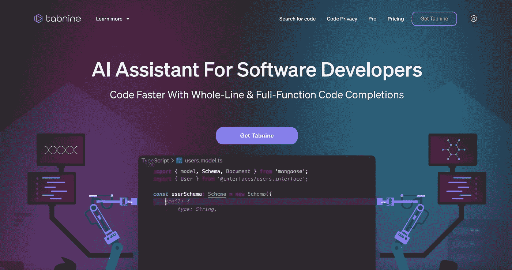
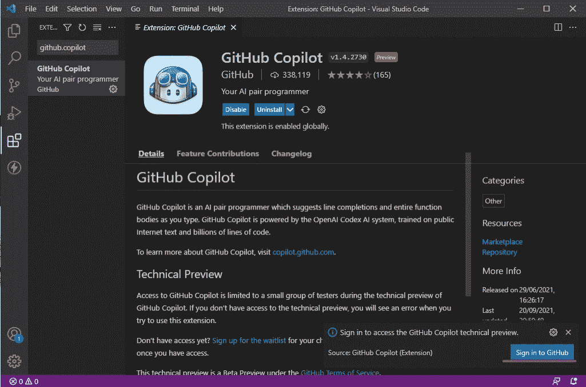
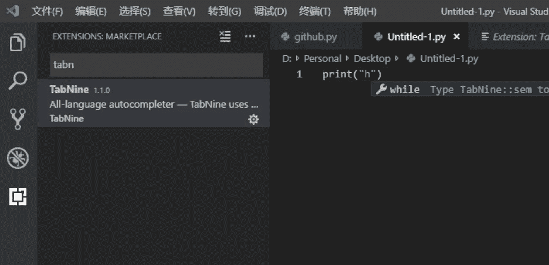
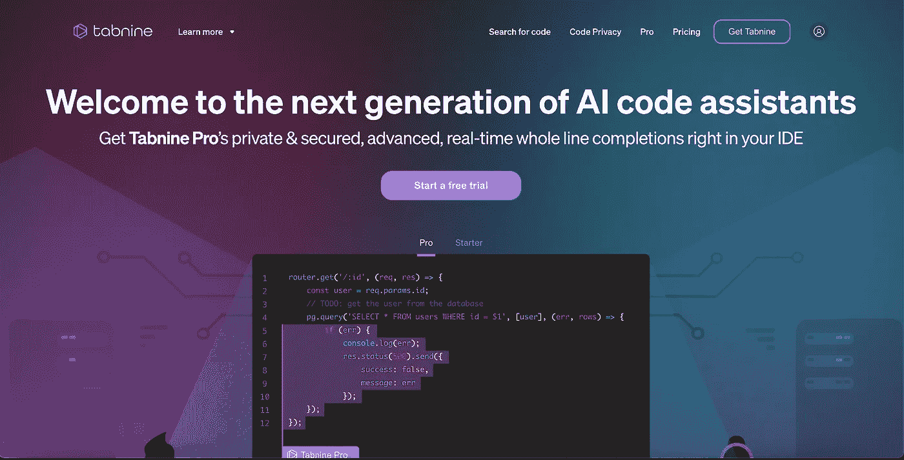
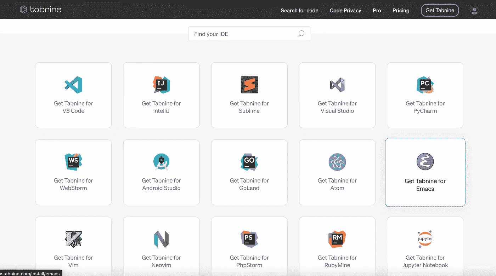
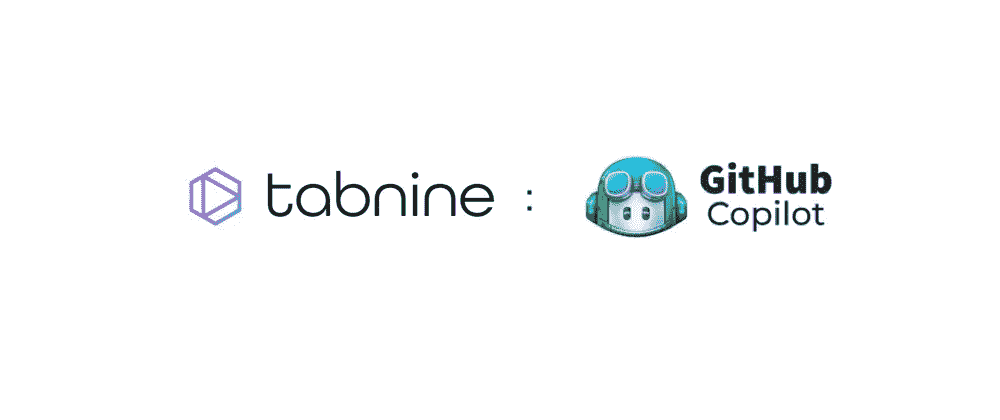
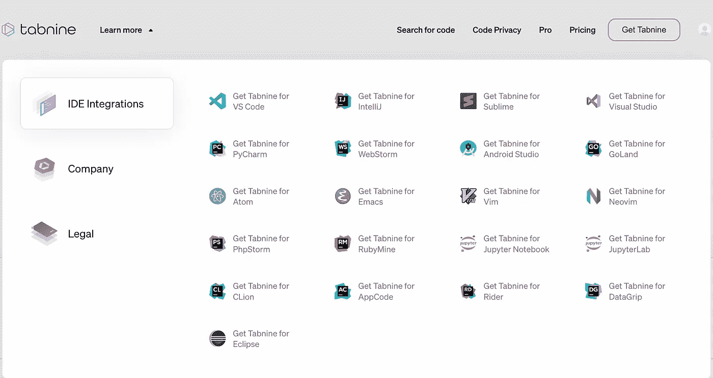
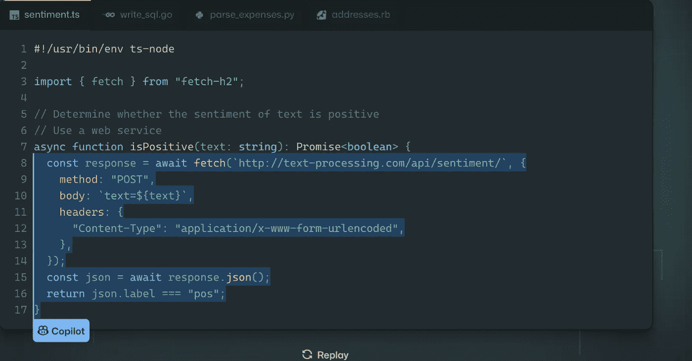

# Github 副驾驶 vs Tabnine？为自己选择最好的 AI 助手

> 原文：<https://javascript.plainenglish.io/github-copilot-vs-tabnine-choose-the-best-ai-assistant-for-you-6bd5acf469e5?source=collection_archive---------4----------------------->

如果你正在为你的下一个 web 开发项目寻找一个新的 AI 程序员，你可能想知道哪个工具最适合你和你的团队。虽然有这么多的选择是很好的，但是权衡每种类型的 AI pair 程序员的优点和缺点可能是压倒性的。

今年，我得到了一个探索两个优秀结对程序员的机会。

1- [Github 副驾驶](https://github.com/features/copilot)——你的 AI 对程序员

2-[Tabnine](https://www.tabnine.com/)——软件开发者的 AI 助手。

本文将展示 Copilot 和 Tabnine 之间的区别。

# 介绍

GitHub Copilot 是一个新的 GitHub 和 OpenAI 服务，它自称是“你的 AI 配对程序员”。

它是一个 Visual Studio 代码插件，根据当前文件的内容和光标位置为您创建代码。

使用起来感觉真的很棒。例如，在本例中，我输入了一个应该“将文本写入文件 fname”的函数的名称和 docstring:Copilot 完全为我编写了函数的灰色主体！所以我按下了键盘上的一个键，这个想法被接受并融入到我的代码中。

> *这远远不是第一个“人工智能驱动的”软件合成工具。*

2018 年，GitHub 的自然语言语义代码搜索证明了如何使用简单的英语描述来识别代码样本。

几年来，Tabnine 提供了“人工智能驱动的”代码完成。Tabnine 和 Copilot 都可以生成完整的多行函数，以及文档和测试，这取决于代码文件的完整上下文。

这对 fast.ai 的我们来说非常令人兴奋，因为它提供了降低编码壁垒的前景，这对我们的目标非常有益。于是乎，我就特别渴望挖到副驾驶。然而，正如我们将看到的，我仍然不确定 Copilot 是一个福音。它甚至可能最终成为一个诅咒。

> 现在所有开发者都可以使用 GitHub Copilot，你需要每月支付 10 美元才能使用。

有人认为 GitHub Copilot 很出众，值得花钱购买，功能强大，将来会进化成一个很棒的工具。

然而，许多人对此不满意，因为它是使用自由源代码教授的；典型用户现在必须付费才能使用它。这种经营理念太可怕了。微软就不能在给普通开发者留下免费限制版的同时，提供一个有附加功能的企业版吗？

无论如何，GitHub Copilot 现在是一项选择有限的优质服务，但也存在一些替代服务，如 Tabnine。

# 什么是 Tabnine

另一方面，Tabnine 是一个人工智能编码助手，可以帮助你成为更好的编码员。通过在所有最常见的编码语言和 ide 中实时完成项目代码，Tabnine 将加快您的开发速度。

# Tabnine 保护您的代码隐私

> Tabnine 从不存储或共享您的代码。

Tabnine 在获得许可的开源代码上训练其公开可用的人工智能模型。

# Github Copilot 和 Tabnine 哪个好

*   Tabnine 是一个基于开放人工智能概念的人工智能代码完成工具，拥有比 Copilot 更多的功能。
*   两者都提供基于机器学习的代码完成；但是 Copilot 的架构是独一无二的，“用一个模型来统治他们。”由于训练和推理需要大量的计算资源，它也是完全集中的——只有微软可以训练模型，只有微软可以托管模型。
*   另一方面，Tabnine 更喜欢个性化的语言模型，在彻底评估各种规模的模型后，这些模型会相互协作。为什么？因为代码预测是不同子问题的集合，不适合整体模型方法。
*   Tabnine 发现，结合专门的模型显著提高了他们超过 100 万用户的建议的精确度和长度。

> *Tabnine 方法的一个显著优势是，它可以为任何代码预测任务使用适当的工具，对于大多数目的，Tabnine 的较小模型可以快速有效地提供出色的预测。*

*   副驾驶预测完全基于云，而 Tabnine 预测既基于本地也基于云。GPU，还有云端，你的代码上传的地方，处理完就被移除了。这是关于选择是否在云中处理你的代码。
*   Copilot 现在只预测几种主要语言，Tabnine 支持 30 多种编程语言。
*   Copilot 仅适用于 Visual Studio 代码、Visual Studio、JetBrains IDE 和 Neovim。另一方面，Tabnine 兼容广泛的编辑器，包括 Visual Studio 代码、vim、emacs、jupyter、JetBrains 编辑器、Android Studio、sublime text 等等。

*   就目前而言，最显著的区别是，Copilot 仍处于测试阶段，它建议的许多代码还没有经过测试；他们甚至报告说，它预测的代码可能会变成有错误或安全缺陷的代码，这与 Tabnine 相反，Tabnine 已经在生产中，简而言之，已经提供了 Copilot 提议的内容。
*   Tabnine 提供了一个根据你的代码训练的私有模型，而 Github Copilot 没有。
*   Github Copilot 有 3+个集成，而 Tabnine 有 21 个集成。
*   Tabnine 没有像 Github Copilot 那样创建跨多种编程语言的大型全局模型，而是根据每个开发人员的需求定制较小的模型。

市场上有这么多工具，您如何知道哪一个最适合您的特定用例或技能集呢？

> 我推荐你阅读 Tabnine CEO 的这篇帖子。Tabnine 和 Copilot 的综合比较。

# Github Copilot 有哪些替代品

Tabnine 在过去的一年中被使用了很多，Tabnine 是我最近使用最多的一个，在开发产品代码时是一个很大的帮助。我换编辑，用不同的语言，AI 等工作。生产力的提高确实很明显，用户也喜欢处理个人数据的策略。

事实上，有更多的工具来提高开发人员的生产力是非常棒的，人工智能技术的杠杆作用甚至更好。我喜欢它变得越来越受欢迎，许多开发人员可以提高他们的生产力。

然而，通过提高由成千上万的开发人员编写的完美而高效的代码的能力，这些平台可以永久受益。

回应“谁看守望者？”我希望您考虑以下问题:“谁将实现自动化？”不要误解我的意思，我喜欢拥有一个工具来帮助我提高效率的想法；我再次使用 Tabnine，这就是为什么我打这个比方，但是当我看到微软，一个大公司，进入这个领域时，我不禁持怀疑态度。

然而，作为一名开发人员，这是一个美好的时刻；在编码方面已经有了许多突破，目前，我们仍然自己创造代码，而不是让机器生成代码。随着我看到它变得越来越普遍，我将在未来提供更多的信息。

# 为什么开发者选择 Tabnine 而不是 GitHub Copilot

1- Copilot 只是偶尔查询模型，并建议一个代码片段或一整行代码。Copilot 不建议在代码行中间使用代码，因为它的人工智能模型不太适合这一目的，但 Tabnine 也建议使用完整的代码片段或代码行，但人工智能会随着您流动，因此在使用 Tabnine 时，接受的代码建议数量要高得多。

2- Tabnine 可以在客户的 GitLab/GitHub/BitBucket 存储库中的特定代码上训练私人 AI 模型，而 Copilot 使用单一的通用 AI 模型。

Copilot 模型不能由用户训练或运行，但是用户可以在 Tabnine 云上运行该模型，在开发者机器上本地运行，或者在使用 Tabnine(使用 Tabnine Enterprise)的自托管服务器上运行。

4-与 Copilot 不同，开发者可以在他们的防火墙内使用 Tabnine，而无需向互联网公开任何代码。

5-微软目前只为开发者提供 Copilot 作为商业产品，没有免费计划；Tabnine 有一个奇妙的免费计划。

# 结论

Copilot 可能有利于像 Go 这样有许多样板文件但元编程能力很少的语言。(结果现在很多人用 Go 使用模板化代码生成。)对于使用外语的有经验的程序员来说，它也可能是有价值的，因为它可能有助于基本语法并指向库函数和常用习惯用法。

然而，Copilot 现在对其免费服务收费，客户不确定这些好处是否物有所值。

> *用户越来越多地转向替代品，其中之一就是***。**

*如果年轻的开发者独自工作，Tabnine 提供免费版本。Tabnine 永远不会存储或公开您的代码。任何涉及为了训练团队模型而与 Tabnine 服务器共享代码的活动都需要明确的同意。所以这似乎是更好的选择。*

*这篇博文现在已经完成了。*

*我希望你今天有新收获。如果你看到了，请友好地点赞或分享给其他人看。*

*最新动态，在 Twitter 上关注 [**Tabnine**](https://twitter.com/tabnine) 。*

# *无耻的插头*

*订阅我的 [**简讯**](https://www.getrevue.co/profile/AnkurTyagi) &关注我的 [**Twitter**](https://twitter.com/TheAnkurTyagi) 了解更多内容。*

**原载于【https://theankurtyagi.com】**。****

***更多内容请看*[***plain English . io***](https://plainenglish.io/)*。报名参加我们的* [***免费每周简讯***](http://newsletter.plainenglish.io/) *。关注我们关于*[***Twitter***](https://twitter.com/inPlainEngHQ)[***LinkedIn***](https://www.linkedin.com/company/inplainenglish/)*[***YouTube***](https://www.youtube.com/channel/UCtipWUghju290NWcn8jhyAw)*和* [***不和***](https://discord.gg/GtDtUAvyhW)***