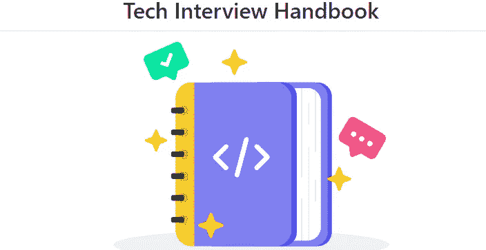
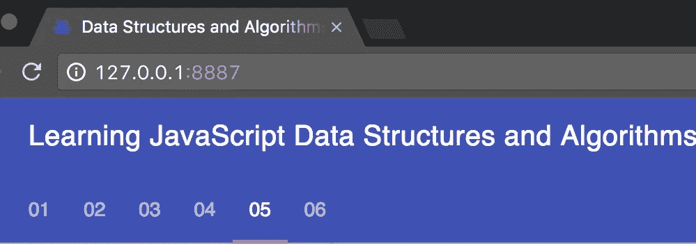
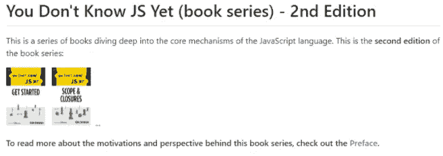
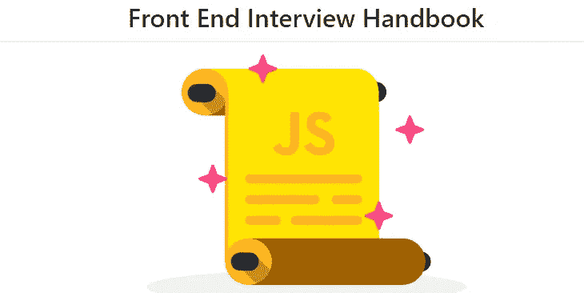
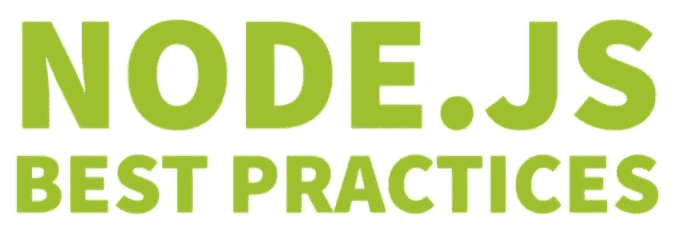
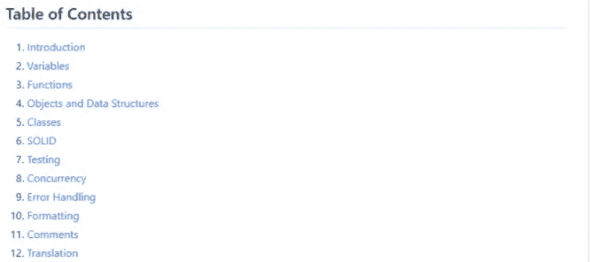

# 准备 JavaScript 采访的 10 个有用的 GitHub 存储库

> 原文：<https://javascript.plainenglish.io/github-repositories-to-prepare-for-javascript-interviews-47c012450681?source=collection_archive---------9----------------------->

## JavaScript GitHub 存储库，帮助你在下次面试中表现出色。

Photo by [Tezos](https://unsplash.com/@tezos?utm_source=medium&utm_medium=referral) on [Unsplash](https://unsplash.com?utm_source=medium&utm_medium=referral)

GitHub 是一个受所有开发者欢迎的开源平台。如今，许多科技公司都在他们的项目中使用 GitHub。在这里，任何开发人员都可以托管代码、参与开源项目以及学习可用的 Git 存储库。

在 GitHub 上有很多有用的存储库可以帮助你学习任何你想要的东西。这个平台在质量和对开发者有价值的内容方面非常丰富。

作为一个新的开发者，面试准备是你申请工作前需要考虑的重要事情之一。幸运的是，有很多免费的资源可以帮助你做到这一点，GitHub 就是其中之一。

这就是为什么在本文中，我想与大家分享一些有用的 GitHub 存储库，这些存储库可以帮助您准备 JavaScript 访谈。让我们开始吧。

# 1.技术采访手册

[技术面试手册](https://github.com/yangshun/tech-interview-handbook)是一个非常棒的资料库，里面汇集了大量有用的资源，可以帮助你为技术面试做好准备。

Capture by the author from [GitHub](https://github.com/yangshun/tech-interview-handbook)(external link).

这个知识库的创建是为了帮助那些想找一份技术工作的人。它附带了实用的内容和技巧，涵盖了技术面试的所有阶段。我强烈建议您无论使用哪种编程语言，都可以查看它以了解更多信息。

# 2.JavaScript 数据结构和算法

这个[存储库](https://github.com/loiane/javascript-datastructures-algorithms)提供了一个了不起的 JavaScript 和 TypeScript 数据结构和算法的集合。这里列出了 15 个可供你学习的章节。

Capture by the author from [GitHub](https://github.com/loiane/javascript-datastructures-algorithms)(external link).

# 3.你不了解 JS

[你不知道 JS](https://github.com/getify/You-Dont-Know-JS) 是一个流行的 GitHub 资源库，其中包含了《你不知道 JS》一书的系列内容。对于任何使用 JavaScript 的人来说，这都是一个非常有用的存储库，因为这本书深入解释了 JavaScript 语言的核心概念。

Capture by the author from [GitHub](https://github.com/getify/You-Dont-Know-JS)(external link).

这个存储库在 GitHub 上有超过 149k 的星级，如果你想把你的 JavaScript 知识提升到一个新的水平，我强烈建议你去看看。

# 4.JavaScript 问题

这个[存储库](https://github.com/lydiahallie/javascript-questions)提供了一长串高级 JavaScript 问题及其解释。在面试过程中，你可能会面临下面这些问题。因此，这是一个很好的库，可以提高您的 JavaScript 技能和 ace 面试。

Capture by the author from [GitHub](https://github.com/lydiahallie/javascript-questions)(external link).

贡献者不断用新的 JavaScript 问题更新存储库，以帮助开发人员提高他们的技能。这些问题也有许多不同的语言版本(英语、西班牙语、阿拉伯语等)。

# 5.前端面试手册

[前端面试手册](https://github.com/yangshun/front-end-interview-handbook)又是一个牛逼的知识库，里面有很多前端角色的面试准备资料。

Capture by the author from [GitHub](https://github.com/yangshun/front-end-interview-handbook)(external link).

我强烈推荐这个知识库给任何在科技公司或创业公司寻找前端角色的人。当涉及到前端面试准备时，该存储库涵盖了许多领域和技巧。

# 6.30 秒的采访

[30 秒面试](https://github.com/30-seconds/30-seconds-of-interviews)是一个非常有用的常见面试问题集，可以帮助你作为一名开发人员准备面试。

Capture by the author from [GitHub](https://github.com/30-seconds/30-seconds-of-interviews)(external link).

这是一个很棒的资源库，可以帮助你提高编码技能。它有将近 10k 颗 GitHub 星星，我强烈推荐去看看。

# 7.节点最佳实践

[Node best practices](https://github.com/goldbergyoni/nodebestpractices) 是另一个非常有用的资源库，它提供了许多技巧、最佳实践和风格指南来帮助您提高 NodeJS 技能。

Capture by the author from [GitHub](https://github.com/goldbergyoni/nodebestpractices)(external link).

这是一个很棒的知识库，可以帮助你改进代码，为 NodeJS 面试做准备。

# 8.回应面试问题

这是一个惊人的[库](https://github.com/sudheerj/reactjs-interview-questions)，包含了 500 个 React 面试问题及其答案和解释。这无疑是提高你的 React 编码技能和准备面试问题的最佳资源之一。

 [## GitHub-sudheerj/react js-Interview-Questions:react js 面试问题 500 强名单

### 500 强面试问答列表...编码练习题即将推出！！- GitHub …

github.com](https://github.com/sudheerj/reactjs-interview-questions) 

# 9.VueJS 面试问题

这是另一个[存储库](https://github.com/sudheerj/vuejs-interview-questions)，包含了 300 多个有用的 VueJS 面试问题以及答案和解释。

 [## GitHub-sudheerj/vuejs-面试-问题:300 个 vue js 面试问题和答案的列表

### 300 个 VueJS 面试问题的列表 Vue.js 是一个开源的渐进式 Javascript 框架，用于构建用户…

github.com](https://github.com/sudheerj/vuejs-interview-questions) 

这绝对是准备下一次 VueJS 面试和提高技能的绝佳资源。

# 10.干净代码 JavaScript

[Clean Code JavaScript](https://github.com/ryanmcdermott/clean-code-javascript) 是一个非常流行的 GitHub 库，它为您提供了编写干净 JavaScript 代码所需的技巧和概念。

Capture by the author from [GitHub](https://github.com/ryanmcdermott/clean-code-javascript)(external link).

编写人类可以理解的干净代码是所有面试官在面试开发人员时考虑的一个重要因素。这就是为什么我推荐检查这个库，它肯定会帮助你写干净的 JavaScript 代码。

# 结论

正如你在上面看到的，这是一个非常有用的 GitHub 库列表，它将帮助你提高技能，赢得 JavaScript 编码面试，并获得你梦想的工作。你只需要保持一点一致性，尽可能多地从这些资源中学习。

*感谢您阅读本文。此外，如果你觉得我的内容有用，而你不是一个媒体成员，你可以抓住你的媒体成员* [***这里***](https://mehdiouss.medium.com/membership) *(媒体推荐链接)获得无限制的访问媒体上的所有文章，并支持我们作为作家。*

 [## 通过我的推荐链接加入 Medium-Mehdi Aoussiad

### 作为一个媒体会员，你的会员费的一部分会给你阅读的作家，你可以完全接触到每一个故事…

mehdiouss.medium.com](https://mehdiouss.medium.com/membership) 

**更多阅读:**

 [## 每个 Web 开发人员都应该知道的 6 个有用的 CSS 函数

### 可以在 CSS 代码中使用的强大功能。

javascript.plainenglish.io](/6-useful-css-functions-every-web-developer-should-know-4be9ad59183f)  [## 你应该在 2022 年使用的 9 个很棒的 CSS 工具

### 有用的 CSS 工具和资源，以提高您的生产力。

blog.devgenius.io](https://blog.devgenius.io/9-awesome-css-tools-that-you-should-use-in-2022-2155eed03c4c) 

*更多内容看* [***说白了。报名参加我们的***](http://plainenglish.io/) **[***免费周报***](http://newsletter.plainenglish.io/) *。在我们的* [***社区不和谐***](https://discord.gg/GtDtUAvyhW) *获得独家获取写作机会和建议。***