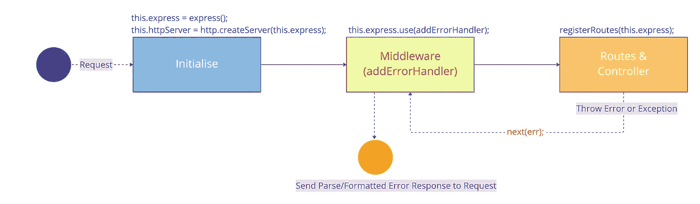
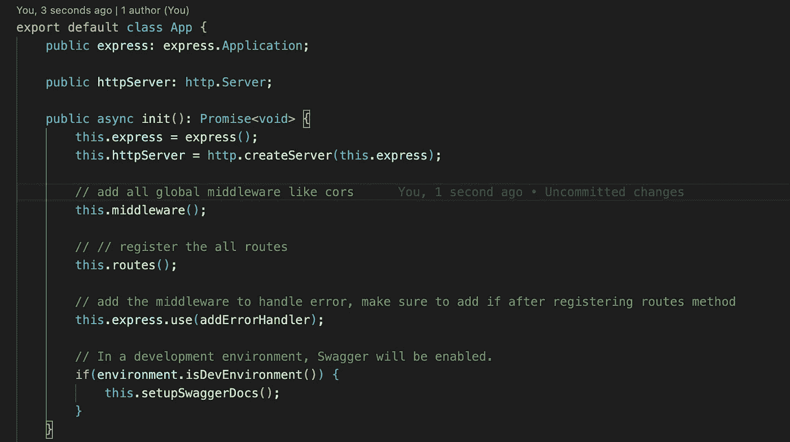
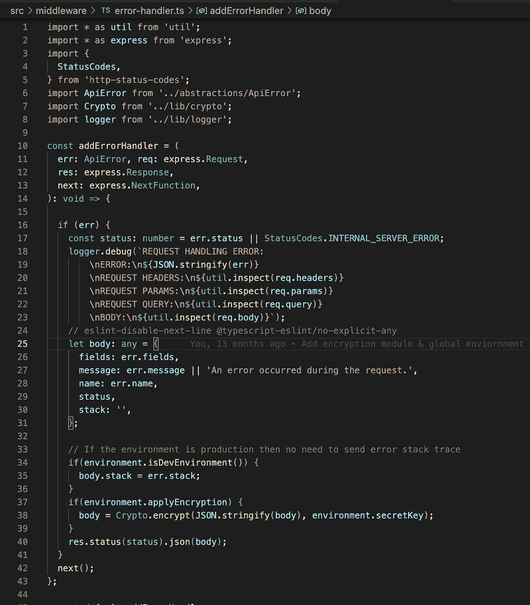
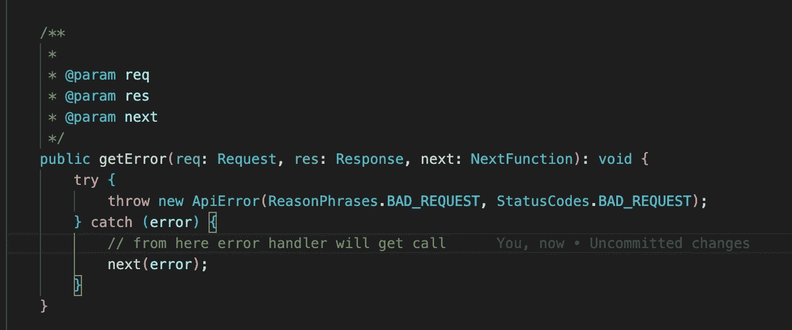
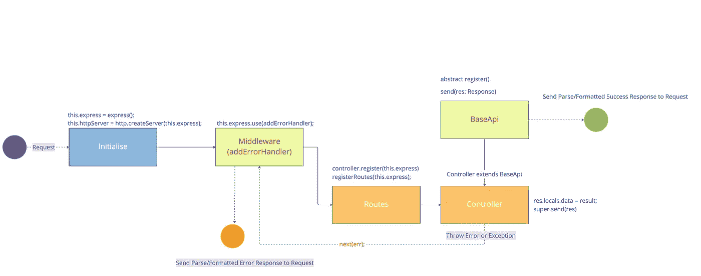
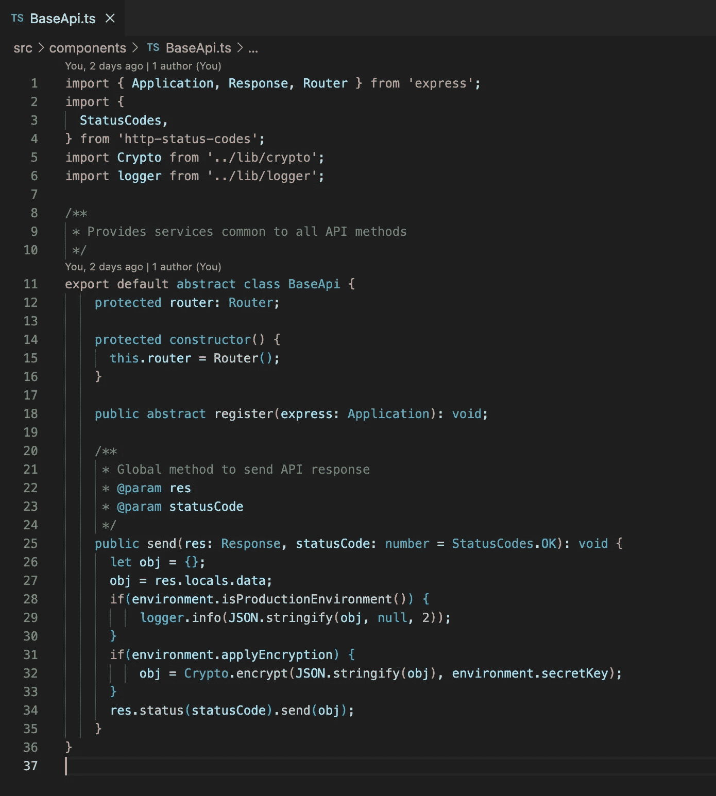
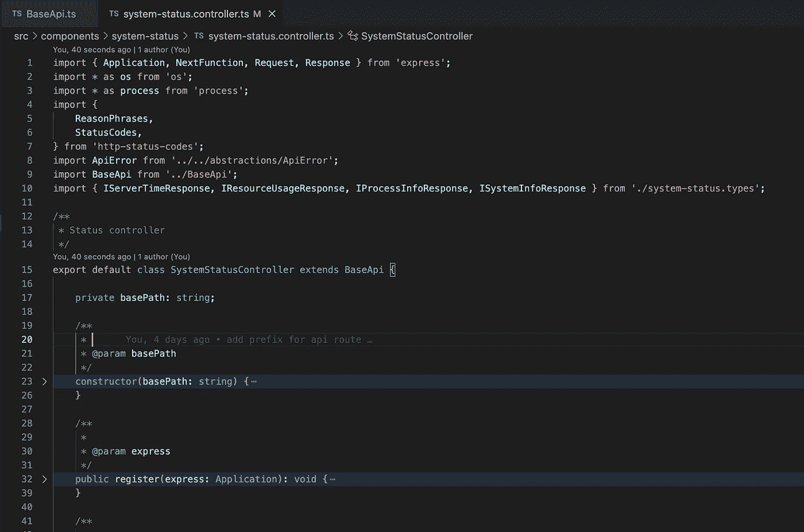
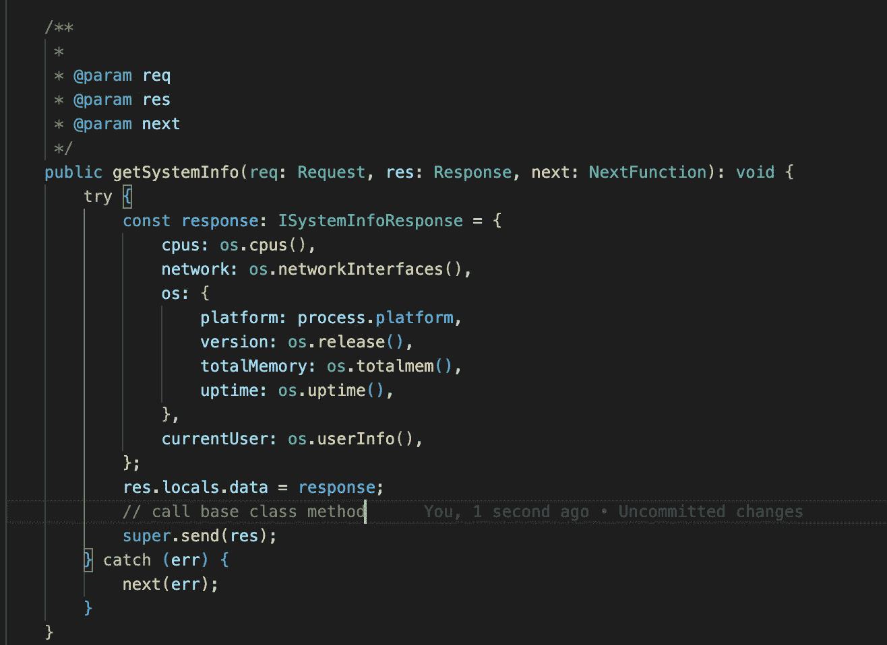

# 带有 Express 和 TypeScript 的 Node.js 中的全局错误和响应处理程序

> 原文：<https://javascript.plainenglish.io/global-error-and-response-handler-in-node-js-with-express-and-typescript-913ec06d74b3?source=collection_archive---------1----------------------->

## 本指南将帮助您向 Node.js 应用程序添加全局错误和成功响应处理程序。


Photo by [Erik Mclean](https://unsplash.com/ja/@introspectivedsgn?utm_source=medium&utm_medium=referral) on [Unsplash](https://unsplash.com?utm_source=medium&utm_medium=referral)

# 介绍

众所周知，JavaScript 支持异常的概念。JavaScript 可以在 try-catch 块中“抛出”和“捕获”异常，就像大多数具有异常处理功能的传统语言一样，比如 Java 和 C++。

```
try {     
    // handle business logic here
    // throw exception from here if any
} catch(exception) {
  // catch & handle exception here
}
```

但是正如我们都知道的，我们的代码包含了大量的 try-and-catch 块，我们无意中编写了单独的代码来处理相同或不同类型的错误。此外，在 Node.js 中，我们正在为每个控制器方法编写代码，以发送成功或失败响应。

为了解决这类问题，我们需要一个单一的、集中的方法来处理各种情况。

请在下面找到没有集中机制来处理错误和成功响应的问题列表

1.  代码重复
2.  向现有代码添加额外功能的挑战(例如加密/解密)
3.  没有共同的模式、行为和反应

# 履行

如果您正在寻找一个现成的、轻量级的、具有必要特性的样板文件，请查看我的 below 资源库，许多开发人员已经在使用它了。

[](https://github.com/santoshshinde2012/node-boilerplate) [## GitHub-Santosh shinde 2012/Node-Boilerplate:用于微服务的节点类型脚本样板…

### 微服务的节点类型脚本样板。用 TypeScript 编写的 Node.js 应用程序的框架(带有安装说明…

github.com](https://github.com/santoshshinde2012/node-boilerplate) 

## **1。全局错误处理器**

我们将使用 Node.js 中间件在一个地方捕获错误。



Global Error Handler

**步骤 1 —创建快速应用**



Create the express application

**第二步——创建并添加错误处理中间件及其实现**



error handler middleware

**步骤 3——从应用程序中抛出错误来测试我们的代码**



Throw Error

## 2.全局成功响应处理程序

我们将创建一个带有响应处理程序实现的基类，并在 API 实现的派生 express 控制器类中调用它。



Success Response Handler

**步骤 1 —创建基类**

我们将定义一个抽象方法来为每个控制器注册路由，并定义一个公共发送方法及其在该类中的实现。



**步骤 2 —从控制器类**中派生出 BaseApi 类

```
export default class SystemStatusController extends BaseApi {}
```



**步骤 3—使用 super 关键字调用基类 send 方法**



Call base class send method using super keyword

# 参考

[](https://github.com/santoshshinde2012/node-boilerplate) [## GitHub-Santosh shinde 2012/Node-Boilerplate:用于微服务的节点类型脚本样板…

### 微服务的节点类型脚本样板。用 TypeScript 编写的 Node.js 应用程序的框架(带有安装说明…

github.com](https://github.com/santoshshinde2012/node-boilerplate) 

感谢阅读，请分享你的评论，如果这个博客增加了你的学习价值，请鼓掌。

*关注我上* [***推特***](https://twitter.com/shindesan2012) *和*[***LinkedIn***](https://www.linkedin.com/in/shindesantosh/)*。*

*更多内容看* [***说白了。报名参加我们的***](https://plainenglish.io/) **[***免费每周简讯***](http://newsletter.plainenglish.io/) *。关注我们关于* [***推特***](https://twitter.com/inPlainEngHQ) ，[***LinkedIn***](https://www.linkedin.com/company/inplainenglish/)*，*[***YouTube***](https://www.youtube.com/channel/UCtipWUghju290NWcn8jhyAw)*，* [***不和***](https://discord.gg/GtDtUAvyhW) *。对增长黑客感兴趣？检查出* [***电路***](https://circuit.ooo/) *。***