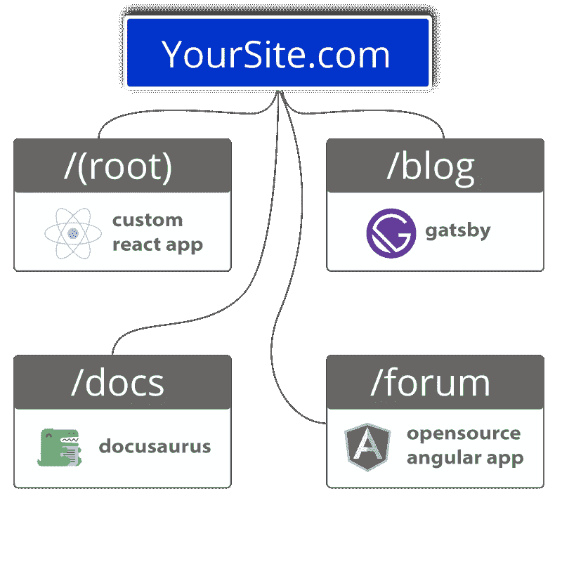

# 通过微前端实现完全模块化

> 原文：<https://javascript.plainenglish.io/go-fully-modular-with-micro-frontends-b68730e3e0c4?source=collection_archive---------13----------------------->

在这个过程中，微前端给自己带来了一个坏名声。

也许这是一个事实，即“值得信赖的”尝试和真正的方式建立网站已经在铁板一块的风格。如果它没坏，为什么要修理它？

有人说微前端是不必要的，过于复杂的东西。其他人担心[应用程序的有效负载大小，这是我们在这里提到的。正如 Martin Fowler 在这里所说，其他人仍然担心测试和生产环境之间的环境](https://www.fathym.com/blog/articles/2022/march/2022-03-31-addressing-micro-frontend-criticisms-payload)[差异。](https://martinfowler.com/articles/micro-frontends.html#Downsides)

很长一段时间以来，微前端的名声一直不好。但这些不是你爸爸的微前端。

## 真正完全模块化的微前端

关于微前端的一个误解是架构的实际工作方式。至少，和我们在一起。

过去——甚至今天——有些人会把一个页面，比如主页，分解成多个部分。这不是我们做微前端的方式。

相反，在完全模块化的方法中，每个页面都是由单独的团队或开发人员创建的。

“每条路线都有自己的 NPM 包或 GitHub repo，”工程总监杰里米·汤姆林森解释道。“这意味着分开队伍。也意味着不再堵！”

我们在您的域中独立托管每一条路由。

对于最终用户，所有的途径(定价、文档等。)似乎所有的东西都是用相同的代码库编写的。

# 模块化的优势

微前端包括:

*   个体的、独立的、较小的前端。
*   多个团队同时从事他们自己的项目。
*   这意味着更小的增量部署。一个团队不会等待另一个团队来推动他们的部署。
*   更小、更有凝聚力的代码库。这也使得它们更容易维护和更改。
*   允许根据需要扩展团队。
*   给予重写的能力，改变或更新前端递增部分。这意味着修复漏洞或改变网站的功能不会迫使网站因维护而关闭。

## 使用多个不同的框架

使用模块化方法的另一个巨大优势是，如果您愿意，每个路线/页面/应用程序都可以用不同的 JavaScript 框架编写。但是，最终用户不知道它是否有反应、角度等。这为开发人员提供了使用新技术的可能性，并根据每个页面/网站的需要进行更好的调整。

为什么一个公司想要在一个网站上使用多个不同的框架？原因是多方面的。

正如 Fathym 首席执行官马特·史密斯所打趣的，“我已经忘记了比我能记得的更多的框架。”

简单地说，外面有很多这样的人。数百个，甚至更多，而且一直在创造。或者，至少，变体可能首先是设计工具，但也可以被翻译成 JavaScript 并使用。

通过所有这些选项，它们可以提供不同的功能，满足不同的需求。开发人员可以自由选择他们认为最适合每个特定应用和路线的产品。

## 团队成员的能力

也许你有一个团队成员不是开发人员，但是他们需要或者想要帮忙。您也可以选择使用静态站点生成器，甚至可以将它们与开发人员完全开发的 JavaScript 框架搭配使用。

使用低级尤其是无代码工具的“公民开发者”的兴起意味着，如果你愿意，几乎任何人都可以建立一个网页或整个网站。我们在这里讨论的模块化架构有助于实现这一切。

这意味着更多人的更多贡献。这些人可能会从外部的角度有一些典型的开发人员可能没有的令人惊讶的想法。

# 结论

多年来，微前端已经有了一个坏名声。

有些人认为它们没有必要。嘿，巨石柱已经存在很久了，如果它没坏，就不要修理它，对吗？嗯，有时那些遗留的代码库和巨石是如此庞大和复杂，人们可能会认为它们已经损坏，需要修复。

其他人不喜欢微前端，因为他们认为它们太复杂。事实上，*一些*微前端架构过于复杂。例如，有些人认为多个团队应该在一个页面上工作，每个团队开发一个独立的元素或功能。那样的话，是的，很复杂。

但这不是我们所说的微前端和“完全模块化”

我们所说的微前端是指*每个页面都是由不同的团队构建和维护的。*比如:首页用 React，文档用 docs，论坛用 Angular，博客用 static site builder Gatsby。

人们可以想象一个科技创业公司，当然有一个主页来解释他们是谁，他们有一个专门的网页来展示他们的技术文档，还有一个用户反馈论坛。然后，随着时间的推移，创业公司意识到他们需要一种更加注重内容的方法来告诉世界他们正在做的所有精彩的事情。所以，现在他们也需要一个博客。

新的内容创建者可以去和盖茨比一起创建博客，而不是让开发人员从其他重要任务中抽身出来。

这说明了微前端的重要性:多个团队可以同时在支持整个项目的不同项目/页面上工作。

对于较小的公司，或者甚至是使用微前端的单个开发人员，存储库可以由一个人管理，他们不必被分配给多个团队。我们的模块化方法[帮助大大小小的团队。](https://www.fathym.com/blog/articles/2022/january/2022-01-20-how-our-microfontends-help-businesses-big-and-small)

更奇妙的是，如果说一个开发者创建了一个[网站，但公司正在扩大规模，](https://www.fathym.com/blog/articles/2022/april/2022-04-29-scale-as-you-grow)他们可以通过使用所有重要的路线来轻松地划分事情，然后分配任务和/或为每个人创建责任。继续扩大规模，每个团队都有自己的职责、目标和目的，这些不仅服务于他们的网站，也服务于整个团队的努力。

试用完全模块化微前端的最佳方式是[今天注册一个免费账户，](https://www.fathym.com/dashboard)然后在未来升级。

【https://www.fathym.com】最初发表于**。**

**更多内容看* [***说白了。报名参加我们的***](https://plainenglish.io/) **[***免费周报***](http://newsletter.plainenglish.io/) *。关注我们*[***Twitter***](https://twitter.com/inPlainEngHQ)*和*[***LinkedIn***](https://www.linkedin.com/company/inplainenglish/)*。查看我们的* [***社区不和谐***](https://discord.gg/GtDtUAvyhW) *加入我们的* [***人才集体***](https://inplainenglish.pallet.com/talent/welcome) *。****