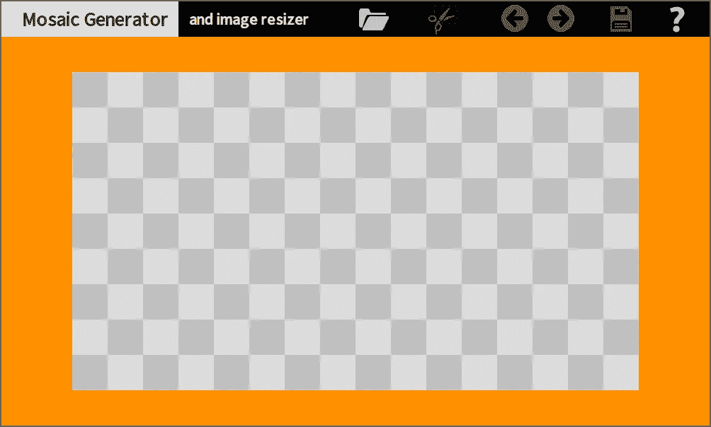
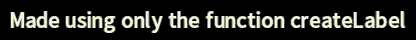
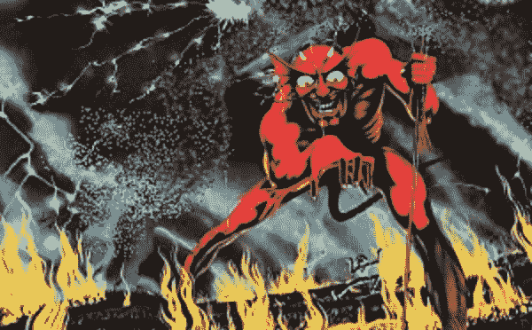

# 再见 HTML。你好画布！

> 原文：<https://javascript.plainenglish.io/goodbye-html-hello-canvas-3cc1b2e7b096?source=collection_archive---------3----------------------->

## 第 6 部分:盒子&开始真正的应用程序

这里可以看之前的文章[。](/goodbye-html-hello-canvas-956cc7d0770f)



Real App Partial Demo

## 介绍

我承诺的这篇文章的内容变得太大了。我只好把**和**分开了。此外，我花了比预期更多的时间来编写代码。我做了很多重构，寻找最好的设计/最大的效用。

我已经完成了整页引擎的代码，比如 BobSprite。然后我意识到，如果我能把引擎转换成模块化的格式，对我们会更有用:一个盒子；你可以把它作为一个特殊网页时代的唯一元素，或者作为一个普通网页的特殊部分(比如视频标签)；实际上，你可以在每个网页上使用很多框。

然后我复活了把所有东西都做成纯帆布风格的想法…而且成功了！使用独立的盒子比服从整体引擎的规则更容易(我已经放弃了)。

眼下， *I* ***还得创造更多的小工具*** 。无论如何，它足以成为今天文章的基础。

## 真正的应用

我为我们的实际应用程序选择了一个带有简单图像版本的马赛克生成器，因为它有用且不常见，并且它的代码不会误导我们对盒子本身的研究。真正的 app 是**还没完成**。

## 图书馆

我尽了最大努力让这个库的使用变得极其友好/直观/安全/不啰嗦。这些目标导致

*   几个功能，有清晰的名称
*   一个清晰简单的应用程序结构
*   没有可选的函数参数(多种编码方式会造成混乱)
*   这个盒子封装了它能封装的所有东西，(几乎)不给你造成内部错误的机会
*   这个库试图**捕捉你可能发生的每一个错误**——它立即停止运行，并在控制台中写入一个**清除消息；该消息总是以“未捕获”开头，后跟 2 个跟踪(“—”)**
*   很少，你必须遵守的简单规则

注意:这个库与以前文章中的描述有些不同。

## (部分)演示

我喜欢单页应用程序。但是我喜欢**单文件**应用；尤其是对于简单的演示。这种格式不利于研究代码，我将在文章的最后解决这个问题。

这个演示是一个 170.1 kB 的单文件应用程序——未压缩；没什么大不了的。除了库和应用程序代码，它还包括嵌入的图像和字体。

这是 [**为演示**](https://storage.googleapis.com/jblate/medium/mosaic-partial-demo.html) 的链接。

这个演示是使用传统的 HTML 元素(

# 、、
)加上两个 GoodbyeHtml 框和一个 GoodbyeHtml **标签**构建的。目的是表明现在我们可以在以下两者之间选择**和**:

*   一个纯粹的 GoodbyeHtml 应用(就一个大盒子，像 BobSprite)
*   一个传统的 HTML 页面，包括尽可能多的 GoodbyeHtml 框

每个盒子仅使用 canvas 元素构建。浏览器只能看到一个画布。但是在内部，有更多的画布来存储和操作图像。它们都被绘制到盒子的主画布上。

今天我们不看库的代码。我们的重点是学习如何使用图书馆。

一些读者担心很难编写基于画布的网页。我希望你会发现使用这个库非常容易。

现在，让我们研究一个真正的(不完整的)应用程序的代码的简化版本。

## 应用程序代码

```
// (embedded fonts here)
// (embedded images here)"use strict"var goodbyefunction main() {
    //
    goodbye = createGoodbyeHtmlLibrary()
    loadResources()
}
```

我们开始创建这个库，并把它赋给一个全局变量，这样它就可以在我们代码的任何地方使用了。

然后我们需要加载资源。

## 加载资源


Loading

我们基于画布的网页就像视频游戏的软件:它需要预先加载所有资源。计算机视频游戏只是从计算机磁盘加载资源。

当我们的应用程序通过 web 加载资源时，我们必须有一种方法在继续之前检查资源是否被加载。

浏览器异步加载资源*，**甚至是嵌入式资源**。*

*这就是为什么我们有一个名为 ***loader*** *的库实用程序。**

```
*function loadResources() {
    //
    const loader = goodbye.createLoader()
    //
    loader.loadFont("black", fontSourceProSansBlack) 
    loader.loadFont("white", fontSourceProSansWhite)
    //
    loader.loadImage("help-black", embededImages["help-black"]) }
    loader.loadImage("load-black", embededImages["load-black"]) }
    //
    loader.ready(resourcesLoaded) // must send a callback
}  

function resourcesLoaded() { // the callback 
    //
    // processing the images, if needed
    // (more code here)*
```

*请注意，使用加载程序需要 3 个步骤:*

*   *创建加载程序*
*   *要求加载所有资源*
*   *告诉加载器没有更多的资源要加载，哪个是回调函数(在我们的代码中，加载器将在所有资源加载后调用这个函数)*

*加载的资源存储在名为 ***allFonts*** 和 ***allImages*** 的库变量中。*

*注意:本系列的第二篇文章讲述了如何创建字体。*

## *其他库实用程序*

*目前，除了 *createLoader* 之外，GoodbyeHtml 库还有这些实用函数: *cloneImage* 、 *createCanvas* 、 *fadeImage* 、 *createCheckerboard* 、 *negativeFromImage* 、 *createLabel* 、 *calcTextLength* 和 ***createBox* 、**。*

*例如，使用 *fadeImage* 我们可以从一个正常的按钮图像创建一个禁用的按钮图像:*

```
*const disabled = goodbye.fadeImage(original, "black", 0.40)*
```

*另一个例子:有时我们有白底黑字的图标；点击时会变成白底黑字的图标——反之亦然。当一组和另一组完全相反时，我们不需要加载两组图标。我们可以使用*negative romimage*，它同样适用于字体表的。*

```
*const whiteIcon = goodbye.negativeFromImage(blackIcon)*
```

**

*Original, Negative, and Faded*

## *GoodbyeHtml 标签*

```
*const label = goodbye.createLabel("white", "black", 10,10,5,5, "My label")*
```

*GoodbyeHtml 标签是一个图像(更准确地说，是一个画布)，您可以将其视为任何其他图像。其参数是:*

*   *要使用的字体的 id(字符串)*
*   *背景颜色(字符串)*
*   *左填充(整数)*
*   *右填充(整数)*
*   *顶部填充(整数)*
*   *底部填充(整数)*
*   *文本(字符串)*

*你不直接选择宽度和高度。宽度和高度是所选字体和填充的结果。*

**

*A GoodbyeHtml Label*

## *函数的参数*

*没有可选参数:没有调用函数的替代方法。这种设计让你轻松掌握本库。*

*此外，我试图使库中的参数结构非常标准，并与常见模式兼容。*

*所有坐标/尺寸格式为 ***左、上、宽、*** 和 ***高*** 。*

*有一个例外；有一种情况下，参数的工作方式与您想象的一样:标签的填充:它们与可怕的 CSS 模式不匹配。*

*用于填充的 GoodbyeHtml 模式*开始*喜欢通用模式。*

*从左边的 ***到左边的*** 开始。然后它期望 ***对***；因此很容易将文本*水平放置/居中*。*

*接下来是 ***顶部*** 填充，接着是 ***底部*** 填充；使文本*垂直*定位/居中变得容易。*

## *CSS 疯狂和虐待狂一瞥*

*我们为什么去上学？我们上学是为了学习对我们以后的生活非常有用的模式；因为其他人都在学习同样的模式。*

*例如，绿色标志表示*前进，*红色标志表示*停止*。*

*另一个例子是笛卡尔坐标:X 和 Y；通常被翻译为左和上。这是普遍的模式。*

***x 坐标总是在最前面，然后是 y 坐标。***

*我们可以定义一个矩形，告诉它的左上角和右下角: ***左*** ， ***上*** ， ***右*** ， ***下*** (或*左、上、宽、高*)。*

*我们到处都能看到这种情况，这不仅仅是一个编程问题。是数学！*

*但是，进入 CSS 并说，“*忘记你所学的一切。真正的坐标系是* ***上*** *，* ***右*** *，* ***下*** *，* ***左****

**

*Iron Maiden — The Number Of The Beast*

*上面我们看到了一张 CSS 创作者的照片，当时他 2 岁，正在玩他最心爱的木偶:一个快乐而天真的 web 开发者。*

*除了与宇宙模式相冲突之外，它还是一派胡言。它不像水平-先-垂直-后，这是有意义的，并尽可能遵循普遍模式。*

*在那个曾经折磨自己(学习 CSS)的年纪，我已经记不住那个愚蠢的“模式”了。然后有一天，看了一本 CSS 的书，发现了一个帮助我记忆“模式”的窍门。*

*是啊！CSS 不是一种语言；这是一个又臭又粘的模糊技巧包。*

*骗术就是字 **TR** ou **BL** e .不得不承认这是我这辈子见过的最老实的骗术。*

## *创建一个盒子*

```
*const parent = document.getElementById("first-box")const box = goodbye.createBox(1000, 600, parent)*
```

*创建一个框需要 3 个参数:宽度、高度和放置框的 HTML 容器。*

*你没有附加盒子。**框追加自身**。一个更简单的例子:*

```
*const box = goodbye.createBox(1000, 600, document.body)box.setBgColor("#084d6e")*
```

*这个盒子公开了 4 个方法: *setBgColor* ， *initLayers* ， *exchangeLayers，*和 *getLayer* 。*

## *创建层*

```
*// initLayers returns nothingbox.initLayers(["base", "over", "help", "alert"])*
```

*现在，盒子的所有层都被定义了。图层会自动附加到框中。*

*您不能更改或添加层。你只能改变两件事:*

1.  *每层的可见性*
2.  *各层的顺序*

*允许您删除和添加层将会降低代码的可读性和可维护性，因为您可以在代码中的任何地方这样做。此外，这些功能不是必需的。*

```
*box.exchangeLayers(["help", "over", "base", "alert"]) // OKbox.exchangeLayers(["help", "over", "help", "alert"]) // error// message in console:Uncaught -- wrong argument ids for function box.exchangeLayers: duplicated item: help*
```

*函数名为 *initLayer* ，而不是 *createLayer* 是有原因的:它不返回“layers”对象。你必须使用每一层的 **id** (字符串)。*

*图层对象有 5 种方法: *createPanel* 、 *show* 、 *hide* 、 *visible、*log。*

```
*const a = box.getLayer("alert") // returns a layer objecta.hide()
a.show()a.log()let visible = a.visible()*
```

*注意:层没有左/上坐标、宽度、高度或背景颜色。其实是虚拟层。*

## *创建面板*

```
*const layer = box.getLayer("base")const panel = layer.createPanel(0, 0, 1000, 50, "black")

panel.paintRect(0, 0, 250, 50, "white")panel.setFont("black")panel.write(30, 10, "Mosaic Generator")*
```

**createPanel* 的参数是**经典**左、*顶*、*宽*、*高*——和*背景颜色*。*

*在创建过程中，面板会自动附加到其图层上。并且检查两次:*

1.  *如果它完全适合放在盒子里*
2.  *为了与同一层中的其他面板碰撞*

```
*const layer = box.getLayer("base")const panelA = layer.createPanel(0, 0, 100, 50, "black")const panelB = layer.createPanel(99, 0, 100, 50, "red") // error// message in console:Uncaught -- panel 2 clashes with panel 1 in layer base*
```

*面板对象有一些方法(后面还会有更多):*隐藏*，*显示*，*设置字体*，*写入*，*清除*，*绘制*，*绘制图像*，*设置颜色*，*创建按钮*，*创建表面，*和*记录*。*

*注意:在面板上书写和绘画不会创建小部件；因此，没有关于装配和碰撞的检查。*

## *创建按钮*

```
*const buttonOk = panel.createButton(460, 350, 68, 50, "dimgrey")const img = goodbye.createLabel("white", "black", 20, 20, 10, 10, "OK")buttonOk.setImageNormal(img)buttonOk.setOnClick(function () { box.getLayer("alert").hide() })*
```

*创建按钮几乎是创建面板的翻版。*

**createButotn* 的参数为**经典**左、*顶*、*宽*、*高*—*bgColor*。按钮的位置相对于它的父节点:面板(而不是盒子)。*

*在创建过程中，按钮会自动附加到其面板上。并且检查两次:*

1.  *如果它完全适合面板内部*
2.  *对于同一个面板中的其他部件的碰撞*

```
*const b = panel.createButton(460, "black", 68, 50, "grey") // error// message in console:-- wrong argument top for function panel.createButton: expecting integer >= 0, got string: black*
```

*在当前阶段，库不会自动在按钮中插入文本；我们必须手动进行。*

*按钮对象有这些方法:*隐藏*，*显示*， *setImageNormal* ， *setImageActive* ， *setImagePressed* ， *setImageDisabled* ， *disable* ， *activate* ， *normalize* ， *setBgColor* ， *setOnClick 【T57**

## *该按钮声明*

*GoodbyeHtml 按钮有 4 种状态，您可以为每种状态设置一个图像:*

*   *常态*
*   *禁用(不做任何事情)*
*   *active(必须调用 button . activate)——表示已经被点击，某些状态已经改变；再次单击它会使按钮变为正常状态，并且状态会变为先前的值*
*   *按下—表示它收到了鼠标按下事件，并且正在等待鼠标抬起事件产生单击事件*

**

*Normal, Active, Disabled, and Pressed*

*如果在按钮被按下时鼠标离开按钮，则按下状态被取消，并且未来的点击事件被中止，以避免接受伪点击。您应该在演示中尝试一下。*

*对于按钮，您只能侦听 click 事件。所有其他鼠标事件仅在内部处理。*

## *创建表面小部件*

*创建曲面就像创建按钮一样。表面是一个原始的小部件，非常可定制。它的目的是给你自由去做你通常不能做的事情，因为盒子的刚性/安全结构。*

*我们现在没有时间讨论表面。想象一下，一个特殊的层包含一个面板，透明的背景，覆盖整个盒子。这个面板只有一个小部件，一个透明的背景表面，也完全覆盖了盒子。在这种情况下，你可以在任何地方画任何东西…你可以有更多像那样的特殊图层。*

*对于 surface，您必须直接侦听所有鼠标事件，click 事件除外，该事件不可用。您已经听到了鼠标按下和鼠标抬起事件。我们不要多此一举。*

## *等级制度*

*库>框>层>面板>小部件*

*就这么简单。*

1.  *你创建了图书馆。*
2.  *您使用库实用程序，包括 *createBox* 。*
3.  *从盒子中，你创建层。*
4.  *从每一层创建面板。*
5.  *您可以在每个面板中创建小部件。*

*这不像在 JavaScript 中创建 HTML 对象，首先创建它，然后将它附加到某个容器中。或者忘了做。或者做两次(同一个容器与否)。*

*GooodbyeHtml 中没有丢失的小部件。*

*不知道你是什么感受；但是，对我来说，没有比这更简单/健壮/容易/直观/快速/可读/可维护的了。*

## *接下来会发生什么*

*我要在库中包含更多的特性(包括键盘处理)，发布到 GitHub 上，文档化，完成马赛克生成器。*

*下一个演示的应用程序代码将与库和嵌入式资源分开，适合学习体验。*

*这是 [**系列**](https://joanaborgeslate.medium.com/goodbye-html-hello-canvas-bccba5601085) 下一篇的链接。*

**更多内容看* [***说白了就是 io***](https://plainenglish.io/) *。报名参加我们的* [***免费周报***](http://newsletter.plainenglish.io/) *。关注我们关于*[***Twitter***](https://twitter.com/inPlainEngHQ)*和**[***LinkedIn***](https://www.linkedin.com/company/inplainenglish/)*。加入我们的* [***社区不和谐***](https://discord.gg/GtDtUAvyhW) *。***