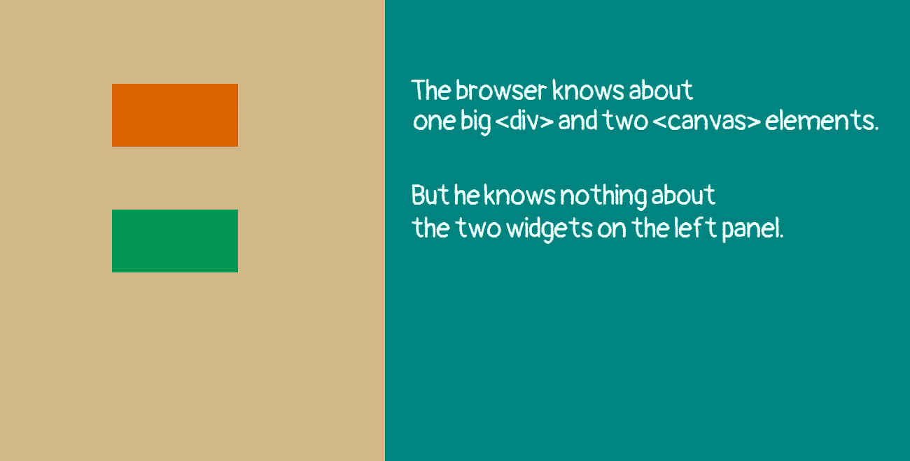
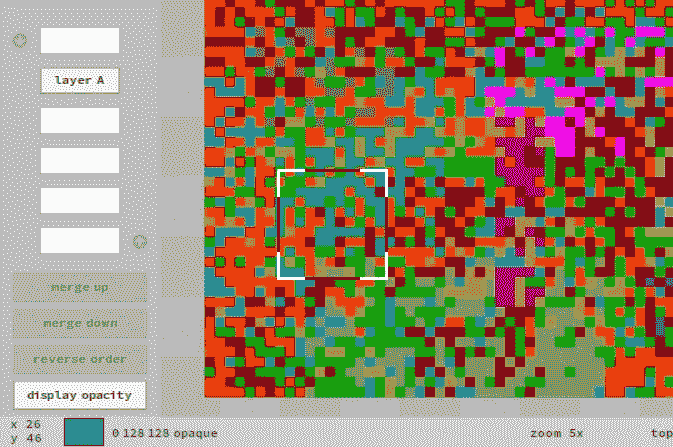

# 再见 HTML。你好画布！

> 原文：<https://javascript.plainenglish.io/goodbye-html-hello-canvas-956cc7d0770f?source=collection_archive---------9----------------------->

## 第 5 部分:动态架构和初始化

这里可以看之前的文章[。](https://joanaborgeslate.medium.com/goodbye-html-hello-canvas-f3935aec3a05)



Explaining The Last Demo

## 回顾

嗯，在上一篇文章的演示中，我们通过改变*小部件*的颜色和改变*虚拟层*的顺序(这意味着改变每个画布的CSS *z-Index* 来对*小部件*上的鼠标按下事件做出反应——画布是心脏，是*面板的实质)*。

CSS *z 向索引*？我们是否正在告别 HTML/CSS？除了标签 *html* 和*正文*之外，库使用的**头罩下的**，只有两种 html 元素:

*   *div* : 刚好一次，为*阶段*
*   *画布*:每个面板一张

并且，对于这两种 HTML 元素，该库使用基本的 CSS 属性，如 *left，top，*和 *z-Index* 。只是你不直接和他们打交道。

只有画布(在*面板*内)接收浏览器提供的鼠标事件**。*小部件*接收由库**创建的鼠标事件**。**

```
myWidget.onmousedown = function (e) { 
    console.log("mouse down") 
}
```

myWidget 不是一个 HTML 元素，但是你可以像对待它一样对待它。小菜一碟；)

# 动态建筑

当我们考虑静态架构和动态架构这两个名称时，我们不应该忘记我们在谈论一个运行在浏览器内部的*引擎，它具有动态的性质。一个真正的静态架构不可能产生上一个演示中的那两个简单的动画。*

## 直接的回应

我们制作了这些动画，通过**直接响应**鼠标事件。这个简单又好。但这还不够，随着应用程序的增长，这可能会成为一个问题。

当我们需要定时动画，比如闪烁的光标时，直接响应是不够的。

直接回应是**一个问题**当……嗯，最好的解释方式是使用真实案例(但要简化内部细节)。



Pixel Monitoring In BobSprite

BobSprite 的一个特性是总是给出关于鼠标下的像素(光标中心)的反馈:位置(X，Y)，颜色样本和 RGBA 值(“不透明”意味着 alpha 值为 255)。此信息出现在应用程序的左下角。

使用直接响应，我们会这样做:

```
// simplified codepicture.onmousemove = updatePixelInfofunction updatePixelInfo(e) {
    const x = e.offsetX
    const y = e.offsetY
    const rgba = getPicturePixel(x, y)
    printPixelInfo(x, y, rgba)
}
```

很好，但我们还需要重新绘制应用程序，因为光标(黑白框)会随着鼠标移动:

```
// simplified codepicture.onmousemove = mouseMoveHandlerfunction mouseMoveHandler(e) {
    const x = e.offsetX
    const y = e.offsetY
    //
    repaintApp()
    updatePixelInfo(x, y)
}function updatePixelInfo(x, y) {
    const rgba = getPicturePixel(x, y)
    printPixelInfo(x, y, rgba)
}
```

好的。但现在我们有一个问题，因为 *repaintApp* 很慢(实际上 *repaintApp* 是 BobSprite 中最慢的功能)，用户可能会非常快速地移动鼠标，**过载** *repaintApp* ，使应用程序响应速度变慢，甚至出现小的冻结。

我们还没有绘画(这涉及到更多的处理，包括记忆)，只是移动鼠标。

除此之外，还有很多改变画面的键盘命令(比如“R”代表旋转)。每个都必须调用 *repaintApp* 和 *updatePixelInfo* 。但是 *updatePixelInfo* 期望接收一个**鼠标事件**，并且我们有一个**键盘事件**。

直接响应的最大问题是它会引发一连串的函数调用。

*当函数链为* ***线性****(A>B>C>D)且不与另一个函数链*冲突时，没什么大不了的。

对于绘图工具来说，冲突是存在的，函数链变得错综复杂。在应用程序中引入新特性意味着打破并重新创建旧的功能链(大重构)。此外，还有一个非常重要的冗余问题:例如，我们可以很容易地调用 *repaintApp* ，次数超过了必要的次数。

因此，**依赖于**你的应用程序的种类，使用鼠标和键盘事件的直接响应意味着，在**最好的场景**中，创建变通办法并使我们的代码变得一团糟，**很难维护**。

## 间接反应

解决方案是采用**间接响应**模式，它也处理像闪烁光标这样的动画。

```
// simplified codevar mouseX = -1
var mouseY = -1var shallRepaint = false
var shallUpdatePixelInfo = falsepicture.onmousemove = mouseMoveHandlerfunction mouseMoveHandler(e) { 
    mouseX = e.offsetX
    mouseY = e.offsetY
    //
    shallRepaint = true
    shallUpdatePixelInfo = true
}function updatePixelInfo() { // no parameters!
    //
    const rgba = getPicturePixel(mouseX, mouseY)
    printPixelInfo(mouseX, mouseY, rgba)
}function mainLoop() { 
    //
    manageBlinkingWidgets()
    //
    if (shallRepaint) { 
        repaintApp()
        shallRepaint = false
        shallUpdatePixelInfo = true 
    }
    //
    if (shallUpdatePixelInfo) {
        updatePixelInfo() // no arguments!
        shallUpdatePixelInfo = false
    }
    // the browser provides this timer
    requestAnimationFrame(mainLoop) 
}
```

关于新代码风格的一些说明:

*   只有一个函数调用昂贵的 *repaintAPP*
*   冗余不再是**的问题；任何地方的任何函数都可以标记出 *repaintApp* 应该被调用而不用担心，因为它只是设置一个布尔值( *shallRepaint = true* )，这是世界上最便宜的过程**
*   此外， *updatePixelInfo* 没有冗余问题；它是基于标志的，如 *repaintApp*
*   一个键盘事件仍然不知道鼠标的位置；并且它不需要知道，因为它将**不调用函数** ( *updatePixelInfo* )，它将**设置标志**(*shall updatePixelInfo = true*)
*   *mouseMoveHandler* 结束，不调用任何函数；我们处理鼠标事件**，而不需要**启动函数调用的**链**！
*   虽然 *requestAnimationFrame* 使循环运行，在 **general** 中，每秒 60 次，应用程序是经济的，因为标志的使用跳过了此刻不需要的过程

这是一个笼统的概念。该库使用 *requestAnimationFrame* 并给出句柄来连接你的回调。在另一篇文章中有更多关于这方面的内容。

# 初始化

当我们创建一个 HTML/CSS 页面时，我们不需要太在意加载资源。我们只需**声明**“将这张照片放在这里”、“使用 ABC 字体”、“用这个 CSS 表单设计按钮的样式”…

浏览器为我们打理一切。虽然没有加载 ABC 字体，但它使用了一些占位符字体。加载 ABC 字体后，它会用 ABC 字体替换占位符字体。

这种策略有时对用户来说有点奇怪。几秒钟后，当有人正在阅读页面时，字体(甚至布局)发生了变化。我没有抱怨。这是事实。其实我觉得这是正确的策略。糟糕的策略是在所有资源加载完毕后才显示页面。

我们基于画布的应用程序的初始化是不同的。为了打印文本，我们需要首先加载字体表。图标也是如此。这是一个要么全有要么全无的策略:

*   我们在显示东西之前加载所有东西，我们不关心填补空白(立即显示内容，使用临时资源)
*   我们可以改变*舞台*的背景颜色，向用户证明有事情正在发生
*   我们非常注意要加载的文件数量和每个文件的大小；我们将图像打包在一张纸上，并将所有 JavaScript 代码打包在一个文件中

记住，我们正在创建一个特殊的应用程序。新来的人不应该首先访问这个页面。他应该登陆网站的主页。他可以等两秒钟。

加载图像后:

1.  字体和图标被打开
2.  接口已安装
3.  鼠标/键盘事件监听器被激活
4.  主循环开始运行

```
var numberOfResourcesToLoad = 0function main() {
    //
    loadImages() // manages numberOfResourcesToLoad
    //
    recoverDataFromLocalStorage() 
    //
    main2()
}function main2() {
    //
    if (numberOfResourcesToLoad == 0) { afterLoadResources(); return }
    //
    setTimeout(main2, 30)
}function afterLoadResources() {
    //
    initFonts()
    initIcons()
    initInterface() 
    //    
    initMouseListening()
    initKeyboardListening()
    mainLoop()
}
```

## 下一步是什么

今天，我们学习了基于画布的页面的更多基本概念。关于**键盘事件处理**我们还没有谈(足够多)。此外，我们没有演示。

在讨论键盘事件处理和运行演示之前，我们需要用于文本输入的小部件；因为键盘事件处理都是关于**焦点**(哪个小部件是击键的目标)。用于文本输入及其操作(包括闪烁光标)的小部件是引擎中最复杂/最难的部分。简单的演示是不够的。

因此，我决定下一个演示/文章:

*   将演示焦点和键盘事件处理
*   将是一个完整的应用程序，具有一些**有用的**功能
*   将**发布**库的第一个版本，准备使用

这是本系列下一篇文章 的 [**链接。**](https://joanaborgeslate.medium.com/goodbye-html-hello-canvas-3cc1b2e7b096)

*更多内容看* [***说白了。报名参加我们的***](https://plainenglish.io/) **[***免费周报***](http://newsletter.plainenglish.io/) *。关注我们关于*[***Twitter***](https://twitter.com/inPlainEngHQ)*和**[***LinkedIn***](https://www.linkedin.com/company/inplainenglish/)*。加入我们的* [***社区***](https://discord.gg/GtDtUAvyhW) *。****