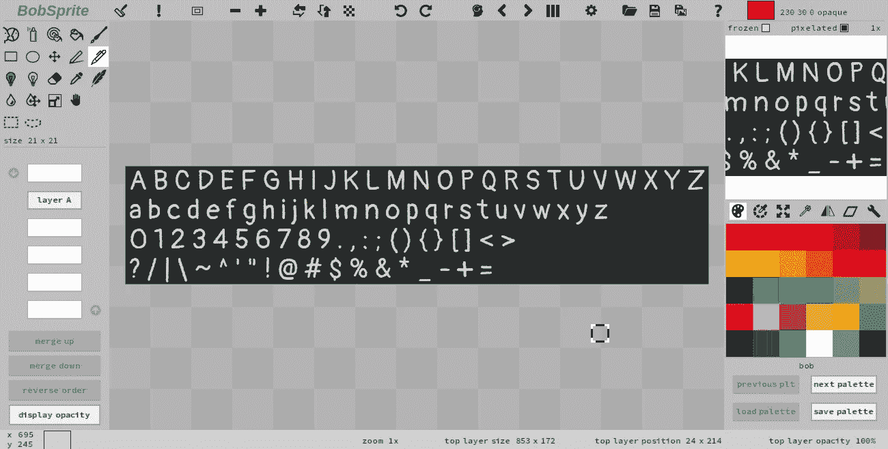
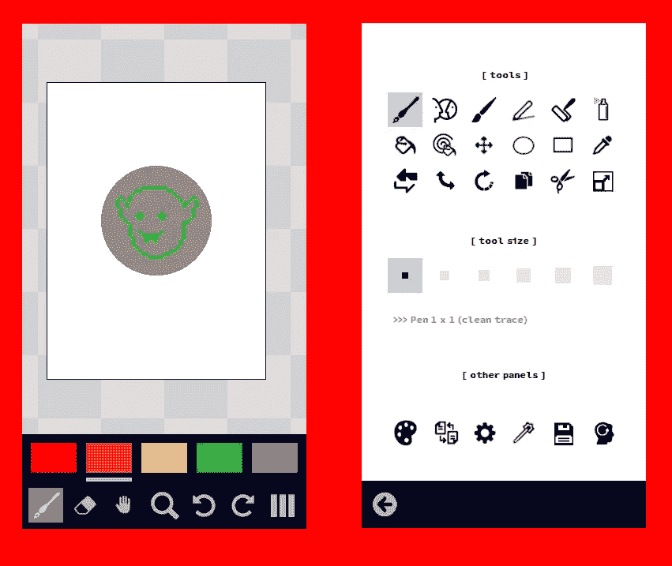

# 再见 HTML。你好画布！

> 原文：<https://javascript.plainenglish.io/goodbye-html-hello-canvas-b44ae0ba85b8?source=collection_archive---------2----------------------->

## 第 3 部分:总体战略和基本架构

可以在这里阅读本系列[的上一篇文章。](/goodbye-html-hello-canvas-d9e62e2e0cfe)



BobSprite For Laptops

## 图书馆

我必须感谢所有回复批评本系列文章主题的读者，因为他们的帖子让我改进了文章。尤其是，它们让我意识到我错过了非常重要的东西:图书馆。

如果没有这个库，这个系列文章最好的结果就是“*”我曾经读过一个有趣的概念，关于纯粹用画布制作一些 web 应用程序。简单的演示看起来效果不错。但是这意味着大量的工作和*(对于大多数开发人员)*我不习惯玩画布。对我来说不值得*”。

本系列的最后一篇文章**将发布**一个非常友好的、高级的、直观的、轻量级的、只有一个文件的 JavaScript 库，它将使一切顺利运行。**开发者将不需要编写“ *canvas* ”，甚至一次都不需要！**

敬请期待；)

## 一些考虑

有人向我指出了画布方法的一些缺点:

1.  没有搜索引擎优化(因为文字是图像)。没错。也许我们将来会找到一个解决办法。
2.  浏览器不进行语言翻译。没错。虽然谷歌、Mozilla、微软、AWS 都不依赖浏览器翻译。他们为目标语言生成每个页面的版本。但是好吧，我们有小网站；自动翻译将为我们节省大量时间和金钱。此外，当前版本的 Chrome(用于我的桌面)不再干扰旧应用程序的菜单按钮(我不知道其他浏览器 X 设备)。
3.  我们必须提供字体表，这是更多的流量和客户的缓存更多的东西。没错。但并不多。我们把它们放在一个包装里。
4.  屏幕阅读器没有机会。没错。但是我们使用画布作为按钮和其他控件的标签。它不应该用于(长)文本。总之， [*ZIM*](https://drabstract.medium.com/your-guide-to-coding-creativity-on-the-canvas-ada0996298f6) 通过将 HTML 文本放在画布后面来处理屏幕阅读器。
5.  我们不能放大，这对可访问性不好。实际上，我们可以放大和缩小它，而不会破坏布局或任何功能；只是人物形象会不好看。
6.  这意味着大量的工作。这就是为什么我将发布一个库来处理所有这些东西的原因。
7.  页面不会自动调整到不同的屏幕尺寸。这只取决于我们如何编程。

# 总体战略

黄金法则是 ***只要适合你，就坚持使用 HTML/CSS。***

需要时使用画布方法。当您想要绝对确定每台设备上的每个浏览器都会准确显示您计划的内容时。当你的 app 要求更高的时候。见本回复作者 [**汉斯·加隆**](https://medium.com/@hcgaron?source=user_profile----------------------------------------) **:**

我用 canvas 完整地绘制了一个网页，主要是因为它的用户界面模仿了原生应用程序的用户界面，并且需要许多(成千上万)特定小部件的实例，这些小部件的属性在不断发展。这对于浏览器来说是不可能的。但是，放入数据结构相对容易，甚至可以传递给 wasm 模块进行更新，然后发送到 canvas 进行绘制。

首页要用 HTML/CSS:***SEO 没问题，自动翻译没问题，屏幕阅读器没问题。***

对于画布风格的应用程序，我们将需要至少 3 个不同的版本(小，平均，大屏幕)。最健壮的方法是创建不同的页面(或者选择正确 JavaScript 文件的页面)。我不会为所有场景创建一个 JavaScript 代码，太乱了！

有意义的是定义一些布局，这些布局将完美地匹配一些屏幕，并且相当好地匹配其他屏幕。

例如，我们创建了一个与 IPhone5 屏幕完美匹配的版本。如果用户的设备很旧，屏幕较小，他会使用滚动条。如果设备的屏幕比 IPhone5 的屏幕大一点，应用程序将居中显示，不会缩放。缩放应用程序始终是可能的(绝不会破坏布局)。只是，缩放不会自动发生。



Two Faces Of BobSprite For Smartphones

# 基本架构

不再废话连篇！

## 身体

为了简单起见，我们将只创建一个假想应用程序的版本。而它的机身将会是 ***1300px 宽***660 像素高。对于笔记本电脑来说，这是一个很好的尺寸，适用于高分辨率屏幕的台式机；但对智能手机来说却失败了。因为我们是开发人员，所以我们只有一台电脑来工作。

## 元素

我们的元素类似于 HTML 元素(标签)。身体不被认为是一个元素，它是身体，最终的容器。

## 这些层

我们不能在正文中添加任何元素。我们将元素添加到层中。当一个层被创建时，它被自动附加到主体上(所有层*列表)。显然，我们也可以删除层并改变它们的顺序(毕竟， *allLayers* ，只是一个列表)。*

层内的元素不能相互重叠。

```
const allLayers = [ ]function createLayer(id) {
    //
    const layer = new Layer(id)
    Object.seal(layer)
    //
    allLayers.push(layer)
    return layer
}function Layer(id) {
    this.id = id
    this.visible = true
    this.left = 0
    this.top = 0
    this.width = 300
    this.height = 200
    this.opacity = 1
    this.background = null // "white"
    // more attributes here
    this.elements = [ ]
}
```

引擎按照图层在列表中的顺序打印图层*所有图层*。但是以相反的顺序应用鼠标事件。

在 CSS 中，相当于我们的图层概念的是 ***z-index*** 属性。

我不喜欢 CSS *z-index* 属性，原因有三:

1.  与 CSS 中的所有东西一样，定义可能分散在各处。我看不到“大局”。所以，我不放心一切都好。
2.  当我想插入一个新的层时，我可能不得不重新索引许多其他元素。不仅仅是工作；这是引入 bug 的风险。
3.  *z-index* **只对定位元素(位置:绝对、位置:相对、位置:固定或位置:粘滞)和伸缩项(显示的直接子元素:伸缩元素)起作用**。

是啊！CSS 对我来说太复杂了。

在下一篇文章的[中，我们将有一个关于身体/层/元素的演示，我们将处理鼠标事件！](https://joanaborgeslate.medium.com/goodbye-html-hello-canvas-f3935aec3a05)

*更多内容看* [***说白了。报名参加我们的***](https://plainenglish.io/) **[***免费周报***](http://newsletter.plainenglish.io/) *。关注我们关于*[***Twitter***](https://twitter.com/inPlainEngHQ)*和*[***LinkedIn***](https://www.linkedin.com/company/inplainenglish/)*。加入我们的* [***社区***](https://discord.gg/GtDtUAvyhW) *。***