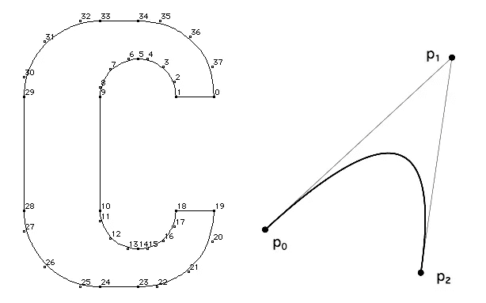
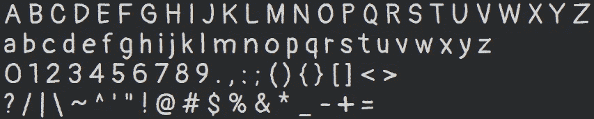

# 再见 HTML。你好画布！

> 原文：<https://javascript.plainenglish.io/goodbye-html-hello-canvas-d9e62e2e0cfe?source=collection_archive---------1----------------------->

## 第 2 部分:在画布上打印字符

可以在这里阅读本系列[的上一篇文章。](/goodbye-html-hello-canvas-part-1-92f750961666)


Photo by [Mitchell Luo](https://unsplash.com/@mitchel3uo?utm_source=medium&utm_medium=referral) on [Unsplash](https://unsplash.com?utm_source=medium&utm_medium=referral)

# 重要编辑:

读者[迈克·本德](https://medium.com/@mikebender_deephaven)，写了这样的回复:

> 这篇文章的前提“画布函数 fillText…质量差”是不正确的。您完全可以使用 fillText 在画布上绘制文本，并使用子像素着色获得清晰的文本。您所需要做的就是在创建上下文画布时设置选项{ alpha: false }，然后浏览器将优化呈现。

我做了初步试验，证明他是对的。但是将 alpha 设置为 false 会禁用半透明颜色的打印。如果您需要这两个特性，解决方案将涉及两个重叠的画布:一个标准画布，另一个仅用于 fillText 函数。无论如何，它**会比关于当前文章文本的提议**更简单。

# 澄清！

本系列的第一篇文章有一些强有力的回复；基本上，有着同样的担忧。所以，我意识到我应该在继续之前为大家澄清一下:

1.  尽管这个文章系列的标题是，在 ***没办法*** *我是在告诉人们离开 HTML 和 CSS* 。HTML 和 CSS 是 99.9%的情况下的必经之路(并不是说我喜欢它们)。
2.  当要呈现一个保持**相同布局** **和各处观感**的表格(表格数据)时，我知道我可以依靠图像。我的意思是在标准 HTML 和 CSS 中使用图像，只在必要的时候使用。也许我将需要不同版本的表格(图片)用于不同的屏幕和可访问性问题。
3.  和其他软件一样，浏览器也不是没有漏洞的。即使是 Chrome 在处理它不习惯的东西时也可能表现得很糟糕；比如翻译用 JavaScript 编写的 HTML 元素的复杂结构的页面。
4.  浏览器是为你自动调整的。但是你不能完全控制每个设备和浏览器的最终外观。你可以实现完全的控制，在任何地方保持精确的外观，但是有一个**代价要付出**。在 99.9%的情况下这是不值得的。
5.  我写这些文章是为了 0.1%的案例。
6.  使用画布非常有效。
7.  JavaScript 代码并不难，可以重用，而且“很短”——在压缩成(不太简单的)绘图工具之前只有 412 kB。

## 更多说明

我认为我创造了一个如此大胆的标题(我的错)，以至于有些人在开始回复之前几乎没有阅读整篇文章。

总的来说，读者开始回答基于画布的应用程序*不能工作*；他们写了“*求求你，不要这样做*”、“*这是某种精心的讽刺*”、“*只要没见天日*”(我很喜欢这个；)…

我回答了他们，解释(再次)我的意思，并(再次)指向像素艺术绘图工具的链接([这是主页，不是 app](https://www.bobsprite.com/) )。然后他们开始表现出更准确的担忧。但是一些*把这个特定应用程序的当前版本的细节作为技术的固有缺陷*:

1.  "*缩放画布(缩放整个应用程序)会使打印在画布上的文本有点模糊。*“—你缩放过 Gimp、Inkscape、MS Paint 或者 PhotoShop 吗？仅仅因为浏览器允许缩放整个应用程序并不意味着你应该这样做。
2.  我有高分辨率的大屏幕。因此缩放应用程序将是一件好事。”—好的。在这种情况下，我们必须改进代码来很好地处理这种屏幕。这意味着有更多的工作要做？当然可以。我之前说过，这是要付出代价的(但结果是完美的)。
3.  "*此应用程序不适用于智能手机。*”—真相。但是这和是否基于画布没有关系。每个版本的绘图工具(无论是否基于浏览器)都可以在智能手机或电脑上运行，但不能同时在两者上运行。
4.  "*你忘了* ***无障碍*** *(通过不允许更大的字体)。*“—不一定！没有任何东西禁止你创建一个按钮，使应用程序适合有辅助功能问题的人。不仅仅是字体大小的问题，还有颜色、简化/特定版本等等。那就太好了！
5.  "*当我打开控制台时，它覆盖了应用程序的一部分。* " —它不应该与开放的控制台一起使用。

你可以通过一个基于画布的应用程序获得完全的控制权。你可以让它适合不同的屏幕，适合有无障碍问题的人。这只是更多的工作。很多时候是不值得的。有几次真的很有必要。

**重要编辑**:我写这篇文章的时候，并没有意识到无障碍也包括盲人；这意味着与屏幕阅读器兼容。这个问题将在下一篇文章中讨论。非常感谢善良的读者，他们与我战斗，直到我明白。

## TrueType 字体

[来自微软文档](https://docs.microsoft.com/en-us/typography/truetype/):TrueType 字体技术由两部分组成:字体本身的描述(TrueType 字体文件)，以及读取字体描述并生成位图的程序(TrueType 光栅化器)。



Letter C “inside” .ttf File — A Bezier Curve

*ttf* 字符被记录为数学公式(贝塞尔二次曲线)。因此，它们可以很容易地以高质量进行缩放，并转换为图像(位图——像素/字节的数组)。

对我们来说重要的是，当浏览器显示带有文本的标签时，它只是在屏幕上打印字符(位图图像)。它的工作原理类似于画布函数 *drawImage* 。

## 字体的画布策略

不幸的是，正如我们在第一篇文章中看到的，画布函数 *fillText，*虽然容易使用，但质量很差。这就是为什么我们将使用函数 *drawImage* 作为我们自己的打印文本函数的基础。轻松点。

而不是直接用一个高度精密，非常令人佩服的*。ttf* 文件，我们将创建**不起眼的**但非常有效的字体表。

为了打印出与 HTML 相同质量的文本，我们将需要一个**专用的字体表** **，用于字体系列、字体大小、字体粗细、字体颜色、背景颜色和字体样式(斜体)的每种组合**。

看起来我们需要几十个字体表，但是实际上，几个字体表就足够了。

如果我们希望应用程序在更高分辨率的屏幕上看起来更好，或者我们正在解决**可访问性**问题，我们需要创建具有更大字体大小的字体表。

# 创建字体表



“Pangolin” Font Sheet

> 那么，如何实现同样质量的 HTML 文本呢？HTML 文本将是我们的来源！

我们使用他的在线工具来创建字体表。我们可以选择:

1.  字体大小
2.  字体粗细
3.  行高
4.  斜体与否
5.  字体颜色
6.  背景颜色

对于字体家族，我们必须编辑工具(网页)的 CSS 代码。

然后我们截取一个截图，并使用一些图像编辑器，从截图中剪切出字体表，保存为一个 *png* 文件。正如我之前说过的，这是一个不起眼的工作，这里的目的是用每个人都可以使用的方法来证明一个概念。

# 测试字体表


Testing The Font Sheet

现在我们使用另一个在线工具[来测试字体表](https://storage.googleapis.com/jblate/medium/test-font-sheet.html)。我们需要做的就是加载字体表( *png* image)并开始在键盘上打字。

你不需要创建一个字体表来使用这个工具。把上一节的图片(穿山甲字体表)保存在电脑上就行了。

当您运行这个工具时，您会意识到在画布上高质量地打印文本是多么容易。

## 它是如何工作的

基于先前建立的符号序列(“ABCDE……”)，该工具逐行扫描字体页(图像)的像素，搜索符号之间存在的空白列，以便识别该行中每个符号的开始和结束；为每个符号创建一个小画布，并将其放入字体字典中。简单快捷！

字体(字典)完成后，我们可以非常容易地在画布上打印文本:

```
function writeTextOnCanvas(context, font, txt, left, top) {
    //
    for (const c of txt) {
        if (c == " ") { left += font["."].width; continue }
        //
        const cnv = font[c]
        context.drawImage(cnv, left, top)
        left += cnv.width
    }
}
```

## 只有几行清晰的代码

阅读工具的代码(JavaScript ),我们意识到这是多么简单。扫描图像和创建字体字典的部分只有 4 个函数，占用了 80 个短而稀疏的行！

在[的下一篇文章](https://joanaborgeslate.medium.com/goodbye-html-hello-canvas-b44ae0ba85b8)中将讨论整体战略和基本架构。

*更多内容看* [***说白了就是***](https://plainenglish.io/) *。报名参加我们的* [***免费周报***](http://newsletter.plainenglish.io/) *。关注我们关于*[***Twitter***](https://twitter.com/inPlainEngHQ)*和*[***LinkedIn***](https://www.linkedin.com/company/inplainenglish/)*。加入我们的* [***社区***](https://discord.gg/GtDtUAvyhW) *。*