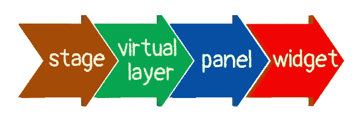
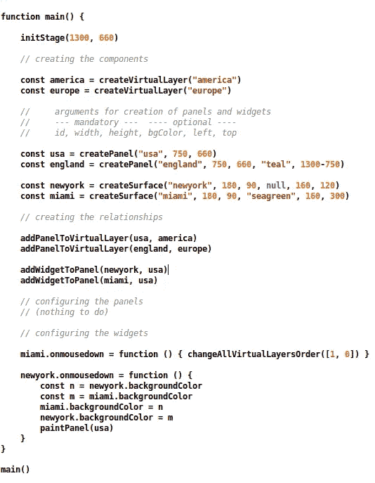

# 再见 HTML。你好画布！

> 原文：<https://javascript.plainenglish.io/goodbye-html-hello-canvas-f3935aec3a05?source=collection_archive---------1----------------------->

## 第 4 部分:静态架构和简单的鼠标事件演示

你可以在这里阅读之前的文章[。](/goodbye-html-hello-canvas-b44ae0ba85b8)


The Library

## 图书馆的目标

我一边写文章，一边建造图书馆。我对这个库和用它开发的应用程序有一些目标:

1.  图书馆必须没有臭虫
2.  这个图书馆必须非常容易理解/记忆/使用
3.  该库必须灵活，易于修复/改进/扩展
4.  同时，图书馆必须小而全
5.  应用程序必须具有良好的性能

虽然这个库很小，但它将是完整的，因为它将包含所有的基本内容，而不必编写太多代码来安装您的接口。

注意:这个库正在被原型化；**这是我倾听你的想法/喜好的最佳时刻**。

## 废话，废话，废话(或关于变化的基本原理)

BobSprite 是用很多画布做成的，因为它从 HTML/CSS 模式开始，慢慢收敛到画布模式。

当我承诺发布一个库时，我决定从一个全新的模型开始:一个大画布(身体)仅此而已，所有的东西都直接画在上面。

但是我非常担心这个模型，因为

1.  我没有练习过。我**必须有一个关于这个主题的完整域名**,因为它是其他人将用来创建应用程序的库的基础，而我对此一无所知
2.  我在创作文章的同时也在开发这个库。我不想冒险在第十一篇文章中说，"*嘿，伙计们，让我们从第三篇文章开始重新开始吧！这个模型不够好。*”
3.  我想尽快发布这个库，但是我是基于一个新的/未经测试的概念
4.  我认为这个模型可能有一个(可能察觉不到)更差的**性能**万一它画了整个画布；或者可能需要更复杂/更不健壮的库代码，以防它只绘制片段

因此，我决定放弃只有画布的模型。还有…不！我不会背叛我的读者，用库里面的几十个 HTML 元素巧妙地替换掉大画布。

另一组关注点与这个库对开发人员来说应该有多简单有关。

1.  我不希望(在你的代码中或者在你的头脑中)名字与 HTML ( ***正文*** 叶子、 ***阶段*** 进入)发生冲突； ***元素*** 叶子、 ***小工具*** 进入)
2.  我不希望误导的名字( ***层*** 叶， ***虚层*** 入)
3.  我不希望冗余( ***虚拟层*** 将只有绝对必要的属性)
4.  我想要一些简单/必要/明显的元素，在一些简单/必要/明显的关系中工作

# 静态建筑



The Static Architecture

请，**忘记我在上一篇文章**中介绍的*基本*架构。我不仅不得不改变它，因为我不得不把它的名字从*基础*改成*静态*；因为我已经意识到我们必须谈论一下*动态架构*(不在本文中)。所以*静态*这个名字比较合适。

## 舞台

*阶段*是最终容器。它是在引擎盖下的 *div* HTML 元素。你可以把它的背景设置成任何普通的 HTML *div，*就这样。只有*虚拟层*可以附着在*载物台*上。

## 虚拟层

一个*虚拟层*基本上就是一个面板列表。它是虚拟的，因为它没有**实体**(大小、位置、不透明度、颜色、背景……)。其目的是根据面板的深度对面板进行分组。创建虚拟层后，它会自动附加到舞台。只有*面板*可以连接到*虚拟层*。

没有等同于*虚拟层*的 HTML 元素。你可以把它看作是一个更简单的 *z 索引* CSS 属性。

## 嵌板

遮光罩下的*面板*是一个画布(HTML canvas 元素)加上其*小部件*和附加信息(id、背景、鼠标处理程序……)的列表。只有*小部件*可以连接到*面板*。*面板中的*与**相同**虚拟层中的*不得相互重叠。*

## 小工具

典型的*小部件*是一个按钮、一个文本输入框、一个范围滑块……对用户来说看起来像一个对象的东西。微件列表尚未完成。一个*小部件*不得脱离其*面板*的限制。*小部件*不得相互重叠。

注意:从一开始，本系列文章的目的就是展示和证明一些概念。这一点没有改变。我将解释这些概念，展示一些代码片段，并展示简单/简洁的演示。当您阅读文章/演示时，不要担心代码。所有的功能**将**封装在库的直观函数中。

```
"use strict"function assureVirginId(id, kind) {
    //
    let existent = ""
    //
    if (allVirtualLayers[id] != undefined) {
        existent = "virtual layer"
    }
    else if (allPanels[id] != undefined) {
        existent = "panel"
    }
    else if (allWidgets[id] != undefined) {
        existent = "widget"
    }
    //
    if (existent == "") { return true }
    //
    const msg = "ERROR: cannot use [" + id + "] as id for " +
    kind + " because it is being used by a " + existent
    //
    alert(msg)
    //
    return false
}//////////////////////////////////////////////const allVirtualLayers = { }const allVirtualLayersOrder = [ ]function createVirtualLayer(id) {
    //
    if (! assureVirginId(id, "virtual layer")) { return null }
    //
    const vl = new VirtualLayer(id)
    Object.seal(vl)
    //
    allVirtualLayers[id] = vl
    allVirtualLayersOrder.push(vl)
    return vl
}function VirtualLayer(id) {
    //
    this.id = id
    this.visible = true
    this.panels = [ ]
}///////////////////////////////////////////////const allPanels = { }function createPanel(id) {
    //
    if (! assureVirginId(id, "panel")) { return null }
    //
    const panel = new Panel(id)
    Object.seal(panel)
    //
    allPanels[id] = panel    
    return panel
}function configPanel(id, cfg) {
    //
    const panel = allPanels[id]
    if (panel == undefined) { 
        alert("ERROR: unknown panel [" + id + "]") 
        return 
    }
    //
    if (cfg.left) {
        if (! assureGoodDimension(cfg.left)) { return }
        panel.left = cfg.left
    }
    // 
    // more code here...
}function Panel(id) {
    //
    this.id = id
    this.widgets = [ ]
    //
    const cnv = createCanvas(width, height)
    const ctx = cnv.getContext("2d")
    //
    cnv.style.position = "absolute"
    cnv.style.left = "0px"
    cnv.style.top = "0px"
    cnv.style.backgroundColor = "tan"
    //
    cnv.onmouseenter = null
    cnv.onmouseleave = null
    cnv.onmouseup = null
    cnv.onmousedown = function (e) { mouseDownOnPanelById(e, id) }
    cnv.onclick = null
    //    
    this.canvas = cnv
    this.context = ctx
}/////////////////////////////////////////////////// more code here...
```

上图中，你可以看到一些类似于正在建造的图书馆的东西。代码是**还没有封装**(函数不是用库前缀调用的，像 ***lib*** *)。创建面板*)。

在您抱怨面板的事件处理非常普通(确实如此)之前，让我说一下**的复杂性在于小部件**的事件处理(上面没有显示)。别担心，图书馆负责这个。

你可能已经观察到的一件事是，库将尽力警告你每一个可能的错误。这与 HTML，尤其是 CSS 所做的正好相反！**在我看来，沉默错误是 CSS** 中最糟糕的部分。

# 简单的鼠标事件演示

这个演示程序以最简单的形式处理鼠标事件；它不在乎用户移动鼠标太快或点击太快。

如果你想深入处理鼠标事件，我推荐下面的文章，但如果你真的想深入****只有**。**

**[*在富浏览器应用中处理用户输入——处理鼠标和键盘事件的正确架构*](https://levelup.gitconnected.com/handling-user-input-in-rich-browser-apps-a73a951d03f0)**

**这个演示是关于创建**

*   **2 *虚拟层***
*   **2 个*面板*(每个*虚拟层*一个)；它们重叠是因为它们的宽度之和大于*载物台*的宽度**
*   **左侧面板上的 2 个*表面*(最简单的一种*控件*)**

**鼠标按下第一个*表面*会交换两个*表面*的颜色。
鼠标按下第二个*表面*反转*虚拟层*的顺序，反转它们的*面板*的 z 顺序。**

**我想在演示中展示更多有趣的功能；但是这种东西属于动态架构，所以我们将不得不等待下一篇文章。**

****

**The Developer Code In The Demo**

**代码(嵌入在 HTML 文件中)被分成两部分:伪库部分和开发者部分。上面我们看到了开发者部分的代码:只有几行清晰的代码！**

**事不宜迟，下面就让我们来看看 [***这里的***](https://storage.googleapis.com/jblate/medium/simple-mouse-event.html) 极简 demo。**

## **它是如何工作的**

**没有用于*阶段*或*虚拟层*的鼠标事件处理程序。**

**但是对于每个*面板*(对于每个*面板*的画布，确切的说)引擎(库的内部函数)创建鼠标事件处理程序。**

**对于*面板*上的每个鼠标事件，引擎开始检查是否涉及*小部件*，考虑属于该*面板*的所有*小部件*的大小和位置。**

**如果不涉及*小部件*，则引擎结束该过程。否则，引擎会在这个*小部件*中搜索与鼠标事件匹配的处理程序。如果这样的处理程序存在(不为空)，它就被激活(它的回调函数被执行)。**

**你可以在这里阅读[的下一篇文章](https://joanaborgeslate.medium.com/goodbye-html-hello-canvas-956cc7d0770f)。**

***更多内容看* [***说白了就是 io***](https://plainenglish.io/) *。报名参加我们的* [***免费周报***](http://newsletter.plainenglish.io/) *。关注我们关于*[***Twitter***](https://twitter.com/inPlainEngHQ)*和**[***LinkedIn***](https://www.linkedin.com/company/inplainenglish/)*。加入我们的* [***社区不和谐***](https://discord.gg/GtDtUAvyhW) *。****