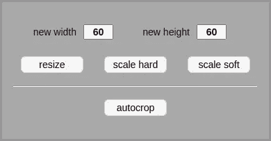
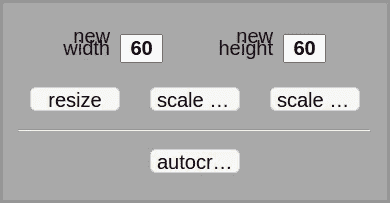
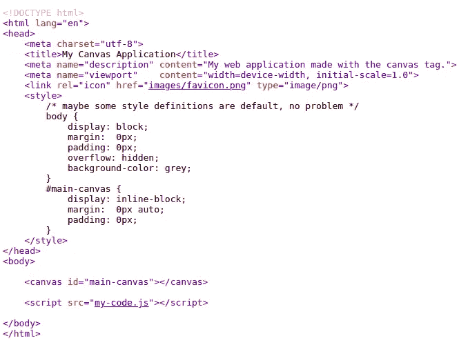
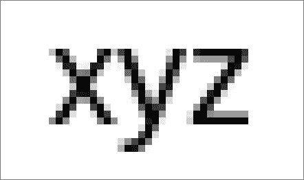

# 再见 HTML。你好画布！

> 原文：<https://javascript.plainenglish.io/goodbye-html-hello-canvas-part-1-92f750961666?source=collection_archive---------0----------------------->

## 第 1 部分:真正控制您的 web 应用程序


Photo by [Sam Albury](https://unsplash.com/@sammisamuel21?utm_source=medium&utm_medium=referral) on [Unsplash](https://unsplash.com?utm_source=medium&utm_medium=referral)

编辑:这个系列文章不是关于构建通用的网页。

**编辑 2** :如果你没有时间，下面是从该系列的第七篇文章中复制的三个链接。

1.  [播放](https://storage.googleapis.com/jblate/medium/mosaic-demo.html)的完整演示(不适用于智能手机)
2.  [GitHub —完整演示](https://github.com/JoanaBLate/mosaic-generator)
3.  [GitHub — GoodbyeHtml 库](https://github.com/JoanaBLate/goodbye-html)

我必须承认，我发现 HTML 和 CSS 太复杂了，尤其是在页面元素的微调方面。规则太多，反直觉，互相碰撞。有时候我们**需要**来使用**的招数**(!)来实现简单的事情。元素的**定义可能分布在许多地方** : HTML、CSS(内嵌、嵌入和外部文件)和 JavaScript。在级联系统中很容易迷路。

还有浏览器和设备的问题，因为在一些浏览器上运行良好的东西在另一个浏览器上可能表现不佳，甚至在不同设备上的同一浏览器上也是如此。

我放弃了和 HTML、CSS 打交道；不是因为它(对我来说)复杂。我放弃了，因为*它不起作用(它应该起作用)*。

## 浏览器/设备特性

有一次我变得非常沮丧，因为当页面被加载到 iPhone 上时(尽管也使用 Chrome)，一个**表格**中的一些文本占用了比我计划的更多的空间，因此**破坏了布局**。我修改和改变 CSS 甚至 HTML 很多次都没有结果。

你不能责怪字体，因为我用的是特殊字体(不是浏览器标准字体)，所以每个设备都应该使用相同的字体。我更深入地研究了这个字体，自己使用了一个不同的名字(也许 iPhone 已经缓存了一个不同的版本)。还是没有好转。我做了截图，开始一个像素一个像素地分析不同的结果，发现问题出在文本的字符间距上。iPhone 上的空间更大。所以，我很快开始编辑*字母间距* CSS 属性。还是没好！


Result On Non-iPhone Devices


Result On iPhone

然后我明白了:一个人不能依赖 HTML 和 CSS 来真正控制一个网页的显示(无论在哪里)。忘记使用复杂的 CSS 来设计一个漂亮的表格吧:在网页中放一张图片！

## 字体大小配置

还有一个重要的原因是你不能控制你的网页的表现。即使世界上只有一种设备和一种浏览器，由于可访问性问题，浏览器让**用户选择最小字体大小**，忽略了你对字体大小的定义，严重扰乱了网页设计。



Planned Font Size



Overrided Font Size ByThe User

## 翻译

我们可以更进一步，浏览器还有一件事可以做，不仅可以打破你的设计还可以打破应用:翻译！对此我有过非常糟糕的经历。我说的不仅仅是按钮上铺天盖地、毫无意义的文字。我说的是谷歌浏览器显示了 12 个菜单按钮，而它应该只有 6 个。它们都不起作用。我再说一遍:**因为翻译功能在用户浏览器中是活动的，Chrome *发明了* 6 个菜单按钮，坏了我的 web app** ！！！


Standard Menu


Browser “Translated” Menu

可能发生这种情况是因为页面元素是用 JavaScript 而不是 HTML 创建的，所以浏览器不够智能，无法识别。

浏览器想要为它的用户提供翻译。也许你可以欺骗一个浏览器一段时间不提供翻译，但这是不可靠的。浏览器不同，经常变化。

编辑:我再次测试了旧版本(2017)的应用程序。Chrome 流畅地翻译了页面。干杯！

编辑 2:似乎 **React 的人在 2017 年也遇到了类似的问题**:
[让 React 对来自 Google Translate #11538](https://github.com/facebook/react/issues/11538) 的 DOM 突变具有弹性

## 变焦

此外，用户更改的**缩放级别可能会破坏设计。**

## 那么，现在怎么办？

如果你正在创建一个简单的(*)网页，你可以继续使用 HTML 和 CSS，*推送图像，而不是*用 HTML 标签和 CSS 属性构造表格。因此，您的表格将在任何浏览器、任何设备、任何缩放比例、任何语言和用户配置的任何字体大小上保持美观。此外，只使用旧的，传统的，普遍的东西(小心炒作)。

EDIT: About simple(*):这里的“simple”指的是一个可以适应浏览器流畅布局的页面。抱歉延迟解释。

但是，如果你正在创建一些复杂的应用程序[，比如这个绘图工具](https://www.bobsprite.com/editor)(目前只适用于 PC)，那么我建议你停止使用 HTML 和 CSS，拥抱画布和 JavaScript。



The .html File

我只想说清楚，代码(。html 文件)上面有[你需要的所有 HTML 和 CSS](https://github.com/JoanaBLate/goodbye-html/blob/main/Goodbye%20HTML.html)。

# 打印文本

在画布上打印文本很简单，使用它的标准函数***fill text***；但是结果视觉效果很差。

```
var canvas = document.createElement("canvas")
var context = canvas.getContext("2d")
document.body.appendChild(canvas)context.font = "20px arial"
context.fillText("xyz", 50, 50)
```



Canvas fillText Black On White (magnified)

直接在网页上打印文本会产生更好的效果。

```
document.body.style.fontFamily = "arial"
document.body.style.fontSize = "20px"
document.write("xyz")
```


HTML Black Text On White (magnified)

上面的两幅图像对应于在**白色**背景上用**黑色**彩色**打印“xyz”产生的真实像素，使用的字体为 Arial，字体大小为 20 像素。**

当我们用它的标准功能在画布上打印时，我们只有灰度像素。

当我们直接在页面上打印文本时，我们有大量不同颜色的像素；虽然肉眼来看，人物看起来是纯黑色(或者深灰)。此外，它们看起来比以前的印刷方式好得多。

我们不打算在应用程序中显示丑陋的字符。我们不会的！

因为涉及的内容很多，包括真实代码，所以这个主题必须分成几篇文章:

1.  如何在画布上印出好看的字
2.  如何创建按钮和面板(层)
3.  如何创建滑块和复选框
4.  如何处理小工具上的鼠标事件
5.  如何处理键盘事件(控制焦点)

我们将在浏览器中创建一个浏览器！这很容易，很愉快，也很有教育意义！

这是[系列](https://joanaborgeslate.medium.com/goodbye-html-hello-canvas-d9e62e2e0cfe)的下一篇文章。

*更多内容看* [***说白了。报名参加我们的***](https://plainenglish.io/)***[***免费周报***](http://newsletter.plainenglish.io/) *。关注我们*[***Twitter***](https://twitter.com/inPlainEngHQ)*和*[***LinkedIn***](https://www.linkedin.com/company/inplainenglish/)*。加入我们的* [***社区***](https://discord.gg/GtDtUAvyhW) *。****