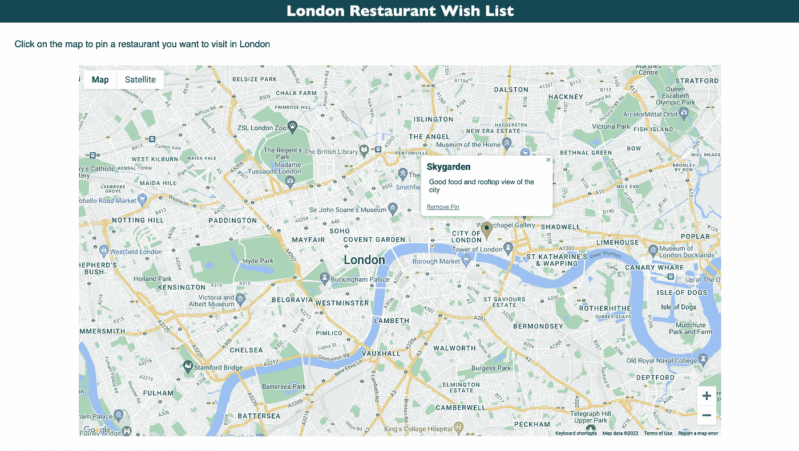

# Google API 项目:创建一个餐馆愿望列表地图

> 原文：<https://javascript.plainenglish.io/google-api-project-creating-a-restaurant-wish-list-map-f10b5aa6113e?source=collection_archive---------7----------------------->

## 在项目中利用 Google Maps API 嵌入地图、创建标记、添加标记细节和删除单个标记。

Photo by [GeoJango Maps](https://unsplash.com/@geojango_maps?utm_source=medium&utm_medium=referral) on [Unsplash](https://unsplash.com?utm_source=medium&utm_medium=referral)

为了保持学习的趣味性，我一直在尝试用动手项目来练习我正在学习的技能。我对自学的恐惧总是停留在“辅导模式”中，无法将技能应用到实际项目中。

最近，我完成了一些关于 API 使用的培训材料，并决定将这些知识应用到我自己设计的一个小型项目中。在这篇文章中，我描述了我想到的概念项目与最终结果的对比。我还试图描述我面临的一些主要挑战。

# 概念:餐馆愿望清单地图

我想要创建的项目如下:

*   一个由标题和嵌入其中的谷歌地图组成的单页网站。
*   地图应该放大以显示伦敦城。
*   当用户找到他们想去的餐馆(或其他景点)时，他们可以点击地图在那个位置添加标记。
*   在添加标记之前，用户将被要求输入一个标题和任何关于该地点的评论，以供将来参考。
*   一旦标记显示出来，点击它就会显示这个标题和他们先前输入的任何细节。
*   出现的信息窗口还将包含一个链接，允许用户删除标记(删除错误添加的项目或已经访问过的地方)。
*   地图应该是页面的主要焦点，没有过多的干扰。

# 成品

Overview of the final product: including a pin showing the name, some details, and a working remove button

*(我知道在文章中途放置成品看起来很奇怪，但是，我发现当我阅读某人设计的项目时，当我可以看到最终结果时，理解他们的挑战和关键点会容易得多)*

尽管造型过于简单，但我不得不说我对成品感到非常自豪。我开始做的所有功能都包括在内，并且标签清晰地显示在地图上。

通过阅读文档，我对 Google API 了解了很多，并定制了地图显示，删除了对应用功能不重要的选项，如“街道模式”和旋转。

***我在这篇文章的末尾附上了代码，以防有人感兴趣。我们随时欢迎您的任何反馈或问题(好的或坏的)!***

# 一路上的挑战

在这个项目开始时，我认为主要的挑战是让地图出现在网页上，但一旦我明白了谷歌 API 键是如何工作的，这部分就相对简单了。

挑战实际上来自于弄清楚如何将用户输入组合到大头针中，然后如何移除单个标记。移除标记是最后一步，我认为这很容易，但我错了！

1.  **了解 Google API 密钥**
    要使用所有的 Google API，必须创建一个帐户(包括添加账单信息)。API 的使用被定义为随用随付，每个人每月有 200 美元的免费积分。虽然我只是将 API 用于我的个人项目，但我确实担心我会滥用 API 或不对其进行适当限制，最终导致巨额账单。对于涵盖 API 的所有内容和教程，我发现很少解释如何正确地添加限制。关于什么需要花钱和不需要花钱的说明也很难理解(至少对我来说)。在继续之前，为了安全起见，我花了一些时间浏览了文档。*(这也是为什么这个项目使用的 API 键被从下面分享的代码中删除)*
2.  **向用户窗口添加自定义信息** 我观看的帮助这个项目的文档和 youtube 视频总是显示创建者将任何 pin 信息直接输入到 Javascript 文件中。由此，他们创建了一个位置数组，然后将该数组解析成一个`addMarker`函数。
    我想让用户根据输入创建自己的 pin，这样这种方法就行不通了。为了保持设计的简洁，我创建了一个表单，当用户点击地图并输入信息时，这个表单就会出现。我试图使用这些输入创建一个 addMarker 函数，但是不确定如何将 lat/long 数据从 click 传递到子函数。谢天谢地，我找到了一个 StackOverflow 帖子(那个网站拯救了我无数次！)描述了如何使用`event.latLng.lat()`和`event.latLng.lng()`从点击中提取目标的纬度和经度，然后将它们保存为变量。从那里，我可以最终向前迈进，并最终确定解决方案。
3.  **移除单个标记**
    说这是项目中最大的挑战是轻描淡写。由于标记是由函数添加的，它们默认没有附加任何 ID，因此很难用 Javascript 定位它们。知道我需要一个 id，我创建了一个`mapMarker`数组变量来存储所有带有索引 id 的标记，然后使用这个 ID 作为输入，在元素创建中构建了一个对`deleteMarker`函数的调用。虽然这听起来很容易，但我花了很大力气来构思如何定位标记以及如何在锚元素中包含变量。我不得不多次重新规划，才找到一个可行的解决方案。

# 结论

总之，这篇文章比预期的要长，这个项目帮助我将 API 的基础知识发展成一个我感兴趣的领域的迷你项目。虽然有时非常具有挑战性，但看到项目成形并解决出现的每个问题是如此令人满意。

随着我更多地进入培训课程的后端部分，我很兴奋地学习如何将输入存储到数据库中，以便在页面刷新后标记仍保留在页面上…一旦我掌握了更多的知识，我一定会回来进行更新以改进功能！

如果你喜欢这篇文章并想阅读更多，一定要查看我的类似文章。考虑成为一个媒体成员，以获得无限的接触最好的想法和作家。

[**如果你通过这个链接加入 Medium，我会从你的费用中收取很少的一部分——而且不会花你任何额外的钱！提前感谢。**](https://medium.com/@simply_stef/membership) **💰**

***感谢阅读！***

# 源代码

我在这里包括了我为这个项目写的代码，如果你注意到任何可以改进的地方，或者对一些东西如何工作有疑问，请在评论中告诉我。

***注意:我使用的 Google API 密匙已经被移除，以防止任何人滥用它——所以如果你想测试代码，你需要添加你自己的 API 密匙。***

*更多内容看* [***说白了。报名参加我们的***](https://plainenglish.io/) **[***免费每周简讯***](http://newsletter.plainenglish.io/) *。关注我们* [***推特***](https://twitter.com/inPlainEngHQ) *和*[***LinkedIn***](https://www.linkedin.com/company/inplainenglish/)*。加入我们的* [***社区不和谐***](https://discord.gg/GtDtUAvyhW) *。***