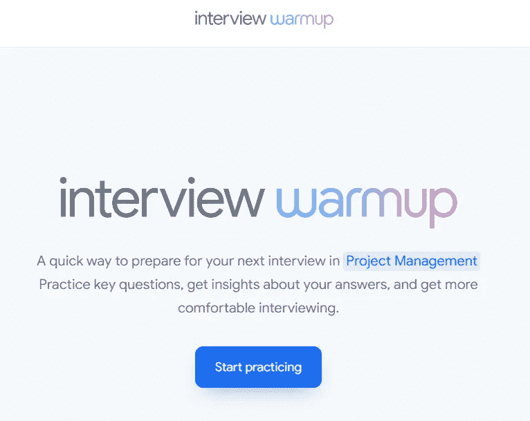

# 谷歌新的面试准备功能将帮助你找到下一份 IT 工作

> 原文：<https://javascript.plainenglish.io/googles-new-interview-preparation-feature-will-help-you-with-your-next-it-job-9bbb14b46b48?source=collection_archive---------1----------------------->

## 从现在开始，你不需要独自准备面试，谷歌会支持你。

Photo by [Shiwa ID](https://unsplash.com/@shiwa_id?utm_source=medium&utm_medium=referral) on [Unsplash](https://unsplash.com?utm_source=medium&utm_medium=referral)

除了所有的技术材料，独自准备一轮综合面试可能是一个棘手的部分。

我的一个朋友最近打电话给我练习他的面试问题，之后，他问我对他的答案的反馈。我知道我是一个好朋友，但我不是招聘人员，我只是一个像他一样的普通人。因此，我不会得到他所要求的那种强烈的反馈。

不仅如此，许多人不会有像我这样的好朋友来给他们关于一般面试问题的反馈，这就是最近时代技术发挥巨大作用的地方—

## 谷歌是来帮忙的

Source-[Google Interview Warmup](https://grow.google/certificates/interview-warmup/)

最近，谷歌推出了名为 [*面试热身*](https://grow.google/certificates/interview-warmup/) 的新功能，这是谷歌计划的一部分。

你只需要点击“开始练习”就可以面对面试，看看除了技术知识，你还缺什么。

当你点击开始练习时，它会要求你选择你的领域。它主要有 6 个领域，其中 3 个与 It 行业相关。

你现在可以练习这 6 个领域

*   数据分析
*   电子商务
*   信息技术支持
*   项目管理
*   UX 设计
*   概述(包括你在各种面试中可能会遇到的基本问题)

一旦你选择好你的领域，你将有 5 个问题要回答。

转折来了…

你不需要把你的答案打出来。你只需要像在实际面试中那样大声说出来。全力以赴。

一旦你说完，谷歌会实时自动转录你的答案。谷歌不会根据你的回答来评判你，但它会给你有价值的见解。

谷歌还会告诉你哪些术语可以包含在你的答案中，这样它们在真实的面试场景中会显得更有分量。

## 最后

[*谷歌面试热身*](https://grow.google/certificates/interview-warmup/) 真是谷歌的一个有趣功能。如果你打算在接下来的一段时间内参加面试，那么你必须至少使用一次这个功能，看看它对你有什么有价值的见解。

目前，我觉得它还处于早期阶段，在面试问题的技术方面还可以有轻微的改进。但是，除此之外，这个功能确实是一个令人兴奋的功能，它使用最新的技术将语音实时转换为文本，并在几分钟内进行分析。

就这些，希望这是给你的信息，祝你在准备下一次面试时好运。

关于我——我是*科技*和*自我提升、* [*的顶级作家点击这里*](https://aniketz.medium.com/) *阅读更多我的文章。*

如果你想购买 5 美元的中等会员资格， [*点击这里*](https://aniketz.medium.com/membership) (当你使用 [*这个链接*](https://aniketz.medium.com/membership) 购买中等会员资格时，我会从你的会员费中抽取一小部分作为佣金，不需要你额外付费)。如果你想订阅我的电子邮件列表然后 [*点击这里*](https://aniketz.medium.com/subscribe) *。*

 [## 通过我的推荐链接加入 Medium-Aniket

### 作为一个媒体会员，你的会员费的一部分会给你阅读的作家，你可以完全接触到每一个故事…

aniketz.medium.com](https://aniketz.medium.com/membership) 

[**通过电子邮件获取我的文章点击这里**](https://aniketz.medium.com/subscribe) **|** [**购买 5 美元的中等会员资格**](https://aniketz.medium.com/membership)

*更多内容请看*[***plain English . io***](https://plainenglish.io/)*。报名参加我们的* [***免费周报***](http://newsletter.plainenglish.io/) *。关注我们关于*[***Twitter***](https://twitter.com/inPlainEngHQ)*和*[***LinkedIn***](https://www.linkedin.com/company/inplainenglish/)*。查看我们的* [***社区不和谐***](https://discord.gg/GtDtUAvyhW) *加入我们的* [***人才集体***](https://inplainenglish.pallet.com/talent/welcome) *。*