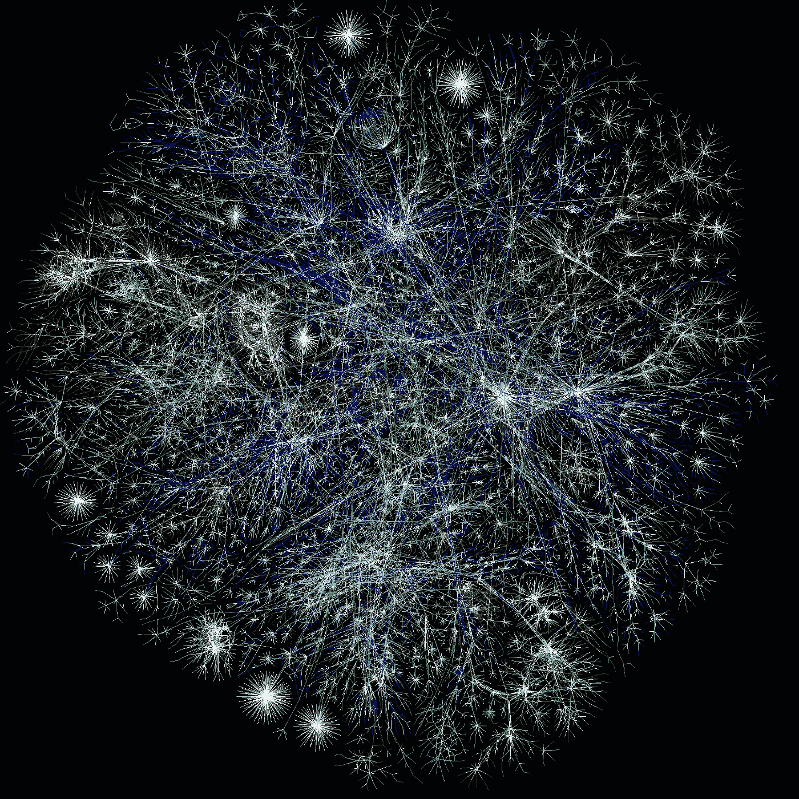

# GraphQL:是未来吗？

> 原文：<https://javascript.plainenglish.io/graphql-is-it-the-future-9e10a978dc42?source=collection_archive---------6----------------------->

## GraphQL 如何潜在地革新 API 设计和开发范例。

在我经历 web 开发旅程的高潮和低谷时，我偶然发现了一个宝箱:GraphQL。通常被称为“API 的未来”和“新标准”，这种由脸书开发的 API 查询语言深深吸引了我。我很好奇 GraphQL 如何可能彻底改变 API 设计和开发范式，在使用 GraphQL 框架开发了一个加密货币投资模拟器之后，我已经策划了几个学习点，我将在下面详细阐述。

## **API 设计和架构的简史**

早在 GraphQL 之前，SOAP(简单对象访问协议)和 REST(代表性状态传输)是跨 web 应用程序传输数据包的最常见方法。

REST 只是一组原则，而 SOAP 是由万维网联盟(W3C)维护的开放标准协议。SOAP 使用 XML 模式，允许跨不同语言和设备平台标准化 CRUD(创建、读取、更新、删除)操作。

虽然 SOAP 作为一种协议避免了使用 HTTP 的需要，但该协议强加的标准增加了复杂性并最终增加了加载时间，使得 SOAP 总体上更慢。然而，这些标准还增加了安全性、原子性、一致性、隔离性和持久性(ACID)，创建了内置的错误处理功能，并确保了安全的数据库事务。

另一方面，REST 是一套使用标准 HTTP 方法(如 GET、POST、PUT、DELETE)来执行 CRUD 操作的架构原则。如果没有协议所必需的安全特性，这就给设计者留下了更加开放的结构设计，比如数据返回的格式(JSON、XML、纯文本)，最终使得 RESTful APIs 更加灵活和易于创建。

## GraphQL 呢？

GraphQL 是一个规范，这意味着它是语言不可知的。一个用。NET/C#可以与用 Node.js 编写的 GraphQL 服务器通信，同时使用 HTTP POST 方法。

顾名思义，GraphQL 在图中表示其数据，使用节点和边，而不是像 MongoDB 那样使用行和列。这些节点和边可以是多维的，使得 GraphQL 能够理解其复杂性。

也许 RESTful APIs 和基于 GraphQL 的 API 之间最大的区别在于，GraphQL 的架构比 RESTful 服务器驱动的架构更加客户端驱动。例如，如果数据库存储不同类型的汽车，而客户机需要汽车的名称和制造日期，REST 需要专门针对名称和日期的 GET 操作，或者客户机端必须过滤掉大型 GET 操作中返回的所有无关数据，以找到名称和日期。然而，GraphQL 允许客户端指定他们只需要名称和日期，这样就不会出现溢出或不足。

此外，GraphQL 提供的另一个好处是数据交换只发生在单个端点，而不是 REST 需要的多个端点。GraphQL 使用 typedefs 和 resolvers 来指定可以检索和更新哪些数据，允许客户端只需要一个 API 调用就可以交换所有需要的数据。这不仅可以在运行时更有效，而且编程这些解析器还可以允许更精简的代码。但是因为所有的事情都发生在一个端点，所以缓存比 REST 的多面路由要复杂得多。

一个很酷的注意是，GraphQL 提供了一个测试 API 功能的小平台，这使得像失眠症和其他 API 门户这样的软件过时了。几乎像一个 IDE 一样，playground 允许开发人员快速测试新的查询和变化，允许更有效和愉快的编码。

## 我最后的想法

随着我使用 GraphQL 创建越来越多的项目，我很快意识到与 RESTful APIs 相比，学习曲线极其陡峭。虽然我了解到虽然 GraphQL 提供了有前途的、创新的解决方案，可能会节省大量时间，但我确实希望在 GraphQL 上使用 RESTful API。例如，如果我要开发一个公共 API，我希望能够严格控制要发布的数据。在未来，我肯定会把 GraphQL 视为主流查询语言，但它肯定不能解决所有与 API 相关的挑战，也不能取代 REST。

 [## GitHub-gulphinhenry/cryptocraft:无风险的 Cryptoverse 探索

### Cryptocraft 是一个加密货币交易模拟器，旨在允许用户探索和实验加密。在…

github.com](https://github.com/gulpinhenry/cryptocraft) 

*更多内容请看*[***plain English . io***](http://plainenglish.io/)*。报名参加我们的* [***免费周报***](http://newsletter.plainenglish.io/) *。在我们的* [***社区***](https://discord.gg/GtDtUAvyhW) *获得独家获得写作机会和建议。*