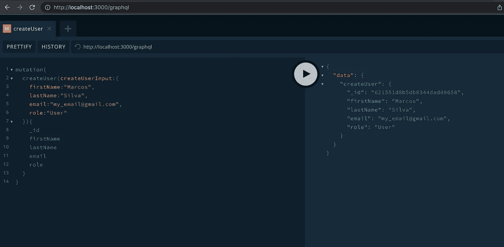
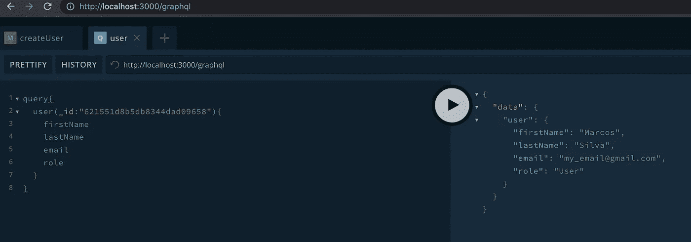
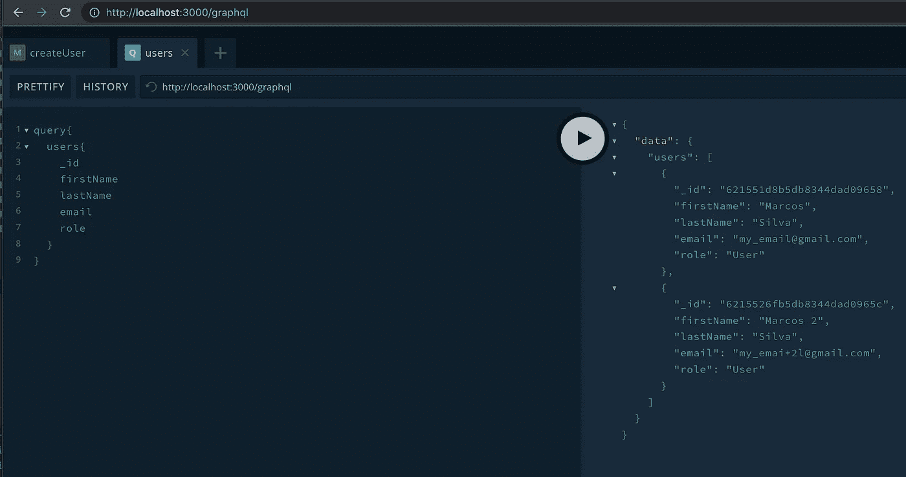
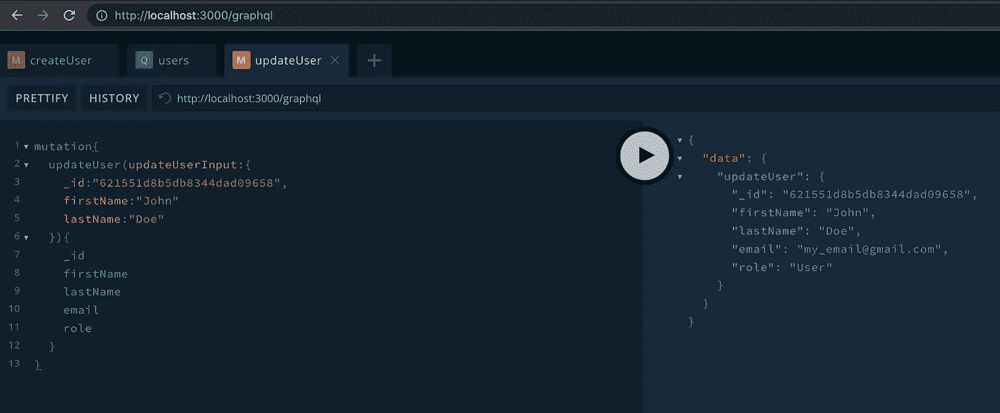
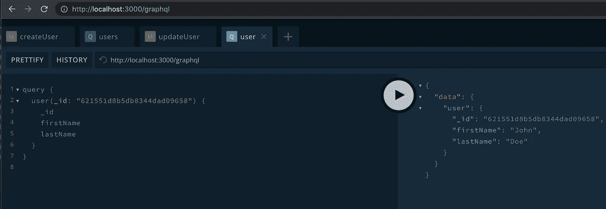
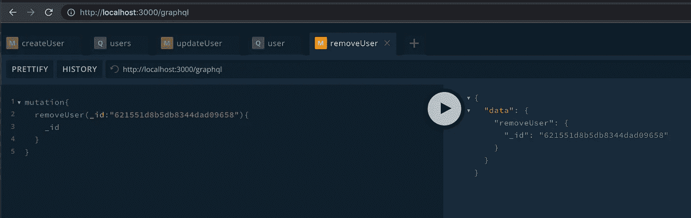
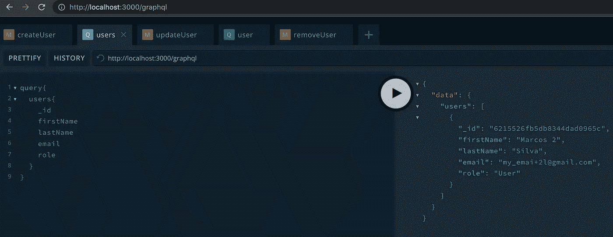
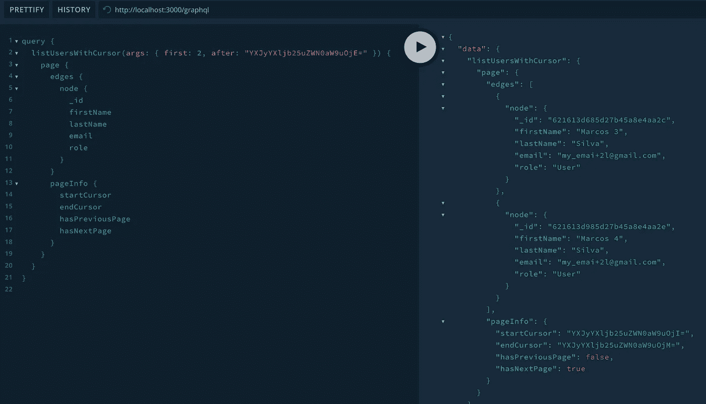

# GraphQL、Node.js 和 MongoDB——使用 NestJS 和 Mongoose 变得很容易

> 原文：<https://javascript.plainenglish.io/graphql-nodejs-mongodb-made-easy-with-nestjs-and-mongoose-29f9c0ea7e1d?source=collection_archive---------1----------------------->

## 这是一个关于如何使用 NestJS 和 Mongoose 模块轻松构建带有 MongoDB 连接的 GraphQL 的教程。

在本文中，我将展示如何使用 NestJS 和 Mongoose 模块以一种非常简单的方式用 MongoDB 连接搭建 GraphQL。


Photo by [Monstera](https://www.pexels.com/@gabby-k?utm_content=attributionCopyText&utm_medium=referral&utm_source=pexels) from [Pexels](https://www.pexels.com/photo/crop-clever-woman-writing-in-book-6237959/?utm_content=attributionCopyText&utm_medium=referral&utm_source=pexels)

你好！今天，我决定简单解释一下如何在一个真正的 NestJS 应用程序中使用 MongoDB。我已经写了一篇文章来解释如何将 GraphQL 与 TypeORM 一起使用，这篇文章每月都有很好的阅读量，这促使我使用相同的方法，但使用 Mongoose，这是后端领域的必备知识，作为非关系数据库。

如果你想查看我的 [TypeORM 文章](https://medium.com/r?url=https%3A%2F%2Fmakinhs.medium.com%2Fgraphql-nodejs-postgres-made-easy-with-nestjs-and-typeorm-4daff3c516d)，请保存后阅读；)

[](https://makinhs.medium.com/graphql-nodejs-postgres-made-easy-with-nestjs-and-typeorm-4daff3c516d) [## graph QL+NodeJS+Postgres——使用 NestJS 和 TypeORM 使之变得简单

### 使用 TypeORM 在 NestJS GraphQL 后端添加 Postgres 模块，并创建一个基本的 CRUD

makinhs.medium.com](https://makinhs.medium.com/graphql-nodejs-postgres-made-easy-with-nestjs-and-typeorm-4daff3c516d) 

像往常一样…如果你够懒，在文章的结尾你可以在一个公共的 Git 库中找到所有的源代码。

[NestJS](https://nestjs.com/) 附带了一个易于使用的[mongose](https://mongoosejs.com/)在本文中，我们将连接到一个本地 MongoDB。动机是因为 MongoDB 比关系数据库更容易开始，编码速度更快，而且根据我过去的经验，对初学者来说非常友好。

此外，MongoDB 是一个非关系数据库，比正式的关系数据库更加灵活，适应性更强。在本文中，我不会深入解释什么是什么，我们可以马上动手操作。我推荐阅读其他文章中关于关系数据库和非关系数据库的内容，比如本文。

在我们开始编码之前，请确保安装了与我相同或更高版本的:

*   [节点](https://nodejs.org/en/)已安装(v14+)
*   嵌套 CLI 版本为:8.2.0
*   yarn 版本:1.22.10(我还是喜欢 yarn over npm)

为了编码和开始，让我们看看我在上一篇文章中使用的前一个[项目](https://github.com/makinhs/nestjs-with-graphql)。我以前的文章，可以在我的 [001](https://github.com/makinhs/nestjs-with-graphql/tree/001) 分支中找到。

[](/graphql-backend-in-nodejs-made-easy-with-nestjs-1489be18b994) [## 使用 NestJS 简化 Node.js 中的 GraphQL 后端

### 在本文中，我将向您展示如何以一种非常非常简单的方式开始一个 GraphQL 后端项目…使用 NestJS！

javascript.plainenglish.io](/graphql-backend-in-nodejs-made-easy-with-nestjs-1489be18b994) 

一旦你得到了 [001](https://github.com/makinhs/nestjs-with-graphql/tree/001) 分支，我们就已经有了最小的 NestJS 配置集。如果你不知道我在 NestJS 谈论什么，请检查我的[以前的文章](/graphql-backend-in-nodejs-made-easy-with-nestjs-1489be18b994)。

我们的项目是一个简单的搭建项目，已经安装了 GraphQL 模块和一些额外的功能，比如我们将使用 mongoose 实现一个基本的 CRUD 的用户模块。

在我的上一篇文章中，我们直接在 *app.module.ts.* 中配置了 GraphQL 模块。在这篇文章中，我想分享另一个模式，您可以在您的项目中使用它，它使 app.module.ts 对于共享库来说更小一些。为此，我们将在您的根项目终端中使用以下 nest-cli 命令创建一个公共模块:

```
nest g module common
```

将导致类似于以下内容的结果:

```
➜ nest g module common
CREATE src/common/common.module.ts (83 bytes)
UPDATE src/app.module.ts (560 bytes)
```

这将为我们创建一个新模块，我们将使用它来共享 GraphQL 和 Mongoose 模块。先说 GraphQL 那个。

只需创建一个名为 graphql.module.ts 的文件，并添加以下内容:

```
import { Module } from '@nestjs/common';
import { GraphQLModule } from '@nestjs/graphql';

@Module({
  imports: [
    GraphQLModule.*forRoot*({
      autoSchemaFile: './schema.gql',
      debug: true,
      playground: true,
    }),
  ],
})
export class GraphqlModule {}
```

然后，在您的 common.module.ts 中

```
import { Module } from '@nestjs/common';
import { GraphqlModule } from './graphql.module';

@Module({
  imports: [GraphqlModule],
  exports: [GraphqlModule],
})
export class CommonModule {}
```

最后但同样重要的是，在 app.module.ts 中:

```
import { Module } from '@nestjs/common';
import { AppController } from './app.controller';
import { AppService } from './app.service';
import { UsersModule } from './users/users.module';
import { CommonModule } from './common/common.module';

@Module({
  imports: [CommonModule, UsersModule],
  controllers: [AppController],
  providers: [AppService],
})
export class AppModule {}
```

注意 CommonModule 是第一个…让我们配置一个本地 mongo 数据库，并设置我们的 Mongoose 来使用它！

在安装 Mongoose 模块之前，我们需要确保我们有一个 Mongo 实例在本地运行和/或在互联网上可访问(比如 [Mongo Atlas](https://www.mongodb.com/pt-br/cloud/atlas/register) )。在本文中，我将展示一种使用 [Docker](https://www.docker.com/) 轻松运行 mongo 实例的方法。

在您的计算机上安装 Docker 之后，只需在您的根项目中创建一个 docker-compose.yaml，如下所示:

```
version: '3'
services:
  mongo:
    image: mongo
    restart: unless-stopped
    ports:
      - '27017:27017'
    volumes:
      - .docker-data/mongo:/data/medium-db
```

然后，要运行此实例，请运行以下命令:

```
docker compose up -d
```

意思是(从你的终端)分离，你可以做其他的任务。

让我们现在安装猫鼬模块。

既然我们已经搭建好了基本的 NestJS，并且 Mongo 数据库已经在本地使用 Docker 运行，那么让我们安装 Mongoose 模块，当我们的应用程序与 Mongo 数据库连接时，它将简化我们的开发人员的工作。

首先，我们需要安装 mongose 模块以及 NestJS mongoose 模块:

```
yarn add mongoose [@nestjs/mongoose](http://twitter.com/nestjs/mongoose)
```

现在，在我们的公共文件夹中，让我们用以下内容创建一个 mongo.module.ts 文件:

```
import { Module } from '@nestjs/common';
import { MongooseModule } from '@nestjs/mongoose';

@Module({
  imports: [
    MongooseModule.*forRootAsync*({
      useFactory: async () => ({
        uri: 'mongodb://localhost/medium-db',
      }),
    }),
  ],
})
export class MongoModule {}
```

我们以一种可以异步加载模块的方式使用 forRootAsync。这个的最大用途是加载。模块中的 env 变量，您可以部署相同的代码，但目标是阶段/生产或您想要使用的任何其他环境。

为了使我们的文章对您更有成效，让我们使用这种方法，从创建/使用您的。根项目中的 env 文件，包含以下内容:

```
MONGODB_URL=mongodb://localhost/medium-db
```

然后，NestJS 允许我们使用他们的配置服务，该服务可以安装在:

```
yarn add @nestjs/config
```

接下来的解释我就不深究了，但是为了控制你的”。env "文件并在那里实际设置一些业务逻辑，请使用如下所示的 config.module.ts:

```
import { Module } from '@nestjs/common';
import { ConfigModule as NestConfigModule } from '@nestjs/config';

@Module({
  imports: [
    NestConfigModule.*forRoot*({
      envFilePath: ['.env'],
      isGlobal: true,
    }),
  ],
})
export class ConfigModule {}
```

然后，在您的 common.module.ts 中:

```
import { Module } from '@nestjs/common';
import { GraphqlModule } from './graphql.module';
import { MongoModule } from './mongo.module';
import { ConfigModule } from './config.module';

@Module({
  imports: [ConfigModule, GraphqlModule, MongoModule],
  exports: [ConfigModule, GraphqlModule, MongoModule],
})
export class CommonModule {}
```

最后，回到你的 mongo.module.ts:

```
import { Module } from '@nestjs/common';
import { ConfigService } from '@nestjs/config';
import { MongooseModule } from '@nestjs/mongoose';

@Module({
  imports: [
    MongooseModule.*forRootAsync*({
      useFactory: async (configService: ConfigService) => ({
        uri: configService.get<string>('MONGODB_URL'),
      }),
      inject: [ConfigService],
    }),
  ],
})
export class MongoModule {}
```

为了测试:

```
yarn start
```

输出如下:

```
$ nest start
[Nest] 51083  - 02/02/2022, 10:19:03 PM     LOG [NestFactory] Starting Nest application...
[Nest] 51083  - 02/02/2022, 10:19:04 PM     LOG [InstanceLoader] CommonModule dependencies initialized +53ms
[Nest] 51083  - 02/02/2022, 10:19:04 PM     LOG [InstanceLoader] ConfigModule dependencies initialized +0ms
[Nest] 51083  - 02/02/2022, 10:19:04 PM     LOG [InstanceLoader] GraphqlModule dependencies initialized +1ms
[Nest] 51083  - 02/02/2022, 10:19:04 PM     LOG [InstanceLoader] MongoModule dependencies initialized +0ms
[Nest] 51083  - 02/02/2022, 10:19:04 PM     LOG [InstanceLoader] MongooseModule dependencies initialized +1ms
[Nest] 51083  - 02/02/2022, 10:19:04 PM     LOG [InstanceLoader] ConfigHostModule dependencies initialized +0ms
[Nest] 51083  - 02/02/2022, 10:19:04 PM     LOG [InstanceLoader] UsersModule dependencies initialized +0ms
[Nest] 51083  - 02/02/2022, 10:19:04 PM     LOG [InstanceLoader] AppModule dependencies initialized +1ms
[Nest] 51083  - 02/02/2022, 10:19:04 PM     LOG [InstanceLoader] ConfigModule dependencies initialized +0ms
[Nest] 51083  - 02/02/2022, 10:19:04 PM     LOG [InstanceLoader] GraphQLSchemaBuilderModule dependencies initialized +15ms
[Nest] 51083  - 02/02/2022, 10:19:04 PM     LOG [InstanceLoader] GraphQLModule dependencies initialized +1ms
[Nest] 51083  - 02/02/2022, 10:19:04 PM     LOG [InstanceLoader] MongooseCoreModule dependencies initialized +19ms
[Nest] 51083  - 02/02/2022, 10:19:04 PM     LOG [RoutesResolver] AppController {/}: +4ms
[Nest] 51083  - 02/02/2022, 10:19:04 PM     LOG [RouterExplorer] Mapped {/, GET} route +3ms
[Nest] 51083  - 02/02/2022, 10:19:04 PM     LOG [NestApplication] Nest application successfully started +108ms
```

太好了，我们可以从我们的。env 文件，我们的 NestJS 连接到 MongoDB。

让我们在 mongoose 的帮助下创建我们的用户 CRUD！

在我之前的 [Postgres + NestJS + GraphQL 文章](https://makinhs.medium.com/graphql-nodejs-postgres-made-easy-with-nestjs-and-typeorm-4daff3c516d)中，我们使用了一个用户实体，我们将在本文中重用它，但是目标是 Mongoose 模型，它基本上有名字、姓氏、电子邮件和角色。

为了更新我们的 user.entity.ts，我们需要意识到我们想要绑定 GraphQL 类型和 mongoose 类型，这将使用 NestJS 装饰器，并且结尾将类似如下:

```
import { ObjectType, Field } from '@nestjs/graphql';
import { Schema as MongooseSchema } from 'mongoose';
import { Prop, Schema, SchemaFactory } from '@nestjs/mongoose';
@Schema()
@ObjectType()
export class User {
  @Field(() => ***String***)
  _id: MongooseSchema.Types.ObjectId;
  @Prop()
  @Field(() => ***String***, { description: 'User firstName ' })
  firstName: string;
  @Prop()
  @Field(() => ***String***, { description: 'User lastName ' })
  lastName: string;
  @Prop()
  @Field(() => ***String***, { description: 'User email ' })
  email: string;
  @Prop()
  @Field(() => ***String***, { description: 'User role' })
  role: string;
}

export const ***UserSchema*** = SchemaFactory.*createForClass*(User);
```

为了公开 mongoose 实体，我们需要用以下内容更新我们的 users.module.ts:

```
import { Module } from '@nestjs/common';
import { UsersService } from './users.service';
import { UsersResolver } from './users.resolver';
import { MongooseModule } from '@nestjs/mongoose';
import { User, ***UserSchema*** } from './entities/user.entity';

@Module({
  imports: [
    MongooseModule.*forFeature*([
      {
        name: User.name,
        schema: ***UserSchema***,
      },
    ]),
  ],
  providers: [UsersResolver, UsersService],
})
export class UsersModule {
}
```

因为生活并不容易…如果你运行`yarn start`，项目仍然会失败…这将会发生，因为我们使用 Typescript，我们的解析器、服务和 dto 期望用户实体有不同的类型。我们现在需要更新它们…适当地。

## 重构我们的 dto

DTO 是数据传输对象的快捷方式，它非常常用于将来自请求的输入翻译到我们的应用程序中。在 NestJS 中，这允许我们定义我们想要接受的输入，并且能够用 decorators 以一种简单的方式在 GraphQL 上定义输入类型，以及添加一些本文没有涉及的[验证](https://docs.nestjs.com/techniques/validation#validation)。

首先重构我们的 dto 将有助于支持稍后对解析器和服务的更改。我们开始吧

首先，在 create-user.input.ts 上，我们将添加新的用户字段:

```
import { InputType, Field } from '@nestjs/graphql';

@InputType()
export class CreateUserInput {
  @Field(() => ***String***, { description: 'first name of the user' })
  firstName: string;
  @Field(() => ***String***, { description: 'last name of the user' })
  lastName: string;
  @Field(() => ***String***, { description: 'email of the user' })
  email: string;
  @Field(() => ***String***, { description: 'role of the user' })
  role: string;
}
```

然后，在 update-user.input.ts 中，我们只需要用 NestJS 提供的 PartialType 扩展 CreateUserInput，并添加 user _id，其值为:

```
import { CreateUserInput } from './create-user.input';
import { InputType, Field, PartialType } from '@nestjs/graphql';

@InputType()
export class UpdateUserInput extends PartialType(CreateUserInput) {
  @Field(() => ***String***)
  _id: string;
}
```

让我们现在改变我们的服务:

## 重构用户服务

NestJS CLI 创建了一个最小的 CRUD 框架，对于我们的例子，我们现在需要编辑两个主要内容:输入和添加逻辑。

请记住，您应该已经在 users.module.ts 中设置了 Mongoose 模型。

首先，您需要注意的是，您需要能够使用 Mongoose 中已经设置好但没有注入到您的 users.service.ts 中的用户模型，然后我们需要添加所有需要的逻辑，以使整个 CRUD 能够工作。最终结果将如下所示:

```
import { Injectable, NotFoundException } from '@nestjs/common';
import { CreateUserInput } from './dto/create-user.input';
import { UpdateUserInput } from './dto/update-user.input';
import { User } from './entities/user.entity';
import { ***InjectModel*** } from '@nestjs/mongoose';
import { ***Model*** } from 'mongoose';

@Injectable()
export class UsersService {
  constructor(
    @InjectModel(User.name)
    private readonly userModel: ***Model***<User>,
  ) {}

  create(createUserInput: CreateUserInput) {
    const user = new this.userModel(createUserInput);
    return user.save();
  }

  findAll() {
    return this.userModel.find().exec();
  }

  async findOne(id: string) {
    const user = await this.userModel.findOne({ _id: id }).exec();
    if (!user) {
      throw new NotFoundException(`User ${id} not found`);
    }
    return user;
  }

  async update(id: string, updateUserInput: UpdateUserInput) {
    const existingUser = await this.userModel
      .findOneAndUpdate({ _id: id }, { $set: updateUserInput }, { new: true })
      .exec();

    if (!existingUser) {
      throw new NotFoundException(`User ${id} not found`);
    }
    return existingUser;
  }

  async remove(id: string) {
    const user = await this.findOne(id);
    return user.remove();
  }
}
```

现在我们可以更新解析器了

## 重构 user . resolver . ts

这里我们只需要修改输入，主要是当来自数字的 id 现在是字符串时:

```
import { Resolver, Query, Mutation, Args } from '@nestjs/graphql';
import { UsersService } from './users.service';
import { User } from './entities/user.entity';
import { CreateUserInput } from './dto/create-user.input';
import { UpdateUserInput } from './dto/update-user.input';

@Resolver(() => User)
export class UsersResolver {
  constructor(private readonly usersService: UsersService) {}

  @Mutation(() => User)
  createUser(@Args('createUserInput') createUserInput: CreateUserInput) {
    return this.usersService.create(createUserInput);
  }

  @Query(() => [User], { name: 'users' })
  findAll() {
    return this.usersService.findAll();
  }

  @Query(() => User, { name: 'user' })
  findOne(@Args('_id', { type: () => ***String*** }) id: string) {
    return this.usersService.findOne(id);
  }

  @Mutation(() => User)
  updateUser(@Args('updateUserInput') updateUserInput: UpdateUserInput) {
    return this.usersService.update(updateUserInput._id, updateUserInput);
  }

  @Mutation(() => User)
  removeUser(@Args('_id', { type: () => ***String*** }) id: string) {
    return this.usersService.remove(id);
  }
}
```

有了这些改变，我们终于可以运行`yarn start`

让我们测试一些代码。为此，在浏览器中打开 localhost:3000/graphql，并使用 GraphQL Playground:



Creating an user

没有动态变量的简单变化如下:

```
mutation{
  createUser(createUserInput:{
    firstName:"Marcos",
    lastName:"Silva",
    email:"[my_email@gmail.com](mailto:my_email@gmail.com)",
    role:"User"
  }){
    _id
    firstName
    lastName
    email
    role
  }
}
```

按 id 获取用户:



getting the user by id

添加另一个用户，然后查询用户:



Listing users

基于用户自己的 id 更新其中一个用户:



Updating the user by _id

让用户验证信息是否已更新:



getting updated user

现在尝试删除用户:



deleting the user

最后，获取所有用户并验证 John Doe 不再存在:



list users without the removed user

就是这样！现在我们有了一个包含 GraphQL 和 MongoDB 的基本 CRUD 集。在结束这篇文章之前，让我来指导你在你的个人项目中应该考虑做的一些快速的额外设置。

## 偏移分页

如果您最近开始使用 GraphQL 进行项目，您可能会考虑在传统的限制/偏移中添加分页。为此，只需添加一个引用您可能需要的限制/偏移的 d to，并将您的列表用户查询升级为如下所示:

对于列表用户，输入 DTO:

```
import { Field, InputType } from '@nestjs/graphql';

@InputType()
export class ListUsersInput {
  @Field(() => ***Number***, { description: 'classical limit' })
  limit: number;
  @Field(() => ***Number***, { description: 'classical offset' })
  offset: number;
}
```

对于 findAll 函数:

```
findAll(paginationQuery: ListUsersInput) {
  const { limit, offset } = paginationQuery;
  return this.userModel.find().skip(offset).limit(limit).exec();
}
```

重构解析器来接收这些输入:

```
@Query(() => [User], { name: 'users' })
findAll(@Args('listUsersInput') listUsersInput: ListUsersInput) {
  return this.usersService.findAll(listUsersInput);
}
```

对于简单的场景来说，这样做应该是可行的，但是由于我们使用的是 GraphQL，我相信我应该展示如何实现光标分页方法，这也是 Apollo 官方文档推荐的用于编号页面的方法。

“我们建议对带编号的页面使用**基于光标的分页**，因为它消除了跳过一个项目或多次显示同一项目的可能性。在基于光标的分页中，常量指针(或光标)用于在获取下一组结果时跟踪数据集中的起始位置”(Apollo Documentation， [link](https://www.apollographql.com/docs/tutorial/resolvers/#paginated-queries)

所以我们直接从基于光标的分页开始吧！

## 实现基于光标的分页

在开始之前，这一部分是从弹弓实验室的一篇文章[中得到的*大量* *灵感*。如果这部分对你来说是一个很好的阅读，请不要忘记阅读他们的文章，并通过喜欢或评论他们的帖子来支持他们。](https://slingshotlabs.io/blog/cursor-pagination-graphql-mongodb/)

首先，我们需要将 graphql-relay 库添加进来:

```
yarn add graphql-relay
yarn add -D @types/graphql-relay
```

什么是接力赛？检查[这个](https://relay.dev/)。

让我们从添加一个通用的 DTO 开始，我们可以用它来处理页面，在 common/dto/page-data.dto.ts 中我们称之为 page-data.dto.ts

```
import { Field, ObjectType } from '@nestjs/graphql';

@ObjectType()
export class PageDataDto {
  @Field()
  public count: number;

  @Field()
  public limit: number;

  @Field()
  public offset: number;
}
```

然后，我们将为中继创建一些类型。同样在通用文件夹中，我们创建一个名为 relay with relay.types.ts 的文件夹:

```
import * as Relay from 'graphql-relay';
import { ObjectType, Field } from '@nestjs/graphql';
import { PageDataDto as PageData } from '../dto/page-data.dto';
import { Type } from '@nestjs/common';

const typeMap = {};
export function RelayTypes<T>(type: Type<T>): any {
  const { name } = type;
  if (typeMap[`${name}`]) return typeMap[`${name}`];

  @ObjectType(`${name}Edge`, { isAbstract: true })
  class Edge implements Relay.Edge<T> {
    public name = `${name}Edge`;

    @Field({ nullable: true })
    public cursor!: Relay.ConnectionCursor;

    @Field(() => type, { nullable: true })
    public node!: T;
  }

  @ObjectType(`${name}PageInfo`, { isAbstract: true })
  class PageInfo implements Relay.PageInfo {
    @Field({ nullable: true })
    public startCursor!: Relay.ConnectionCursor;

    @Field({ nullable: true })
    public endCursor!: Relay.ConnectionCursor;

    @Field(() => ***Boolean***)
    public hasPreviousPage!: boolean;

    @Field(() => ***Boolean***)
    public hasNextPage!: boolean;
  }

  @ObjectType(`${name}Connection`, { isAbstract: true })
  class Connection implements Relay.Connection<T> {
    public name = `${name}Connection`;

    @Field(() => [Edge], { nullable: true })
    public edges!: Relay.Edge<T>[];

    @Field(() => PageInfo, { nullable: true })
    public pageInfo!: Relay.PageInfo;
  }

  @ObjectType(`${name}Page`, { isAbstract: true })
  abstract class Page {
    public name = `${name}Page`;

    @Field(() => Connection)
    public page!: Connection;

    @Field(() => PageData, { nullable: true })
    public pageData!: PageData;
  }

  typeMap[`${name}`] = Page;
  return typeMap[`${name}`];
}
```

最后但同样重要的是，在同一个中继文件夹中，我们将添加一个 connection.args.ts，其中包含:

```
import { ConnectionArguments, ConnectionCursor, fromGlobalId } from 'graphql-relay';
import { Field, InputType } from '@nestjs/graphql';

type PagingMeta =
  | { pagingType: 'forward'; after?: string; first: number }
  | { pagingType: 'backward'; before?: string; last: number }
  | { pagingType: 'none' };

function checkPagingSanity(args: ConnectionArgs): PagingMeta {
  const { first = 0, last = 0, after, before } = args;

  const isForwardPaging = !!first || !!after;
  const isBackwardPaging = !!last || !!before;
  if (isForwardPaging && isBackwardPaging) {
    throw new ***Error***('Relay pagination cannot be forwards AND backwards!');
  }
  if ((isForwardPaging && before) || (isBackwardPaging && after)) {
    throw new ***Error***('Paging must use either first/after or last/before!');
  }
  if ((isForwardPaging && first < 0) || (isBackwardPaging && last < 0)) {
    throw new ***Error***('Paging limit must be positive!');
  }
  if (last && !before) {
    throw new ***Error***('When paging backwards, a \'before\' argument is required!');
  }

  // eslint-disable-next-line no-nested-ternary
  return isForwardPaging
    ? { pagingType: 'forward', after, first }
    : isBackwardPaging
      ? { pagingType: 'backward', before, last }
      : { pagingType: 'none' };
}

const getId = (cursor: ConnectionCursor) =>
  parseInt(fromGlobalId(cursor).id, 10);
const nextId = (cursor: ConnectionCursor) => getId(cursor) + 1;

export function getPagingParameters(args: ConnectionArgs) {
  const meta = checkPagingSanity(args);

  switch (meta.pagingType) {
    case 'forward': {
      return {
        limit: meta.first,
        offset: meta.after ? nextId(meta.after) : 0,
      };
    }
    case 'backward': {
      const { last, before } = meta;
      let limit = last;
      let offset = getId(before!) - last;

      if (offset < 0) {
        limit = ***Math***.max(last + offset, 0);
        offset = 0;
      }

      return { offset, limit };
    }
    default:
      return {};
  }
}

@InputType()
export default class ConnectionArgs implements ConnectionArguments {
  @Field({ nullable: true, description: 'Paginate before opaque cursor' })
  public before?: ConnectionCursor;

  @Field({ nullable: true, description: 'Paginate after opaque cursor' })
  public after?: ConnectionCursor;

  @Field({ nullable: true, description: 'Paginate first' })
  public first?: number;

  @Field({ nullable: true, description: 'Paginate last' })
  public last?: number;
}
```

以上是您只需做一次的最低配置，并且可以在您想要对中继使用光标分页的任何时候在您的代码中重用。我们现在需要做的是创建 GraphQL 可以理解的响应对象，以及调整我们的解析器和服务来支持它。

为了在我们的 users/dto 文件夹中创建响应对象，我们将使用以下内容创建 list-users.response.ts:

```
import { User } from '../entities/user.entity';
import { ObjectType } from '@nestjs/graphql';
import { RelayTypes } from '../../common/relay/relay.types';

@ObjectType()
export class ListUsersResponse extends RelayTypes<User>(User) {}
```

现在让我们回到 users.service.ts 并创建以下内容:

```
async getUsers(paginationQuery: ListUsersInput) {
  const count = await this.userModel.count();
  const users = await this.findAll(paginationQuery);
  return { users, count };
}
```

然后创建一个新的查询来处理光标分页:

```
@Query(() => ListUsersResponse, { name: 'listUsersWithCursor' })
async findAllWithCursor(@Args('args') args: ConnectionArgs): Promise<ListUsersResponse> {
  const { limit, offset } = getPagingParameters(args);
  const { users, count } = await this.usersService.getUsers({
    limit,
    offset,
  });
  const page = connectionFromArraySlice(users, args, {
    arrayLength: count,
    sliceStart: offset || 0,
  });

  return { page, pageData: { count, limit, offset } };
}
```

我们准备测试:

我使用创建用户变异添加了一些用户，从那里我们可以开始玩:

获取前两个用户:

```
query {
  listUsersWithCursor(args: { first: 2 }) {
    page {
      edges {
        node {
          _id
          firstName
          lastName
          email
          role
        }
      }
      pageInfo {
        startCursor
        endCursor
        hasPreviousPage
        hasNextPage
      }
    }
  }
}
```

回应是:


first 2 users

获得“endCursor”将允许我们转移到下两个用户:

```
query {
  listUsersWithCursor(args: { first: 2, after: "YXJyYXljb25uZWN0aW9uOjE=" }) {
    page {
      edges {
        node {
          _id
          firstName
          lastName
          email
          role
        }
      }
      pageInfo {
        startCursor
        endCursor
        hasPreviousPage
        hasNextPage
      }
    }
  }
}
```

我们得到了想要的输出:



Getting 2 more users after the first 2 ones

基本上就是这样。一个具有 NestJS、GraphQL、Mongoose 和游标分页的全功能 CRUD！如果您需要关于光标分页实现的更详细的解释，请阅读这篇[友好的文章](https://slingshotlabs.io/blog/cursor-pagination-graphql-mongodb/)

在这篇文章中，我们改编了我以前的文章“GraphQL + NodeJS + Postgres —使用 NestJS 和 TypeORM 使之变得容易”“，改编为使用 MongoDB 和 Mongoose，并且已经添加了光标分页作为额外的步骤。这篇文章看起来比我以前的文章要大得多，但是它提醒了我，大部分内容都是准备好复制和粘贴代码来帮助你做研究的。

请记住，要说“生产就绪”，您需要做几件事情，例如:

*   将授权/许可添加到您的查询/变异中
*   散列敏感数据，以防你胆敢在你的 MongoDB 中存储密码(我建议使用 Auth0 或任何其他自动为你做这件事的服务)
*   具有不同关系、索引和其他酷东西的更复杂的文档
*   在搜索用户时添加一些过滤选项
*   使用验证管道
*   还有很多其他的东西…

源代码可以在[这个链接](https://github.com/makinhs/nestjs-with-graphql/tree/003-mongoose)中找到，在我提交它的时候一切正常！

本文的第二部分，目标单元测试，已经可以在这里找到:

[](https://makinhs.medium.com/unit-testing-made-easy-with-nestjs-part-02-for-graphql-mongodb-backend-article-series-b37f147e2a9e) [## 使用 NestJS 简化单元测试——graph QL+MongoDB 后端文章系列的第 2 部分！

### 使用 NestJS、GraphQL 和 MongoDB 简化单元测试。在这篇文章中，我们将深入单元测试！

makinhs.medium.com](https://makinhs.medium.com/unit-testing-made-easy-with-nestjs-part-02-for-graphql-mongodb-backend-article-series-b37f147e2a9e) 

感谢你到目前为止的阅读，如果这篇文章对你的学习有用，请给我一个赞/评论！下一集再见！

[](https://makinhs.medium.com/graphql-nodejs-postgres-made-easy-with-nestjs-and-typeorm-4daff3c516d) [## graph QL+NodeJS+Postgres——使用 NestJS 和 TypeORM 使之变得简单

### 使用 TypeORM 在 NestJS GraphQL 后端添加 Postgres 模块，并创建一个基本的 CRUD

makinhs.medium.com](https://makinhs.medium.com/graphql-nodejs-postgres-made-easy-with-nestjs-and-typeorm-4daff3c516d) 

对固体还一无所知？查看我的 SOLID 教程中的 TypeScript:

[](https://makinhs.medium.com/how-to-apply-solid-principles-with-typescript-in-an-easy-way-b91b53bc9853) [## 如何以简单的方式应用 Typescript 的坚实原理

### 在本文中，我们将讨论坚实的原则以及如何在您的 Typescript 项目中使用它！

makinhs.medium.com](https://makinhs.medium.com/how-to-apply-solid-principles-with-typescript-in-an-easy-way-b91b53bc9853) 

## 进一步阅读

[](https://plainenglish.io/blog/how-to-build-a-graphql-ecommerce-app-from-scratch) [## 如何从头开始构建一个 GraphQL 电子商务应用程序

### 这就是你要建造的东西！埃森哲的一项调查(19 个国家的 20，000 多名消费者)发现，47%的人…

简明英语. io](https://plainenglish.io/blog/how-to-build-a-graphql-ecommerce-app-from-scratch) [](https://plainenglish.io/blog/how-to-compose-and-integrate-apis-together-as-if-you-were-using-npm-for-apis) [## 如何将 API 组合和集成在一起，就像您正在使用 API 的 NPM 一样

### 将两个 API 整合到一个应用程序中，该应用程序显示了历史上最大的音乐会，按国家首都排列。与……

简明英语. io](https://plainenglish.io/blog/how-to-compose-and-integrate-apis-together-as-if-you-were-using-npm-for-apis) 

*更多内容请看*[***plain English . io***](https://plainenglish.io/)*。报名参加我们的* [***免费周报***](http://newsletter.plainenglish.io/) *。关注我们关于*[***Twitter***](https://twitter.com/inPlainEngHQ)[***LinkedIn***](https://www.linkedin.com/company/inplainenglish/)*[***YouTube***](https://www.youtube.com/channel/UCtipWUghju290NWcn8jhyAw)*[***不和***](https://discord.gg/GtDtUAvyhW) *。对增长黑客感兴趣？检查* [***电路***](https://circuit.ooo/) *。***