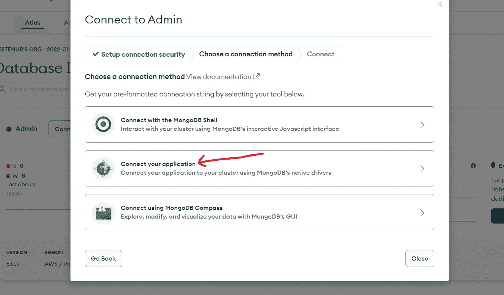
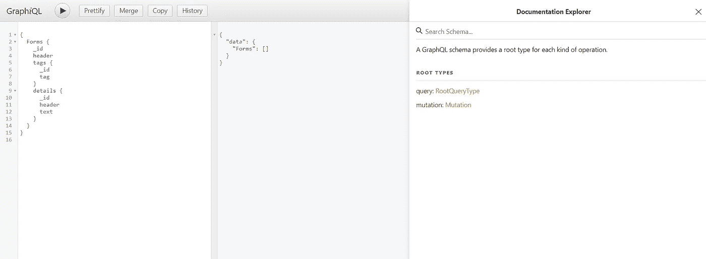
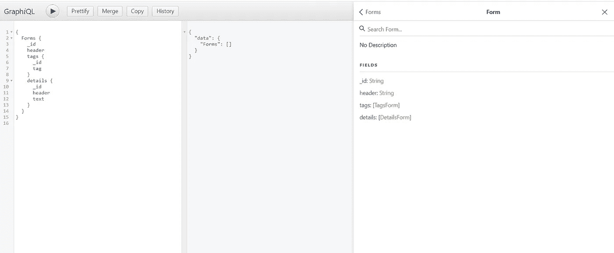
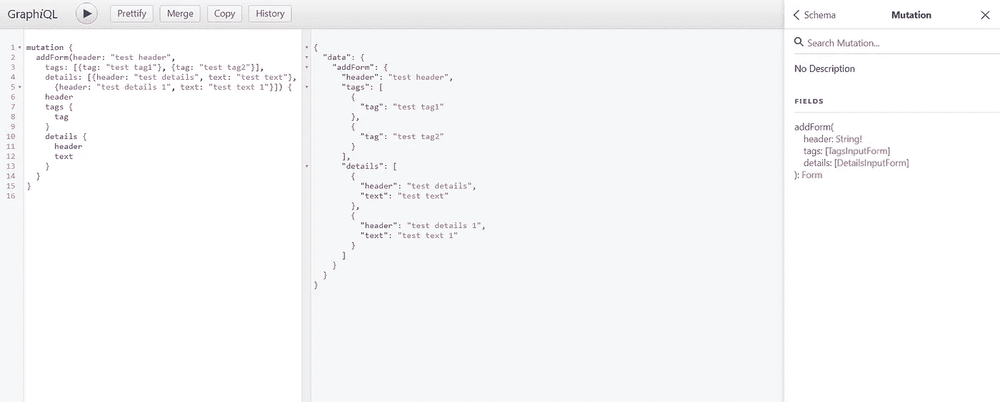
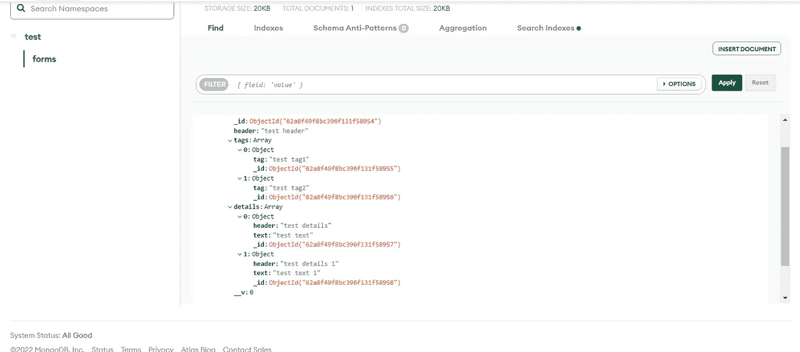

# GraphQL 服务、嵌套查询和 MongoDB 连接

> 原文：<https://javascript.plainenglish.io/graphql-services-and-mongodb-connection-b48b86289e93?source=collection_archive---------17----------------------->

## 如何使用 **GraphQL** 服务写入 **MongoDB** 。


Photo by [Campaign Creators](https://unsplash.com/@campaign_creators?utm_source=medium&utm_medium=referral) on [Unsplash](https://unsplash.com?utm_source=medium&utm_medium=referral)

你好，在今天的文章中，我将向你展示如何使用 **GraphQL** 服务向 **MongoDB** 写东西。

我们要做的第一步非常简单。然后，我将向您展示，如果您需要保存嵌套数据，您可以做些什么。

首先，让我们安装将要使用的软件包。

**nodemon** 包检测你的应用程序何时发生变化，并允许你运行应用程序，而不必停止/启动它。

`yarn nodemon / npm nodemon`

现在让我们打开我们的 server.js 文件。首先，让我们建立 Mongo 连接。

```
const MONGO_URI = 'your mongo url'
if (!MONGO_URI) { throw new Error('') }
```



创建 db 后，您可以通过单击 connect 从这里访问 Mongo URL。

```
***mongoose***.***Promise*** = ***global***.Promise
***mongoose***.connect(MONGO_URI)
***mongoose***.connection
    .once('open', () => ***console***.log('Connected to MongoLab instance.'))
    .on('error', error => ***console***.log('Error connecting to MongoLab:', error))
```

让我们将这些代码添加到 server.js 文件中。然后保存并检查连接是否建立。

**创建 GraphQL 查询**

首先，我们用 GraphQLObjectType 为将要创建的服务创建一个模式。

fields: () => ({…})将包含我们想要保存到 db 的字段。

标签和细节字段将采用列表的形式。我在另一个文件中创建了他们的模式。

如果你看，两者是一样的。我们将使用**标签类型**进行查询。在写突变的时候，我们将使用 **TagsInputType** 。

现在我们需要创建一个根查询类型。

我们将使用我在这里创建的表单字段查询 graphql。

现在让我们创造一个突变。

## 创造 GrapghQL 突变

突变是我们将进行添加、删除和编辑等操作的查询。

让我们创建 schema.ts 文件。

让我们将创建的 schema.js 添加到 server.js 文件中

```
const { graphqlHTTP } = require('express-graphql')
const ***schema*** = require('./schema/schema')
.
.
.
app.use('/graphql', graphqlHTTP({
    ***schema***,
    graphiql: true
}))
```

让我们创建要保存在 Mongo 中的模型。

现在我们已经编写了代码，是时候运行我们的项目了。



通过像这样在 GraphQL 上编写一个查询，您可以将数据保存到 db 并显示来自 db 的数据。

现在让我们来看看 MongoDB。



这是所有的交易。我在 GitHub 上分享代码。

谢谢你。

[](https://github.com/besteenurk/server) [## GitHub - besteenurk/server

### 此时您不能执行该操作。您已使用另一个标签页或窗口登录。您已在另一个选项卡中注销，或者…

github.com](https://github.com/besteenurk/server) [](https://bestte.medium.com/membership) [## 通过我的推荐链接加入 Medium—Beste

### 作为一个媒体会员，你的会员费的一部分会给你阅读的作家，你可以完全接触到每一个故事…

bestte.medium.com](https://bestte.medium.com/membership) [](/various-uses-of-the-javascript-library-particles-js-with-next-js-212e630bd538) [## JavaScript 库 Particles.js 与 Next.js 的各种用法

### 用 npm 包给你的页面添加一些动画怎么样？

javascript.plainenglish.io](/various-uses-of-the-javascript-library-particles-js-with-next-js-212e630bd538) [](/create-graphql-mutations-in-react-app-and-use-them-1eeb89545033) [## 在 React App 中创建 GraphQL 突变并使用它们

### API 操作是几乎所有应用程序的构建块。GraphQL 在这个阶段也帮助了我们。准备好…

javascript.plainenglish.io](/create-graphql-mutations-in-react-app-and-use-them-1eeb89545033) [](/5-things-you-should-know-about-react-router-version-6-bbf3d617c73e) [## 关于 React 路由器版本 6 你应该知道的 5 件事

### 了解这个最常用和最重要的 React 包的最新版本中的重大变化。

javascript.plainenglish.io](/5-things-you-should-know-about-react-router-version-6-bbf3d617c73e) 

*更多内容请看*[***plain English . io***](https://plainenglish.io/)*。报名参加我们的* [***免费周报***](http://newsletter.plainenglish.io/) *。关注我们关于*[***Twitter***](https://twitter.com/inPlainEngHQ)*和*[***LinkedIn***](https://www.linkedin.com/company/inplainenglish/)*。查看我们的* [***社区不和谐***](https://discord.gg/GtDtUAvyhW) *加入我们的* [***人才集体***](https://inplainenglish.pallet.com/talent/welcome) *。*