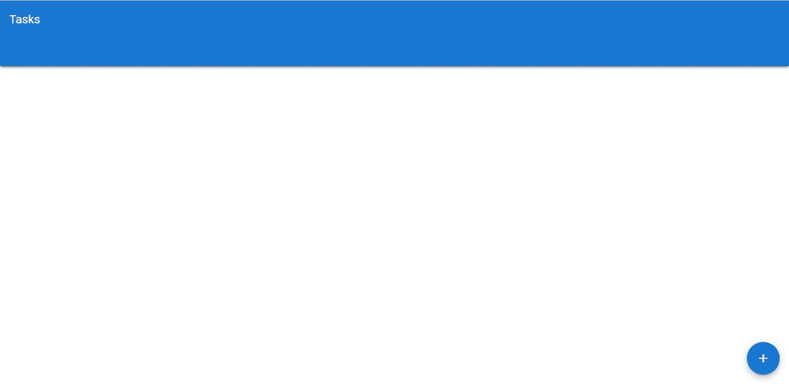
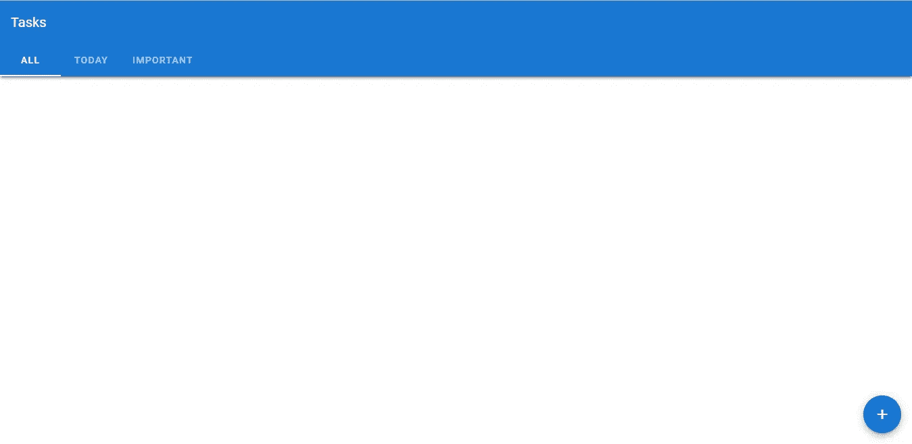
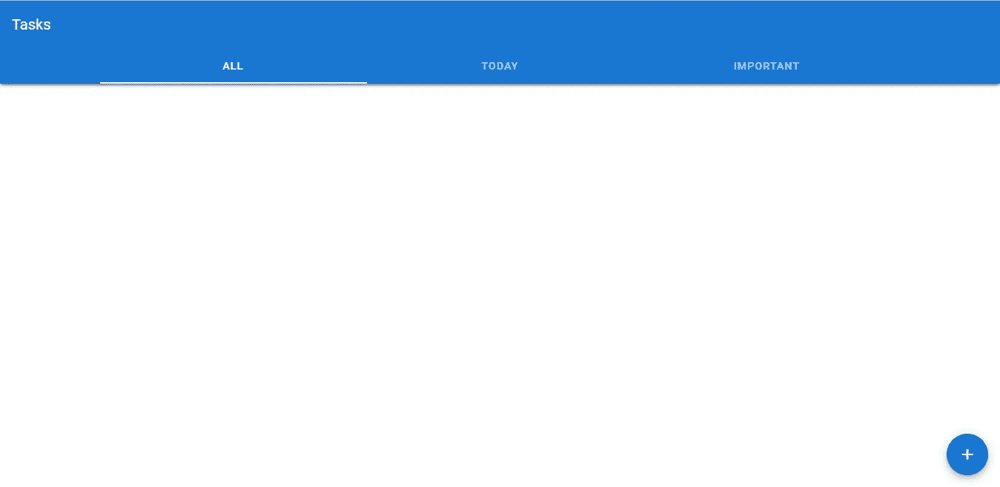
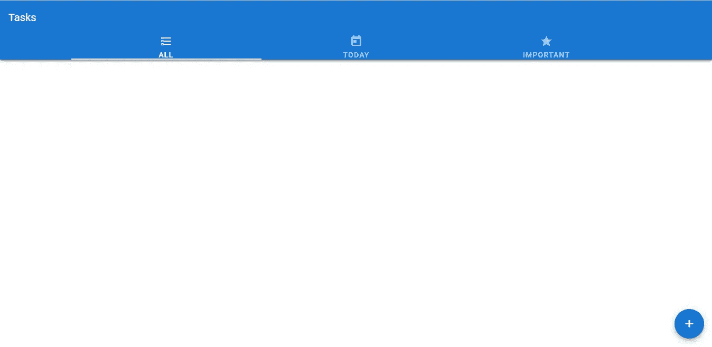
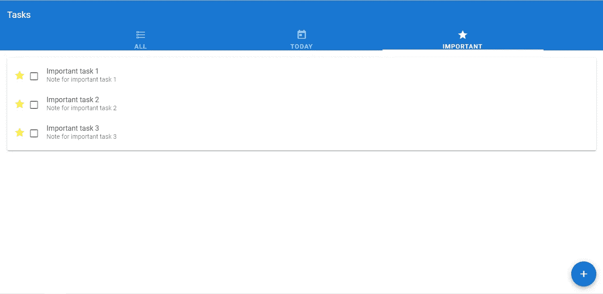

# 使用选项卡对任务分组|验证待办事项列表应用程序教程

> 原文：<https://javascript.plainenglish.io/grouping-tasks-tabs-vuetify-to-do-list-app-tutorial-e52633c13e67?source=collection_archive---------14----------------------->


欢迎回到这个激动人心的教程系列的另一集，在这个系列中，我们从头到尾使用 Vuetify 和 Vue.js 构建了我们自己的待办事项列表应用程序。在我们的[最后一集](/create-a-beautiful-to-do-list-app-with-vuetify-setting-task-due-dates-and-importance-e21e226b496c)中，我们添加了用户设置任务完成日期的功能，使用材料设计框架提供的菜单和日期选择器组件。我们还添加了一个复选框输入，允许用户将关键任务标记为重要。

今天，我们将使用 Vuetify 选项卡组件根据某些属性对我们的任务进行分组。

刚开始使用 Vuetify？查看这篇文章。

## 在 Vuetify 中创建选项卡

为了开始在我们的应用程序中创建选项卡，我们将在工具栏的`extension`槽中创建一个`v-tabs`组件:

```
**src/App.js**<template>
  <v-app>
    <v-card>
      <v-toolbar color="primary" elevation="3" dark rounded="0">
        <v-toolbar-title>Tasks</v-toolbar-title>
 **<template v-slot:extension>
          <v-tabs v-model="tab"> </v-tabs>
        </template>**
      </v-toolbar>
    </v-card>
    ...
  </v-app>
</template><script>
...
export default {
  name: 'App',
  data: () => ({
    tasks: [],
    showNewTaskDialog: false,
    newTask: {
      title: '',
      note: '',
      date: '',
      isImportant: false,
    },
    titleRules: [(value) => Boolean(value) || 'Enter a title'],
    showDatePicker: false,
    **tab: null,**
  }),
  ...
  },
};
</script>
...
```



## 任务分组

我们将任务分为三组，这是此类应用程序的常见类型:

*   所有—我们所有的任务
*   今天—当天到期的所有任务
*   重要—我们在创建过程中标记为重要的关键任务

让我们为每个组创建一个选项卡:

首先，我们将制作一个白色标签指示器，带有`v-tabs-slider`组件:

```
**src/App.js**<template>
  <v-app>
    <v-card>
      <v-toolbar color="primary" elevation="3" dark rounded="0">
        <v-toolbar-title>Tasks</v-toolbar-title>
        <template v-slot:extension>
          <v-tabs v-model="tab">
            **<v-tabs-slider color="white"></v-tab-slider>**
          </v-tabs>
        </template>
      </v-toolbar>
    </v-card>
...
```

然后我们用`v-tab`组件创建每个选项卡:

```
**src/App.js**<template>
  <v-app>
    <v-card>
      <v-toolbar color="primary" elevation="3" dark rounded="0">
        <v-toolbar-title>Tasks</v-toolbar-title>
        <template v-slot:extension>
          <v-tabs v-model="tab">
            <v-tabs-slider color="white"></v-tab-slider>
 **<v-tab>All</v-tab>
            <v-tab>Today</v-tab>
            <v-tab>Important</v-tab>**
          </v-tabs>
        </template>
      </v-toolbar>
...
```



# 获取此应用程序的源代码

在此注册[获得这个伟大应用的最新源代码！](https://mailchi.mp/e784cee7e19a/todo-list-app-source-code)

## 使标签固定

使用`fixed-tabs`道具，我们可以让`v-tabs`组件中的标签占据所有可用空间:

```
**src/App.js**<template>
  <v-app>
    <v-card>
      <v-toolbar color="primary" elevation="3" dark rounded="0">
        <v-toolbar-title>Tasks</v-toolbar-title>
        <template v-slot:extension>
          <v-tabs v-model="tab" **fixed-tabs**>
            <v-tabs-slider color="white"></v-tab-slider>
            <v-tab>All</v-tab>
            <v-tab>Today</v-tab>
            <v-tab>Important</v-tab>
          </v-tabs>
        </template>
      </v-toolbar>
    </v-card>
```



## 显示图标

让我们显示图标和每个标签文本。我们将设置`icons-and-text` `v-tabs`属性，将标签高度增加到 72px，这样图标和文本都可以在标签标题中使用:

```
**src/App.js**<template>
  <v-app>
    <v-card>
      <v-toolbar color="primary" elevation="3" dark rounded="0">
        <v-toolbar-title>Tasks</v-toolbar-title>
        <template v-slot:extension>
          <v-tabs v-model="tab" fixed-tabs **icons-and-text**>
            <v-tabs-slider color="white"></v-tab-slider>
            <v-tab>
              All
              **<v-icon> mdi-format-list-checkbox </v-icon>**
            </v-tab>
            <v-tab>
              Today
              **<v-icon> mdi-calendar-today </v-icon>**
            </v-tab>
            <v-tab>
              Important
              **<v-icon> mdi-star </v-icon>**
            </v-tab>
          </v-tabs>
        </template>
      </v-toolbar>
    </v-card>
...
```



## 显示选项卡项目

我们使用封装在`v-tab-items`组件中的`v-tab-item`元素来显示每个选项卡内容:

```
**src/App.js**<template>
  <v-app>
    <v-card>
      <v-toolbar color="primary" elevation="3" dark rounded="0">
        <v-toolbar-title>Tasks</v-toolbar-title>
        <template v-slot:extension>
          <v-tabs v-model="tab" fixed-tabs icons-and-text>
            <v-tabs-slider color="white"></v-tab-slider>
            <v-tab>
              All
              <v-icon> mdi-format-list-checkbox </v-icon>
            </v-tab>
            <v-tab>
              Today
              <v-icon> mdi-calendar-today </v-icon>
            </v-tab>
            <v-tab>
              Important
              <v-icon> mdi-star </v-icon>
            </v-tab>
          </v-tabs>
        </template>
      </v-toolbar>
    </v-card>
 **<v-tabs-items v-model="tab">
      <v-tab-item> </v-tab-item>
      <v-tab-item></v-tab-item>
      <v-tab-item></v-tab-item>
    </v-tabs-items>**
...
```

## 为每个选项卡项目显示不同的任务列表

现在我们将展示每个`v-tab-item`组件中不同的任务列表。如您所见，我们已经将原始任务列表的标记重构到一个`task-list`组件中，现在我们可以轻松地为每个选项卡项目重用它:

```
**src/App.js**<template>
  <v-app>
    <v-card>
      <v-toolbar color="primary" elevation="3" dark rounded="0">
        <v-toolbar-title>Tasks</v-toolbar-title>
        <template v-slot:extension>
          <v-tabs v-model="tab" fixed-tabs icons-and-text>
            <v-tabs-slider color="white"></v-tabs-slider>
            <v-tab>
              All
              <v-icon> mdi-format-list-checkbox </v-icon>
            </v-tab>
            <v-tab>
              Today
              <v-icon> mdi-calendar-today </v-icon>
            </v-tab>
            <v-tab>
              Important
              <v-icon> mdi-star </v-icon>
            </v-tab>
          </v-tabs>
        </template>
      </v-toolbar>
    </v-card>
    <v-tabs-items v-model="tab">
      <v-tab-item>
 **<task-list :list="tasks" v-on:delete="deleteTask"></task-list>**
      </v-tab-item>
      <v-tab-item>
 **<task-list :list="tasksDueToday" v-on:delete="deleteTask"></task-list>**
      </v-tab-item>
      <v-tab-item>
 **<task-list :list="importantTasks" v-on:delete="deleteTask"></task-list>**
      </v-tab-item>
    </v-tabs-items>
    ...
  </v-app>
</template><script>
...
**import taskList from './components/task-list.vue';**export default {
 **components: { taskList },**
  name: 'App',
  data: () => ({
    ...
  },
 **computed: {
    tasksDueToday() {
      const todayISOString = new Date().toISOString().substr(0, 10);
      return this.tasks.filter((task) => task.date === todayISOString);
    },
    importantTasks() {
      return this.tasks.filter((task) => task.isImportant);
    },
  },**
};
</script>
...
```

使用新添加的计算属性`tasksDueToday`和`importantTasks`，我们对`tasks`数组执行过滤操作，以获得与该组相关的条目。



Only important tasks show up in the “Important” tab

就这样吧！

# 未完待续…

今天，我们学习了如何在 Vuetify 中使用各种与选项卡相关的组件，通过它们，我们能够使用我们创建的选项卡将我们的任务分成三个不同的组。

我们的待办事项应用程序继续成型，敬请期待我们的下一集！

[注册](http://eepurl.com/hRfyJL)订阅我们的每周简讯，了解我们最新的精彩内容！