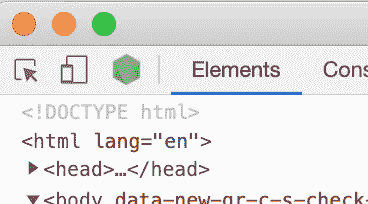
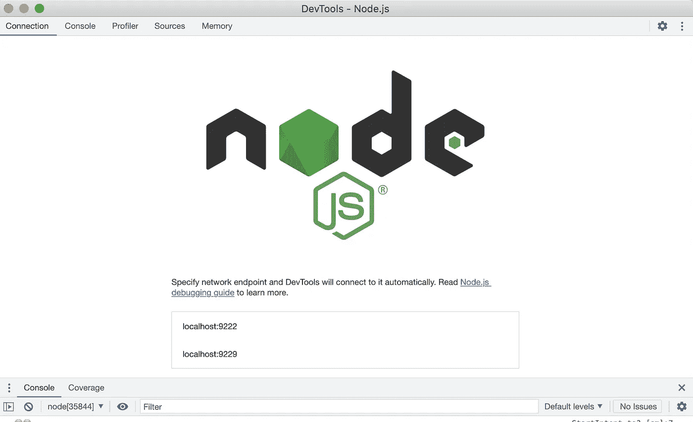

# Node.js 应用程序调试指南

> 原文：<https://javascript.plainenglish.io/guide-to-debugging-node-js-applications-3bd76416cd9c?source=collection_archive---------8----------------------->

即使是设计最好的软件也会有意想不到的错误。那我们怎么调试呢？调试应用程序的最佳方法和工具是什么？

就易用性而言，在开发或原型开发过程中，没有什么能比旧的 console.log 更好了。它很快，语法很简单，而且我们可以同时记录多件事情。

这不是生产环境中的最佳解决方案，因为过多的日志生成会降低服务速度。对于调试具有多个代码分支的更复杂的问题来说，这并不太好，因为在复杂的代码中很容易迷失方向。有哪些选择？


Photo by [Ray Hennessy](https://unsplash.com/@rayhennessy?utm_source=medium&utm_medium=referral) on [Unsplash](https://unsplash.com?utm_source=medium&utm_medium=referral)

调试 Node.js 有两种更好的方法。

1.  从终端开始，使用 Chrome DevTools
2.  使用 VSCode 集成调试器

# 使用 DevTools 调试

如果你是一个全栈开发人员，我相信你对 Chrome DevTools 很熟悉，但你知道它可以用于 Node.js 应用程序吗？

使用— inspect 选项启动应用程序，如下所示。

```
# node --inspect server.js

Debugger listening on ws://127.0.0.1:9229/xxxxx-xxxx-xxxx-xxxx-xxxxxxxxxxxx
For help, see: https://nodejs.org/en/docs/inspector
Server running at http://127.0.0.1:3000/
Debugger attached.
```

该命令将在调试模式下运行 Node.js。它将打开一个 WebSocket，其他应用程序可以连接到这个 web socket 进行调试。当你打开 Chrome DevTools 时，它会自动检测打开的 Node.js 调试端口，并在左上角显示一个 Node.js 图标。单击该图标打开一个专用的 DevTools 窗口来调试您的应用程序。



Node.js icon in DevTools

如果您的应用程序是短期的，您没有时间打开调试窗口，可以使用— **inspect-brk** 选项。它会在启动时暂停应用程序的执行，给你时间打开 DevTools。

如果您将 TypeScript 与 ts-node 一起使用，以下命令将会很有帮助:

```
node --inspect -r ts-node/register  ./application.ts
```

用于调试 Node.js 的 DevTools 窗口的选项卡比它的浏览器兄弟少。我们可以找到标签

*   日志条目控制台。
*   断点和调试的源。
*   CPU 分析
*   内存分析。



在 console 选项卡中，我们可以像在浏览器中一样过滤日志输出。如果您的应用程序产生大量日志，这可能有助于大海捞针。在控制台窗口中查看日志条目比在终端中容易得多。

在 sources 选项卡中，我们可以找到应用程序的所有源代码。如果你有一个 TypeScript 应用程序，并使用源地图，我们将看到原始的 TypeScript 代码。如果没有源代码图，您将会看到编译后的代码，可读性和有用性将会降低。

# 添加断点

当问题比我们用简单的日志所能识别的更复杂时，我们将需要在代码中的某些断点或行号处暂停应用程序。这将允许我们检查应用程序的当前状态。哪些变量被初始化？这些变量的值是什么？我们从 HTTP 请求中得到的确切值是多少？

有两种方法可以添加断点。它们可以通过编写**调试器来添加；**在源代码中。我们可以在任何我们想写的地方写它，它只会在应用程序以调试模式运行时暂停它。(尽管如此，最好不要将这些语句留在代码中)

也可以通过单击源文件中的行号来创建断点。断点用深蓝色箭头标记，而非活动断点用浅蓝色箭头标记。这两种断点的行为方式相同。

当命中断点时，打开源文件，突出显示断点行，显示调用堆栈和范围内的所有变量。

代码会暂停，直到您按下 resume、单步执行、单步执行或单步执行。“步骤”按钮允许您继续执行部分代码，并更好地理解所采用的代码路径。

# CPU 分析

如果您想知道代码的哪些部分使用了最多的 CPU，或者您是否有性能问题，您可以分析您的代码。这与其说是纯粹的调试，不如说是性能优化，尽管错误的实现会导致更高的 CPU 负载。

导致高 CPU 负载的原因并不总是很清楚，可能是一些简单的事情，如过多的 console.log 语句或对相对较大的 JSON 负载的解析。关于绩效评估的更多信息，你可以在这里阅读我的故事。

# 内存分析

内存泄漏是很难解决的问题。它会导致服务慢慢耗尽越来越多的内存，直到以不可预知的方式崩溃。

V8 内存分析器允许您在给定时间拍摄应用程序内存的快照，然后做一些工作并制作另一个快照。通过比较这两个快照，您可以了解应用程序的内存量。

# VSCode 调试

如果您更愿意使用 IDE 来调试代码，可以使用 VSCode 中的 javascript 调试终端自动进行调试。

从菜单或快捷键 CTRL+SHIFT+'打开终端。

从+号旁边的下拉菜单中，选择 JavaScript Debug Terminal。

也可以使用 CTRL+SHIFT+P 打开调试终端，并键入“javascript debug terminal”

在 VSCode 中调试允许您直接在文件编辑器窗口中设置断点。它通常与 DevTools、CPU 和内存分析中的调试工作相同。调试控制台也有一些限制。

我只在必要的时候使用调试模式，因为这是有代价的，启动时间要长得多，性能也会下降。打开调试 websocket 有安全风险，所以不要在生产中使用— profiling 选项。

调试模式和断点在修复单元测试时工作得一样好，我发现它对那个用例真的很有用。

如果您喜欢在 IDE、DevTools 中调试或者使用 console.log，请在评论中告诉我。

如果你喜欢你所读的，考虑加入 Medium，读更多的文章。你的一部分稿费用来支持像我这样的作者。点击这里加入。

*更多内容看* [***说白了就是***](https://plainenglish.io/) *。报名参加我们的* [***免费周报***](http://newsletter.plainenglish.io/) *。关注我们关于* [***推特***](https://twitter.com/inPlainEngHQ) ，[***LinkedIn***](https://www.linkedin.com/company/inplainenglish/)*，*[***YouTube***](https://www.youtube.com/channel/UCtipWUghju290NWcn8jhyAw)*，以及* [***不和***](https://discord.gg/GtDtUAvyhW) ***。***

***对缩放您的软件启动感兴趣*** *？检查出* [***电路***](https://circuit.ooo?utm=publication-post-cta) *。*