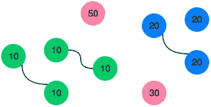

# HackerRank 算法挑战—按匹配销售(JavaScript)

> 原文：<https://javascript.plainenglish.io/hackerrank-algorithm-challenge-sales-by-match-javascript-df9d0f0ddd89?source=collection_archive---------4----------------------->

## 确定在代表每只袜子颜色的整数数组中有多少双颜色匹配的袜子。

有一大堆袜子必须按颜色搭配。给定一个表示每只袜子颜色的整数数组，确定有多少双颜色匹配的袜子。

**例子**

```
***n = 7******ar = [1, 2, 1, 2, 1, 3, 2]***
```

有一副彩色 **1** 和一副彩色 **2** 。还剩三只袜子，每种颜色一只。对数为 **2** 。

## **功能描述**

在下面的编辑器中完成 sockMerchant 函数。

sockMerchant 具有以下参数:

*   *int n:袜子堆中袜子的数量*
*   *int ar[n]:每只袜子的颜色*

## **返回**

*   *int:对数*

## **输入格式**

第一行包含一个整数 ***n*** ，用 ***ar*** 表示袜子的数量。
第二行包含 ***n*** 空格分隔的整数，***ar【I】***，袜子在堆中的颜色。

## **约束**

*   *1 ≤ n ≤ 100*
*   *1 ≤ ar[i] ≤ 100 其中 0 ≤ i < n*

**样本输入**

```
STDIN                       Function
-----                       --------
9                           n = 9
10 20 20 10 10 30 50 10 20  ar = [10, 20, 20, 10, 10, 30, 50, 10, 20]
```

**样本输出**

```
3
```

**解释**



sample output — image

有三双袜子。

## 解决办法

所以，我们有一个代表一双袜子的数字数组。我们被要求找出一个给定数字出现的次数。如果一个数字出现在两个序列中(2 次)，我们将返回一双袜子。如果数字出现在三个序列中(3 次)，我们应该返回 1，因为只有一双袜子。记住一对等于(=)两次出现。

**谨记:**

*   给定数组的出现次数。
*   给定一对中的事件(2)返回一。

我们可以对数组中的元素进行排序，使数组按升序排列。现在我们已经对数组中的元素进行了排序。我们可以遍历数组并比较数组序列。

```
**function** sockMerchant(n, ar) {*// Write your code here***let** numberOfSocks = ar.sort( (x,y) => x— y);**let** numberOfPairs = 0;
   **for** (**let** i = 0; i < n — 1; i++) {
      **if** ( numberOfSocks[i] === numberOfSocks[i + 1]) {
          numberOfPairs++;
          i += 1;
       }
   }
**return** numberOfPair;
```

## 您也可以这样编写代码:

```
**function** sockMerchant(n, ar) {*// write your codes here* **let** NumberOfPairs = 0;*// this is for sorting the array elements*       ar.sort()*// iterate through the array and compare the elements* **for** (**let** i = 0; i<n; i++){ **if**(ar[i] == ar[i+1]){*// increment i iteration and add a pair* i++ NumberOfPairs++ } } **return** NumberOfPairs;*// number of elements in the array**// elements in the array* **let** NumberOfPairs = [10, 20, 20, 10, 10, 30, 50, 10, 20] console.log(sockMerchant(n, NumberOfPairs))
*// Output: 3*}
```

## 注意:

**arr.sort()** 方法用于根据 **compare()** 函数按照给定的顺序对数组进行排序。如果该方法被省略，则数组按**升序**排序。

**语法:**

```
arr.sort(compareFunction)
```

在下面的例子中， **sort()** 方法按升序排列数组的元素。

```
var arr = [2, 5, 8, 1, 4]
document.write(arr.sort());
document.write(arr);
```

**输出:**

```
1,2,4,5,8
1,2,4,5,8
```

## ***for 循环***

是一种重复执行代码的方式。你可以用一个 ***来代替*** 循环，而不是敲入`console.log(“hi”)`五次。

示例:

```
const iterable = [10, 20, 30];

for (let value of iterable) {
  value += 1;
  console.log(value);
}
// 11
// 21
// 31
```

***变量:*** 在每次迭代中，不同属性的值被赋给`variable`。`variable`可以用`const`、`let`或`var`来申报。

***Iterable:***Iterable 属性被迭代的对象。

`for...of`循环是迭代数组的最简单和最灵活的技术。它用于低语法方法，更易于阅读。

现在你知道了。感谢您的阅读。

*更多内容看* [***说白了就是***](http://plainenglish.io/) *。报名参加我们的* [***免费周报***](http://newsletter.plainenglish.io/) *。在我们的* [***社区***](https://discord.gg/GtDtUAvyhW) *获得独家获得写作机会和建议。*