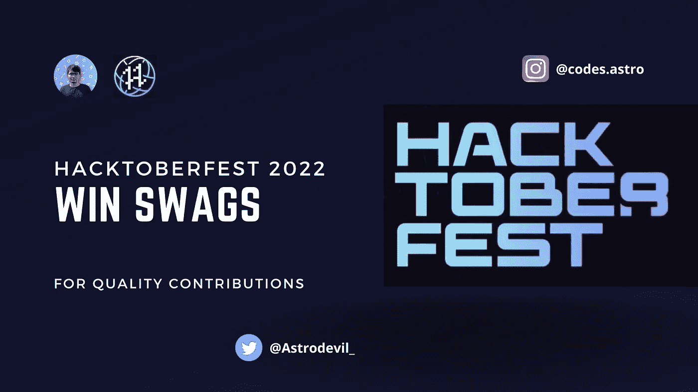

# Hacktoberfest 2022:赢得高质量贡献的奖品

> 原文：<https://javascript.plainenglish.io/hacktoberfest-2022-win-swags-for-quality-contributions-3373cae0e849?source=collection_archive---------16----------------------->

Hacktoberfest 2022 正在进行中，您一定已经开始投稿了。每个人都喜欢开发者社区中的赠品。让我告诉你一些好机会，在 10 月 22 日期间，通过为令人敬畏的项目增加价值来获得酷的奖品。**贡献质量，获得回报！**

# 1.[啤酒节](https://hacktoberfest.com/)

在 10 月期间，向 GitHub 或 GitLab 上的任何 hacktoberfest 标记的存储库投稿，以赢得官方 Hacktoberfest 奖品。

*   4 个合并的 pr 将有资格获得赠品

# 2. [appwrite](https://hacktoberfest.appwrite.io/)

您可以通过不同的方式为 Appwrite 做出贡献。所有接受的贡献都有资格获得 Appwrite 赠品！

*   1 贡献:原始 Appwrite 贴纸包
*   2 贡献:原 Appwrite 贴纸包限量版 Hacktoberfest 贴纸包
*   3 贡献:原创 Appwrite 贴纸包限量版 Hacktoberfest 贴纸包袜子
*   4 个或更多的贡献:限量版 Appwrite Hacktoberfest T 恤贴纸包袜子

# 3.[显示案例](https://www.showwcase.com/opensource)

Showwcase 是开发者学习、分享和成长的平台。您可以使用 shows 制作免费访问的博客帖子、视频、播客和各种其他内容。

您可以自由地为这个 Hactoberfest 开发任何类型的节目，并贡献低代码内容。

*   为开源发布的每个新节目都将在 Showwcase、Twitter 和 LinkedIn 上以 Showwcase 为特色。
*   所有贡献者都将收到一个以 Hacktoberfest 为主题的数字徽章，作为他们在 Showwcase 开发人员个人资料中所做贡献的证明
*   赢取奖品:徽章、奖品、贴纸和吹牛的权利！

# 4.[黑客小队 2022](https://www.hacksquad.dev/)

使用您的 GitHub 注册 HackSquad，加入一个小队或被分配到一个随机小队，贡献代码并获得奖品！每个小队最多可以有 5 名成员。

*   前 60 名的小分队将赢得令人敬畏的奖品！大约 300 名获奖者！

# 5.[卡蒙达](https://camunda.com/hacktoberfest2022/)

Camunda 将为每一个成功完成的 Camunda 挑战赛捐赠一棵树；该组织在世界各地植树，重点是恢复栖息地。

如果你在挑战中成功，你将可以选择获得限量版的 Camunda x Hacktoberfest 2022 t 恤。

*   向任何 Camunda 回购提交四(4)份质量拉动请求(PRs ),包括 [bpmn.io](http://bpmn.io) 和参与* Camunda 社区中心回购。

# 6.appsmith

代码，低代码，无代码投稿欢迎。

*   代码-每个被接受的 PR 将为您赢得更多的硬币。
*   低/否-每个贡献的模板都是 Hacktoberfest 竞赛的参赛作品。我们将在多个类别中分配 36 个总奖项。
*   去逛街！—使用我们奖品中的硬币选择您想要的奖品。他们会准备好并运送给你。

# 7.[啤酒节](https://github.com/dailydotdev/memetoberfest)

由 daily.dev 赞助的开源模因大赛！每个人都可以通过提高 PR 来参与。

*   10 个最好的迷因将获得 daily.dev SWAG！

# 8.[哈苏拉](https://hasura.io/blog/with-hasura-celebrate-open-source-in-style-with-hacktoberfest/)

针对提到的一个或多个问题提交一份 PR。我们将在两周内审核您的 PR。如果有效，它将被合并或标记为“hacktoberfest-accepted”。

*   提交有效投稿的每个人都会收到一件 t 恤和一个贴纸包。
*   我们将回复您的公关评论，要求您填写订单。

# 9.[扩增](https://github.com/amplication/amplication/issues/4039)

Amplication 是一个开源开发工具。它可以帮助您开发高质量的 Node.js 应用程序，而无需在重复的编码任务上花费时间。为了帮助你开始，他们为开源贡献者准备了很多问题。

*   提交一到两个有效拉动请求的贡献者将获得一张独家贴纸。
*   提出三个或更多有效拉取请求的贡献者将获得一个专属咖啡杯或一件 t 恤的选择。

# 10.[工具喷射](https://blog.tooljet.com/hacktoberfest-2022/)

ToolJet 是一个用于构建内部工具的开源低代码平台。伴随着巨大的机遇而来的是巨大的财富。每个有效的 PR 都有资格获得 ToolJet 赠品！

*   1 有效公关:ToolJet 贴纸和 t 恤。
*   3 份有效的 PRs——tool jet 贴纸、t 恤、水瓶。
*   4 个有效的 PRs — ToolJet 贴纸、t 恤、连帽衫、水瓶。
*   此外，前 5 名贡献者这次将获得一份惊喜礼物！

# 11. [novu](https://novu.co/hacktoberfest/)

投稿公开问题，写博文或做教程。

*   只需 3 个合并的 PRs 就能赢得一个礼品包！

# 12. [RapidAPI](https://rapidapi.com/learn/hacktoberfest)

RapidAPI 是世界上最大的 API 中心，300 多万开发人员在这里寻找、连接、构建和销售数万个 API。

*   提交您的申请以赢得 RapidAPI 的奖品。
*   我们将选择前 50 名完成挑战的参与者作为获胜者。这些参与者将获得 RapidAPI 提供的奖品。

# 13.[电子管](https://github.com/devtron-labs/hacktoberfest2022)

为了与世界各地的社区一起庆祝开源，Devtron 很高兴与 Hacktoberfest 合作。Devtron 鼓励开发人员、DevOps 专家、技术作家、设计师以及任何有经验的人尽他们最大的努力为我们的开源项目做出贡献，因为我们是一个开源平台。

*   微博:10 月 1 日—10 月 30 日
*   猎虫:10 月 9 日—10 月 31 日
*   艺术马拉松:10 月 16 日—10 月 23 日
*   黑客日记:10 月 23 日至 10 月 31 日

每个类别都有多个超酷赠品。

# 14. [QuestDB](https://questdb.io/blog/2022/09/30/hacktoberfest-questdb/)

QuestDB 是一个针对时间序列的高性能开源数据库。该项目是用 Java 和 C++从零开始构建的，没有依赖性，没有垃圾收集。

*   如果您成功地向列出的任何 QuestDB 项目提交了一个有效的 pull-request，他们会提供一件额外的 QuestDB T 恤。

# 15.[蔗糖酶](https://invertase.io/community/hacktoberfest)

除了由 Digitalocean 举办的主要活动之外，Invertase 和关注开源的社区合作伙伴一起为世界各地的 Flutter 和 Dart 开发者举办了一个令人兴奋的月份。这个月，你真的需要关注提名库的质量 PRs，以赢得我们的一个赠品盒。

*   4 类成吨的赃物。[了解更多](https://invertase.io/community/hacktoberfest)

# 16. [Uno 平台](https://platform.uno/blog/uno-platform-at-hacktoberfest-2022-prizes-and-how-to-participate/)

今年的活动除了代码贡献之外，还强调非代码贡献，如文档、博客和宣传。

*   10 个质量拉动请求— Uno 平台毛衣和贴纸
*   4 个质量拉动请求— Uno 平台 t 恤和贴纸
*   2 质量拉请求 Uno 平台和 WinUI 3 电子书入门。

# 17.[巴基斯托](https://webkul.com/meetups/hacktober-fest-bagisto-2022/)

第三届 hacktober fest 将由 Webkul 组织。这是为 laravel 电子商务项目 Bagisto 贡献您的技能的绝佳机会。现在成为发展最快的开源电子商务平台 Bagisto 的一员。

*   对于每 4 个被接受的公关，你可以采用宽松的大象以及酷的赠品

# 18.[该死的代码](https://codedamn.com/hacktoberfest)

与世界其他地方共享您的项目。通过添加挑战和说明，将您的项目创建/修改为迷你课程。

*   赢取 T 恤衫和现金奖励。

# 19. [DagsHub](https://dagshub.com/blog/dagshub-x-hacktoberfest-2022/)

去年我们注意到 Hacktoberfest 对于 ML 项目的贡献选项非常少。这就是为什么我们决定创建一个盛大的开源数据科学节，并开启两个新的挑战(更多将到来🤐)来参加 Hacktoberfest，并恢复去年的挑战。DagsHub 对 ML 社区有一些令人惊讶的挑战！

*   DagsHub 将向在 Hacktoberfest 期间贡献至少 2 个拉请求的所有参与者发送礼品。
*   如果你提出 10 个以上的拉货请求，他们会给你寄一个完整的礼品包！

# 20.[美杜莎](https://medusajs.com/blog/medusa-hackathon/)

Hacktoberfest 期间的 Medusa Hackathon 为您提供免费赠品、绝佳的项目机会以及赢取 1500 美元的机会。

*   美杜莎黑客马拉松 t 恤+黑客马拉松连帽衫
*   参与证书
*   有些惊讶美杜莎·默奇🎁
*   对于预先注册:美杜莎手提包

# 21. [Meilisearch](https://blog.meilisearch.com/contribute-hacktoberfest-2022/)

Meilisearch 是 Rust 内置的开源搜索引擎。团队和社区都努力构建与大多数流行的开发语言、框架和部署选项的集成，以便 Meilisearch 无缝地适应大多数开发人员的工作流程。

*   他们今年不会接受对文档回购的贡献。
*   问题不会分配给贡献者:相反，团队将批准最能解决问题的 PR。
*   低质量的 PRs 将不予考虑。
*   每位投稿者都将获得专属礼品。

# 22. [mindsdb](https://mindsdb.com/hacktoberfest)

我们准备了几类开放问题，非常适合首次开发人员、低代码和无代码贡献者。

*   每 10 个积分，您将获得一次参加 Razer Blade 15 笔记本电脑抽奖的机会。
*   你还可以从 10 个小玩意中任选一个。

# 23. [StepZen](https://stepzen.com/blog/stepzen-hacktoberfest-2022)

StepZen 正在参加 Hacktoberfest，您可以通过在我们的示例库中添加新的集成或改进现有的集成来做出贡献。这个库的每一次 PR 都将计入你的 Hacktoberfest 目标。

*   除了获得官方 Hacktoberfest 的资格，贡献者还将获得 StepZen 礼物。

我希望你能为上述项目/平台增加一些价值，并获得同样的回报。享受这个十月，赢取大奖。这是我这边的一个要求，不要为了赠品而发垃圾公关。交付质量。

> 立即获取[开发者资源库— 300 多种资源和工具](https://astrodevil.gumroad.com/l/dsHfg?layout=profile)。
> 
> 在 Instagram [codes.astro](https://www.instagram.com/codes.astro/) 上关注我，了解更多开发者内容。

## 如果你❤️我的内容！在推特[上联系我](https://mobile.twitter.com/Astrodevil_)或者通过[给我买一辆 Coffee☕](https://www.buymeacoffee.com/Astrodevil) 来支持我

*更多内容看* [***说白了。报名参加我们的***](https://plainenglish.io/) **[***免费周报***](http://newsletter.plainenglish.io/) *。关注我们关于* [***推特***](https://twitter.com/inPlainEngHQ) ，[***LinkedIn***](https://www.linkedin.com/company/inplainenglish/)*，*[***YouTube***](https://www.youtube.com/channel/UCtipWUghju290NWcn8jhyAw)*，以及* [***不和***](https://discord.gg/GtDtUAvyhW) *。对增长黑客感兴趣？检查* [***电路***](https://circuit.ooo/) *。***