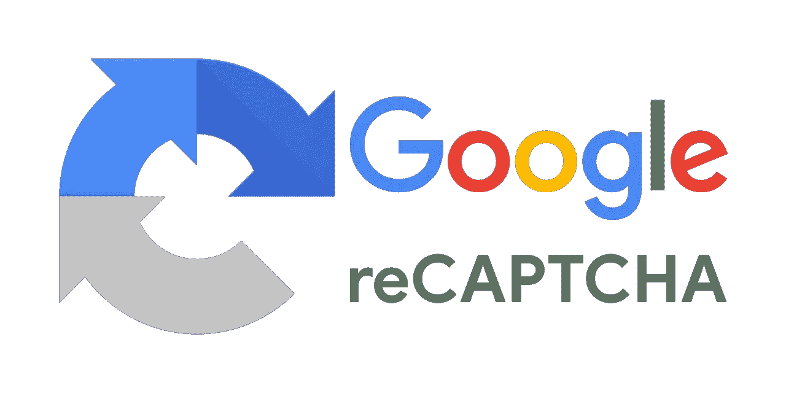
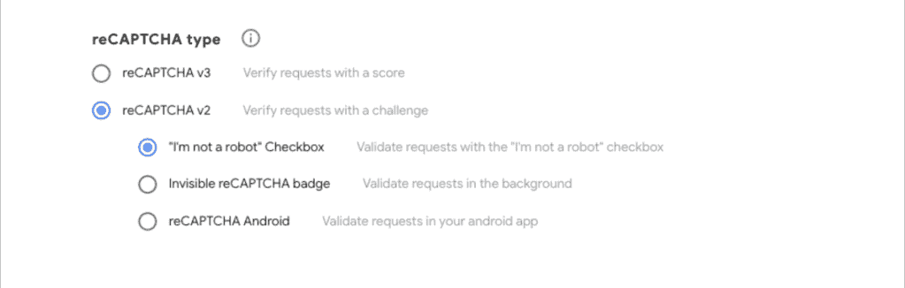
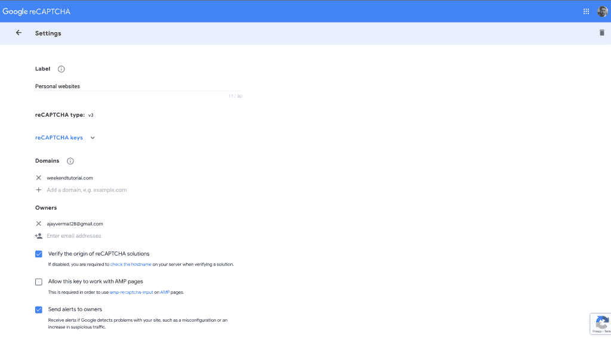
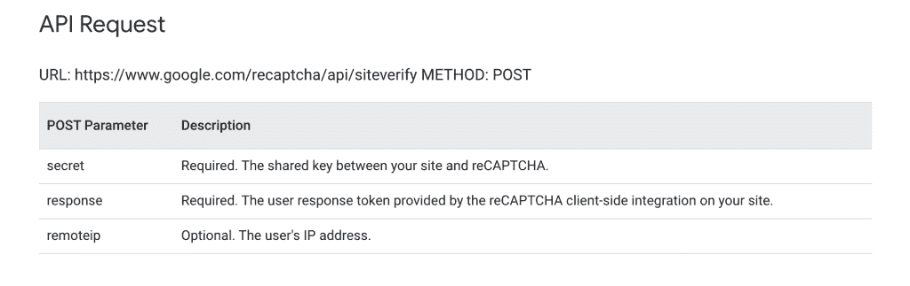
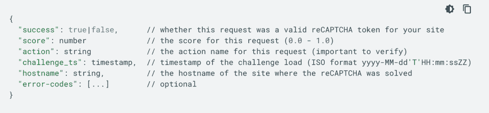

# 2022 年如何正确整合 Google ReCaptcha v3？

> 原文：<https://javascript.plainenglish.io/hahow-to-integrate-google-recaptcha-v3-correctly-in-2022-15a4fd186d7?source=collection_archive---------8----------------------->

## 防止垃圾邮件的解决方案。

Google Recaptcha 是解决垃圾邮件问题的行业标准方法之一。



Google Recaptcha

## 什么是垃圾邮件？

垃圾邮件又称“垃圾邮件”,是指不请自来的电子邮件，通常发送给大量收件人电子邮件用户。该收件人的电子邮件地址被攻击者窃取或购买，用于金钱盗窃或商业目的，具体取决于攻击者的目的。

这些电子邮件大部分时间都隐藏着不应该打开的恶意软件，如果有人打开他们的邮件并点击链接，就会成为这些攻击者的受害者。

**例如**垃圾邮件的源头——

1.  网站上的登录、注册和重置密码表单
2.  博客中的评论和联系我们部分

有四种类型的谷歌 ReCaptcha——



在本文中，我们将集成最新的 google ReCaptcha v3。

如果你已经在使用 Google Recaptcha v2，并且想升级到 Google Recaptcha v3，你可以阅读 Google 文档，这非常简单。

# 集成 Google Recaptcha V3 的步骤

## 第一步。在 ReCaptcha admin 上注册您的网站

首先，我们需要在 [ReCaptcha 管理控制台](https://www.google.com/recaptcha/admin/site/)上注册网站。

看起来是这样的——



# 第二步。客户端集成

在管理控制台上注册网站后，记下 reCAPTCHA 键。

在上图中，你一定看到了 reCaptcha 键。

**ReCaptcha 给出 2 个键-**

**1。站点密钥—** 这是公共密钥，用于客户端集成。
2**2。秘钥—** 这是私钥，不能暴露给任何人。这应该安全地存储在您的后端服务器中。

让我们从客户端集成开始

## 1.用您的站点密钥加载 JavaScript API

```
<script src="https://www.google.com/recaptcha/api.js?render=<site_key>"></script>
```

在上面的代码中，您将传递实际的 Recaptcha 站点密钥来代替

例如，如果 Recaptcha 站点密钥是 **sdfjhjk124jkhk**

你就当**通过？render=sdfjhjk124jkhk**

## 2.对您希望保护的每个动作调用“grecaptcha.execute”

```
<script>
    function onClick(e) {
        e.preventDefault();
        grecaptcha.ready(function() {
            grecaptcha.execute('reCAPTCHA_site_key', {action: 'submit'}).then(function(token) {
                // Add your logic to submit to your backend server here.
            });
        });
    }
</script>
```

无论您希望保护哪个输入框，它可能是您的注册、登录或其他字段，您都需要更新点击处理程序，与上面类似。

您可以看到上面的代码，我们将实际的 Recaptcha 站点密钥和一个回调函数传递给 grecaptcha.execute 函数。

当回调被执行时，我们得到了其中的令牌。这个令牌需要立即传递给后端服务器来获取用户分数。

## 3.立即向您的后端发送令牌并请求验证

这将触发服务器端流。

# 第二步。服务器端集成

利用客户机传递的令牌和已经存储在服务器端的 Recaptcha 密钥，后端将调用 google site-verify api。

google site-verify API 返回一个介于 0.0 到 1.0 之间的分数。我们还设置了一个阈值分数，默认值为 0.5，达到该值时，我们将允许用户发出请求。

如果分数小于阈值分数，我们可以说用户不是人类，而是机器人。如果分数>阈值分数，则用户是人类，并且允许点击的实际功能。

## 请求端点



## 站点验证响应

响应是一个 JSON 对象。



# 挑战

在 StackOverflow 上，我在搜索一些关于 ReCaptcha 的东西，发现大多数人都没有正确地实现它。

他们从服务器端获得分数，并在客户端比较分数和阈值，这是完全错误的。

**例如下面的实现是错误的**

```
<script>
    function onClick(e) {
        e.preventDefault();
        grecaptcha.ready(function() {
            grecaptcha.execute('reCAPTCHA_site_key', {action: 'submit'}).then(function(token) {
                var score = fetchScoreFromAPI(token);
                if (score > THRESHOLD_SCORE) {
                    callCommentApi();
                }
            });
        });
    }
</script>
```

上述不正确的原因是-

1.  客户端从不进行验证
2.  攻击者可以轻松地操纵分数，查看 comment API 端点，并向其发送大量未经请求的电子邮件。

**下面是正确的实现——**

```
<script>
    function onClick(e) {
        e.preventDefault();
        grecaptcha.ready(function() {
            grecaptcha.execute('reCAPTCHA_site_key', {action: 'submit'}).then(function(token) {
                callCommentAPI(token);
            });
        });
    }
</script>

// At server side
function callCommentAPI(token){
    var score = fetchScoreFromAPI(token);
    if (score > THRESHOLD_SCORE) {
        // execute logic for comment API
    }
}
```

因此，我们只是将令牌传递给现有的 API，验证在服务器端完成，这是更安全和正确的方式。

此外，您可以注意到，即使 comment API URL 是公开的，但它不会收到垃圾邮件，因为它首先检查分数。

# 摘要

我希望你学到了新的东西。让我知道你是否认为你能以不同的方式解决它，或者这篇文章是否有问题。

如果你喜欢这篇文章，请分享这篇文章并**关注我**。

请阅读我的其他受欢迎的文章

1.  [Nginx 教程](https://weekendtutorial.com/nginx-tutorial/)
2.  [浏览器存储](https://weekendtutorial.com/browser-storage-in-detail-part-1/)

就这些了，下次再见吧。

*更多内容请看*[***plain English . io***](https://plainenglish.io/)*。报名参加我们的* [***免费周报***](http://newsletter.plainenglish.io/) *。关注我们关于*[***Twitter***](https://twitter.com/inPlainEngHQ)*和*[***LinkedIn***](https://www.linkedin.com/company/inplainenglish/)*。加入我们的* [***社区不和谐***](https://discord.gg/GtDtUAvyhW) *。*