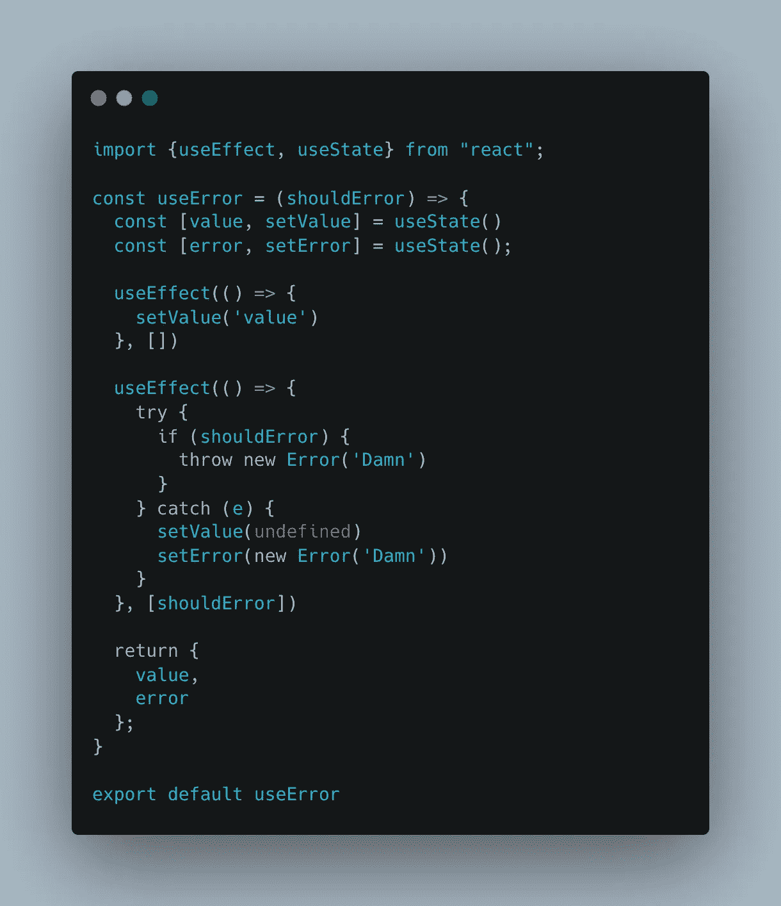

# 测试 React 挂钩时处理错误

> 原文：<https://javascript.plainenglish.io/handle-error-while-testing-your-hooks-e845a08045a4?source=collection_archive---------7----------------------->

## 如何在测试 React 挂钩时处理错误，并针对特定的错误

Photo by Karolina Grabowska: [https://www.pexels.com/photo/four-various-fishing-baits-on-white-background-6478113/](https://www.pexels.com/photo/four-various-fishing-baits-on-white-background-6478113/)

之前，我有幸写了一篇关于**测试你的钩子**的文章。现在我们将更深入，看看如何在测试钩子时处理异常。

 [## 如何像专业人士一样测试你的反应钩

### 一开始看起来可能很复杂，但是测试 React 钩子实际上非常简单！

javascript.plainenglish.io](/testing-your-hooks-like-a-pro-e1e0d7106670) 

处理异常是测试的一个完整部分。它涵盖了应用程序周期中的**失败路径**，正确地涵盖它们是至关重要的。

钩子抛出错误有两种方式。可以是**调用**的时候，也可以是**调用钩子**返回的函数的时候。在本文中，我们将两者都看一看。

## 调用挂钩时处理错误

让我们开门见山吧，没有合适的方法去做这件事。一个钩子在执行时抛出一个错误而没有在内部处理它(未处理)是**没有正确完成**。

让我们看下面的代码:

Hook that throws an error

这个钩子是非常危险的，因为它会在执行时使整个应用程序崩溃。原因是它会抛出一个无法处理的异常。

*不可能在 React 组件中使用 try/catch，因为它会破坏钩子的规则。*

但是有一个简单的方法可以解决这个问题:

> 请记住，这段代码纯粹是为了示例的目的！

那更好！现在，我们的钩子正在处理和管理它的错误！

*这样，我们让我们的组件意识到有一个错误，它可以* ***通过显示一个错误的组件来产生后果*** *！*

现在，我们要测试这个钩子:

瞧啊。因为钩子正在管理并返回错误，所以我们可以很容易地在测试中预料到它，并确保它对应于正确的消息。我们还确保该值被设置为 undefined，以避免组件使用钩子。

## 调用钩子返回的函数时处理错误

这实际上比第一种情况简单得多，我们不必过多考虑异常应该在哪里，因为它很可能是从钩子内部定义的函数中抛出的。

让我们创建一个新的挂钩:

The useErrorTrigger hook

这个钩子只返回一个失败的`trigger`函数。目标是**在我们的测试**中预期这个错误。

Testing our hook

这个测试首先执行钩子来获取它返回的值(在这种情况下，是`trigger`函数)。

然后我们在`expect().toThrow()` jest 函数中执行这个函数。

就是这样！我们将期待触发器函数抛出一个错误消息`Damn`，并使测试成功！

总之，小心你设计钩子的方式，因为它们的可测试性可能在很大程度上取决于此。但是一旦你的钩子设计正确并且没有抛出未处理的错误，那么测试它们就变得非常容易了！

*更多内容看* [***说白了就是 io***](https://plainenglish.io/) *。报名参加我们的* [***免费周报***](http://newsletter.plainenglish.io/) *。关注我们关于* [***推特***](https://twitter.com/inPlainEngHQ) ， [***领英***](https://www.linkedin.com/company/inplainenglish/) ，*和* [***不和***](https://discord.gg/GtDtUAvyhW) *。*