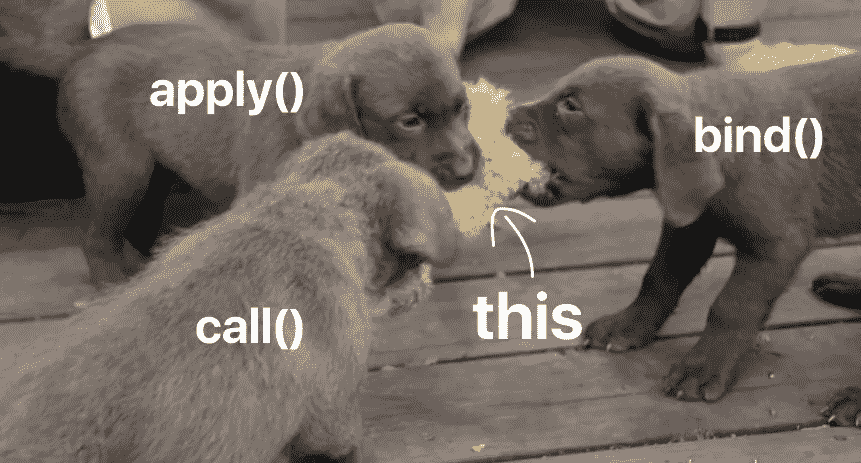

# 用 call()、apply()和 bind()处理“this”

> 原文：<https://javascript.plainenglish.io/handling-this-with-call-apply-and-bind-55fb059d20bb?source=collection_archive---------7----------------------->



所以在[之前的博文](/demystifying-this-in-javascript-5a38d920f216)中，我们看了一下`this`关键字在 JavaScript 中是如何工作的。每个函数都自动获取`this`关键字，其工作方式是，每当调用一个函数时，关键字都指向当前的**执行上下文**。因此它的值将取决于调用函数的方式。这也是为什么有时你可能**会丢失对它的引用**的原因。

*你可以在这里观看这篇文章的视频版本:*

看一下这个例子。

```
class Person {
    constructor(firstName, lastName) {
        this.firstName = firstName;
        this.lastName = lastName;
    } printNameAfter2Seconds() {
        setTimeout(function () {
            console.log(`${this.firstName} ${this.lastName}`)
        }, 2000);
    }
}let person = new Person("John", "Doe");
person.printNameAfter2Seconds();   // undefined undefined
```

这里的类有一个运行`**setTimeout**`函数的方法，延迟 2 秒。这个`**setTimout**`函数还有一个回调函数，试图访问类的 firstName 和 lastName 属性。但是如果你试图在一个实例上执行这个方法，你将得到两个属性的`**undefined**`。

这背后的原因是，由于每个函数都将获得自己的值`this`，这里的回调函数也将获得自己的`this`，它并不引用类实例。因此，在回调函数之外的任何地方，`this`将指向类实例，但是在回调函数内部，它指向某个其他对象(在本例中是窗口对象)。

解决这个问题的一个简单方法是使用箭头函数。箭头函数本身没有`this`值。所以它从它的封闭范围中得到`this`的值。

```
...
printNameAfter2Seconds() {
   setTimeout(**() =>** {
       console.log(`${this.firstName} ${this.lastName}`)
   }, 2000);
}
...
```

所以现在回调函数中的`this`关键字将引用其父作用域`printNameAfter2Seconds`中的`this`关键字。`printName`函数中的`this`指向类实例，这就是为什么您会得到预期的结果。

除了箭头函数，JavaScript 还有一些专门的方法可以解决这个问题。它们是**函数原型**上出现的**调用**、**应用**和**绑定**方法。

## 呼叫方法

事实上这很简单。假设你有两个类，第一个类有一个方法，第二个类想要使用。您可以使用 call 方法，而不是在第二个类中再次编写它。

```
class Car {
    constructor(model) { this.model = model } start() { console.log(`${this.model} is starting`) }
}class Bike {
    constructor(model) { this.model = model }
}let bmw = new Car("BMW");
bmw.start();let honda = new Bike("Honda");
bmw.start.**call**(honda);
```

因此，我们可以从 Car 类的实例中获得的 start 方法将运行 call 函数，并将第一个参数设置为新的上下文。我们希望上下文是 bike 实例，因为我们希望调用 bike(honda)对象的 start 方法。所以我们传递本田对象。启动方法将被执行，`this.model`将指向自行车的型号名称“Honda”。

如果该方法有一些参数，您仍然可以通过在第一个参数后添加参数来使用`call`函数。

```
class Car {
    constructor(model) { this.model = model } start(**time**) { console.log(`${this.model} is starting at    ${**time**}`) }
}class Bike {
    constructor(model) { this.model = model }
}let bmw = new Car("BMW");
bmw.start(new Date().toDateString());let honda = new Bike("Honda");
bmw.start.call(honda, **new Date().toDateString()**);
```

> 所以本质上，`call()`函数允许一个属于一个对象的方法被分配给另一个不同的对象调用。它只是为函数/方法提供了一个新的值，反过来让你重用这个函数。
> 
> 你也可以在普通函数上使用 call，它不一定只是一个类中的方法。

## 运用方法

现在一旦你知道了`call`是如何工作的，你就会自动理解`apply`的方法。它本质上做同样的事情，但是在`call`的情况下，你将会单独传递**的参数现在将会在一个数组中传递。就是这样，这就是`call`和`apply`之间唯一的根本区别。**

```
class Car {
  constructor(model) { this.model = model } start(**time, fuelLeft**) { 
		console.log(`${this.model} is starting at ${time} with ${fuelLeft} left`) 
	}
}class Bike {
    constructor(model) { this.model = model }
}let bmw = new Car("BMW");
bmw.start();let honda = new Bike("Honda");
bmw.start.apply(honda, **[new Date().toDateString(), "1ltr"]**);
```

## **绑定方法**

**现在，最后一种方法是`bind`方法，同样与这两种方法非常相似。这或多或少是相同的方法，但这里的关键区别在于，虽然`call`会立即运行具有新值`this`的函数，但`bind`会将`this`附加到该函数并返回整个函数。**

***所以现在无论你何时运行这个函数，它都绑定了一个特定的值* `*this*` *，它总是会给你相同的结果*。**

**我们也可以用`bind`解决本帖的第一个例子。**

```
class Person {
    constructor(firstName, lastName) {
        this.firstName = firstName;
        this.lastName = lastName;
    } printNameAfter2Seconds() {
        setTimeout(function () {
            console.log(`${this.firstName} ${this.lastName}`)
        }.**bind(this)**, 2000);
    }
}let person = new Person("John", "Doe");
person.printNameAfter2Seconds();
```

**这里我们为 firstName 和 lastName 都获取了`undefined`,因为它的值指向了`window`对象，而不是 person 类实例。这可以用`bind`方法解决。**

**您需要做的唯一更改是在回调函数的末尾附加绑定函数，并传递新的上下文。因为我们知道在函数之外的任何地方，上下文都将是类实例，所以我们可以在 bind 方法中使用它。**

**所以本质上，我们获取了`printNameAfter2Seconds`函数的`this`值，并将其绑定到回调函数。2 秒钟后，当这个函数运行时，它将把`this`的值绑定到类实例，并因此产生预期的输出。**

## **结论**

**如果你明白`this`是如何工作的，这三种方法对你来说会非常有意义。您可以使用它们来重用函数和方法，或者手动设置函数上下文，因为有时，尤其是在嵌套函数的情况下，您可能会丢失上下文。所以在那个时候，这些方法就派上用场了。**

**youtube 上也有这篇文章的视频版本。**

**我建议你反复阅读这篇文章和上一篇文章，以便更好地理解这些话题。这些都是非常重要的概念，将有助于您在未来编写更有意义、更高效的代码。所以，请仔细观看，如果你有任何疑问或建议，你可以在评论中提出，或者通过我的社交网站与我联系。干杯！**

**[YouTube](https://www.youtube.com/channel/UCaktnqx_IENyT5T2lJ3F09w)
[LinkedIn](https://www.linkedin.com/in/akilesh-rao-610357137/)
[Twitter](https://twitter.com/themangalorian)
[GitHub](https://github.com/AkileshRao)**

***更多内容请看*[***plain English . io***](https://plainenglish.io/)*。报名参加我们的* [***免费周报***](http://newsletter.plainenglish.io/) *。关注我们关于*[***Twitter***](https://twitter.com/inPlainEngHQ)*和*[***LinkedIn***](https://www.linkedin.com/company/inplainenglish/)*。加入我们的* [***社区不和谐***](https://discord.gg/GtDtUAvyhW) *。***