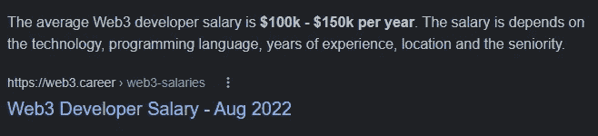
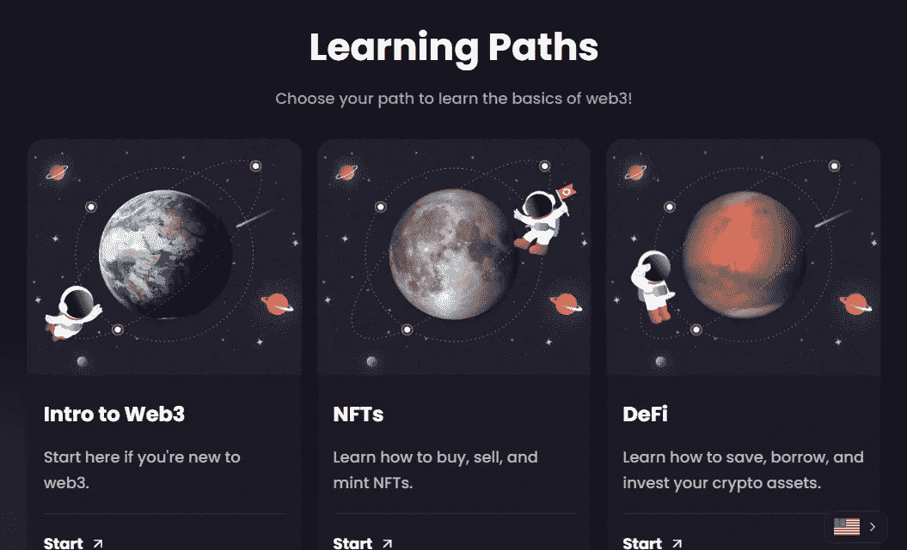
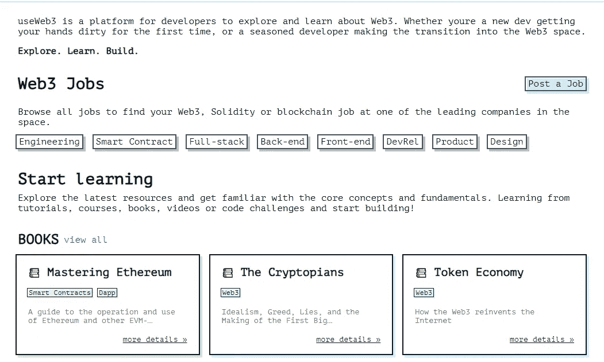
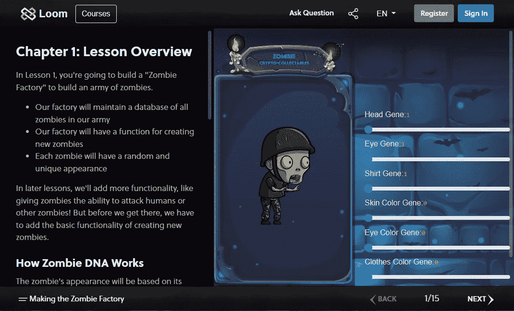
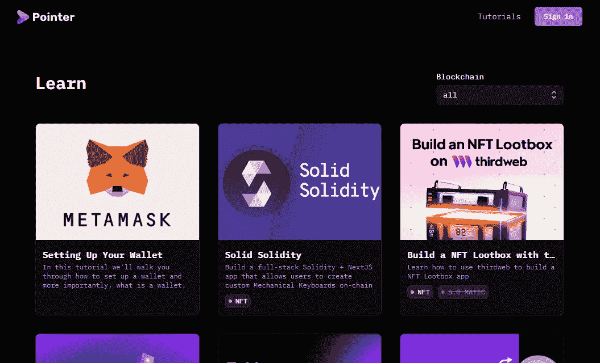

# 每个 Web3 开发者都应该知道的便利资源

> 原文：<https://javascript.plainenglish.io/handy-resources-that-every-web3-developer-should-be-aware-of-776f0fcd16ea?source=collection_archive---------12----------------------->

## 更快地学习并应用所学知识。

Photo by [Christina @ wocintechchat.com](https://unsplash.com/@wocintechchat?utm_source=medium&utm_medium=referral) on [Unsplash](https://unsplash.com?utm_source=medium&utm_medium=referral)

每个人都在讨论 Web3。

即使我主动提出用我的专业知识帮助某些企业，他们想要的也只是深入钻研 web3 领域。之前，我们讨论了投资比特币和以太坊，但现在我们想扩展到 web3 领域。

我举个例子:Dropbox 获得了 600 万美元的 A 轮融资，但 web3 的竞争对手 Filecoin 通过 ICO(首次公开募股)获得了 2.57 亿美元。

这难道不疯狂吗？

这不是关于开发一个 web3 应用程序，但是作为一个 web3 开发者工作是一件大事。

Source: web3.career

所以对于任何对学习 web3 感兴趣的人来说，这些是一些资源。

*注意:我写这篇文章并没有从这些资源中得到任何报酬。换句话说，我没有从他们的网站所有者那里得到任何报酬。没有附属链接，每一个都是免费的。*

1.  [**奥德赛刀**](https://www.odysseydao.com/)

当我们获得一项新技能时，我们希望掌握基础知识。如果没有基础，你将无法掌握任何东西，这就是为什么你会放弃学习技能。

说到 Web3，有太多的概念需要考虑，包括区块链、web3、Dapps、DeFi、DAOs 等等。

老实说，一开始我无法找到一个完美的网站来了解它们。

也许你想学习基础知识，在这种情况下，这个网站可以帮助你。这里有大量关于 DeFi、DAOs 和其他 web3 技术的高质量信息，您应该阅读一下。

此外，这里还有一个链接，可以帮助你理解 [web3 术语](/web3-vocabulary-you-should-be-aware-of-2e886c06a721)。

**2。** [**使用 Web3**](https://www.useweb3.xyz/)

无论你是初学者还是专家，useWeb3 都会让你受益匪浅。

在这个网站上，你可以找到书籍、课程、指南、初学者工具包、教程、网站和许多其他帮助你学习 web3 的资源。

 [## useWeb3.xyz 学习 Web3 开发

### useWeb3 是开发者探索和学习 Web3 的平台。无论你是一个新手还是一个新手…

www.useweb3.xyz](https://www.useweb3.xyz/) 

**3。超级分类帐结构**

大多数 web3 框架都是面向公共区块链的。

简而言之，一旦你创建了一个智能合同，它就可以被所有人访问并公开。

假设你为任何公司工作，并且想要保护某些公司机密，必须只向观众提供他们需要的权力，并且想要使用区块链。

如果你采用公共区块链，这是一项艰巨的任务。是的，你们中的一些人可能想知道为什么分权是区块链存在的主要动机。

我同意，但我不会提及此事。我指的是一个希望使用区块链技术来提高运营效率的中央化组织。

简而言之，假设你受雇于亚马逊，该公司希望利用区块链为其向客户提供的服务的各个方面提供支持。

Hyperledger 布料就是在那里诞生的。

以下是一些相关资源:

*   [Hyperledger 结构文档](https://hyperledger-fabric.readthedocs.io/en/release-2.2/tutorials.html)。
*   [Hyperledger 织物 YouTube 教程](https://youtu.be/iTV89Tqfmgk)。

**4。**

****

**更具体地说，你可以通过访问一些免费网站来学习 web3。**

**在使用了大部分之后，我可以诚实地说这是帮助你快速学习 web3 的最好的网站之一。**

**但是为什么呢，尼廷？仅仅因为所有其他网站仅仅提供对 web3 原则、语言和项目的解释。然而，这个网站将通过创建简单的游戏来帮助你。**

**多棒啊，哈？**

****5。** [**指针**](https://www.pointer.gg/)**

****

**当我学习 web3 开发的时候，我可以学习很多框架和技术。作为一个实例，我可以使用 Truffle、HardHat、Hyperledger Fabric、Polygon、Solana 和许多其他框架。**

**概念的数量让我不知所措。为了确定以最低成本创建应用程序的最佳方法，我想对它们进行大量测试。**

**我相信当你使用一门语言构建任何东西时，无论是通过跟随教程还是自己动手，你都会学到很多。**

**这就是这个网站派上用场的时候。它包括以太坊、多边形和索拉纳的课程。**

**不错吧。**

**就这样——谢谢。**

**如果你愿意，你可以免费获得我的 side hustle 电子书。**

**[*如果你喜欢阅读这样的故事，并想帮助我成为一名作家，请考虑成为一名中等成员。每月花费 5 美元，你可以无限制地访问媒体内容。如果你通过我的链接注册，我会得到一点佣金。*](https://nitinfab.medium.com/membership)**

** [## 9 个让你大吃一惊的侧推工具

### 无论你是程序员、员工还是创造者。

medium.com](https://medium.com/swlh/9-side-hustle-tools-that-will-blow-your-mind-6ebb57787eb6)  [## 7 个你可能不用的黑仔工具可以帮你节省 1000 多美元

### 无论你是学生、朝九晚五的员工还是自由职业者。

medium.com](https://medium.com/swlh/7-killer-tools-youre-probably-not-using-that-could-save-you-1-000-aecd9f37b216) 

*更多内容请看*[***plain English . io***](https://plainenglish.io/)*。报名参加我们的* [***免费周报***](http://newsletter.plainenglish.io/) *。关注我们关于*[***Twitter***](https://twitter.com/inPlainEngHQ)[***LinkedIn***](https://www.linkedin.com/company/inplainenglish/)*[***YouTube***](https://www.youtube.com/channel/UCtipWUghju290NWcn8jhyAw)*[***不和***](https://discord.gg/GtDtUAvyhW) *。*****