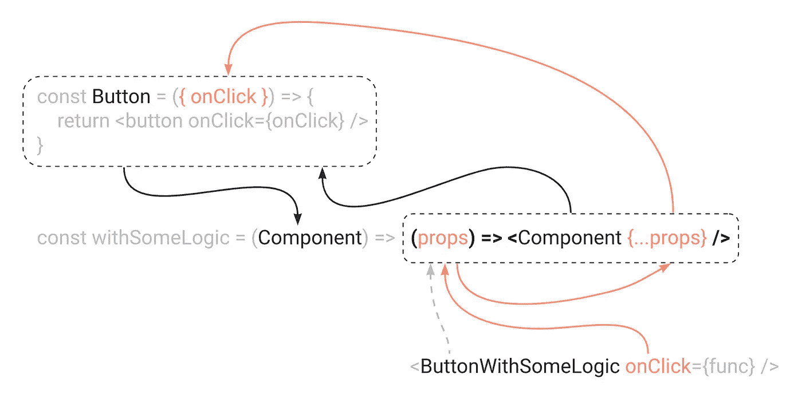

# React 钩子使得高阶组件过时了吗？

> 原文：<https://javascript.plainenglish.io/have-react-hooks-made-higher-order-components-obsolete-8284a9577243?source=collection_archive---------6----------------------->

## React Hooks 时代的高阶元件


React 钩子真的让高阶组件过时了吗？这些唯一的用例是成为我们应用程序中一些现存遗留角落的过去的残余？什么是高阶分量呢？为什么我们首先需要它们？

回答这些问题并建立一个案例，即使在现代应用程序中，高阶组件对于某些类型的任务仍然有用。

但是让我们从头开始。

# 什么是高阶分量？

根据 [React docs](https://reactjs.org/docs/higher-order-components.html) 的说法，这是一种重用用于横切关注点的组件逻辑的高级技术，如果这个描述对你有任何意义的话(对我来说没那么重要🙂).

在英语中，它只是一个函数，接受一个组件作为它的参数之一，处理它，然后返回它的修改版本。最简单的变体是这样的，它什么也不做:

```
*// accept a Component as an argument
const withSomeLogic = (Component) => {
  // do something

  // return a component that renders the component from the argument
  return (props) => <Component {...props} />;
};*
```

这里的关键是函数的返回部分——它只是一个组件，就像任何其他组件一样。而且类似于[渲染道具模式](https://www.developerway.com/posts/react-component-as-prop-the-right-way)，我们需要将道具传递给返回的组件，否则就会被吞掉。

然后，到了使用它的时候，它会变成这样:

```
*const Button = ({ onClick }) => <button onClick={func}>Button</button>;
const ButtonWithSomeLogic = withSomeLogic(Button);*
```

您将您的`Button`组件传递给函数，它返回新的`Button`，它包括在高阶组件中定义的任何逻辑。然后这个按钮可以作为任何其他按钮使用:

```
*const SomePage = () => {
  return (
    <>
      <Button />
      <ButtonWithSomeLogic />
    </>
  );
};*
```

如果我们想要创建一个什么去哪里的心理地图，它可能看起来像这样:



在 codesandbox 中试验这些例子[。](https://codesandbox.io/s/hocs-intro-6jqmju?file=/src/App.tsx)

在引入钩子之前，高阶组件被广泛用于访问上下文和任何外部数据订阅。 [Redux connect](https://react-redux.js.org/api/connect) 或 [react-router 的](https://v5.reactrouter.com/web/api/withRouter) `withRouter`函数是高阶组件:它们接受一个组件，向其中注入一些道具，然后返回。

```
*// location is injected by the withRouter higher-order component
// would you guessed that by the look at this component alone?
const SomeComponent = ({ location }) => {
  return <>{location}</>;
};

const ComponentWithRouter = withRouter(SomeComponent);*
```

正如您所看到的，高阶组件编写和理解起来非常复杂。所以当挂钩[推出的时候，难怪每个人都转而使用它们。](https://reactjs.org/docs/hooks-intro.html)

现在，我们不需要创建复杂的心理地图来说明哪一个道具去了哪里，也不需要试图弄清楚`location`是如何出现在道具中的，我们只需要写下:

```
*const SomeComponent = () => {
  // we see immediately where location is coming from
  const { location } = useRouter();

  return <>{location}</>;
};*
```

组件中发生的一切都可以从上到下阅读，所有数据的来源都很明显，这大大简化了调试和开发。

虽然钩子可能取代了 90%的共享逻辑问题和 100%的访问上下文的用例，但仍然有至少三种类型的功能，其中高阶组件可能是有用的。

让我们看看那些。

# 第一:增强回调并对生命周期事件做出反应

假设您需要在一些回调中发送某种高级日志。例如，当您单击一个按钮时，您希望发送一些带有数据的日志事件。你会怎么用钩子？您可能有一个带有`onClick`回调的`Button`组件:

```
*type ButtonProps = {
  onClick: () => void;
  children: ReactNode;
}

const Button = ({ onClick }: { onClick }: ButtonProps) => {
  return <button onClick={onClick}>{children}</button>
}*
```

然后在消费者端，您将挂钩到回调并在那里发送日志记录事件:

```
*const SomePage = () => {
  const log = useLoggingSystem();

  const onClick = () => {
    log('Button was clicked');
  };

  return <Button onClick={() => onClick}>Click here</Button>;
};*
```

如果你想发起一两个事件，这是没问题的。但是，如果您希望每当按钮被点击时，您的日志事件在整个应用程序中一致地被触发，该怎么办呢？我们大概可以把它烘焙成`Button`组件本身。

```
*const Button = ({ onClick }: { onClick }: ButtonProps) => {
  const log = useLoggingSystem();

  const onButtonClick = () => {
    log('Button was clicked')
    onClick();
  }

  return <button onClick={() => onClick()}>{children}</button>
}*
```

但是然后呢？对于正确的日志，您还必须发送某种数据。我们当然可以用一些`loggingData`道具来扩展`Button`组件，并把它传递下去:

```
*const Button = ({ onClick, loggingData }: { onClick, loggingData }: ButtonProps) => {
  const onButtonClick = () => {
    log('Button was clicked', loggingData)
    onClick();
  }
  return <button onClick={() => onButtonClick()}>{children}</button>
}*
```

但是，如果您希望在其他组件上发生单击时触发相同的事件，该怎么办呢？在我们的应用程序中，通常不是人们唯一可以点击的东西。如果我想向一个`ListItem`组件添加相同的日志记录，该怎么办？复制粘贴完全相同的逻辑吗？

```
*const ListItem = ({ onClick, loggingData }: { onClick, loggingData }: ListItemProps) => {
  const onListItemClick = () => {
    log('List item was clicked', loggingData)
    onClick();
  }
  return <Item onClick={() => onListItemClick()}>{children}</Item>
}*
```

太多的复制面食，容易出错，有人忘记改变我的口味。

本质上，我想要的是在某个地方封装“某些触发的`onClick`回调-发送一些日志事件”的逻辑，然后在我想要的任何组件中重用它，而不用以任何方式改变那些组件的代码。

这是第一个不用钩子的用例，但高阶元件可能会派上用场。

# 增强 onClick 回调的高阶组件

不用到处复制粘贴“点击发生→记录数据”逻辑，我只需创建一个`withLoggingOnClick`函数，即:

*   接受组件作为参数
*   截获它的 onClick 回调
*   将我需要的数据发送到用于日志记录的任何外部框架
*   完整地返回带有 onClick 回调的组件以备将来使用

它看起来会像这样:

```
*type Base = { onClick: () => void };

// just a function that accepts Component as an argument
export const withLoggingOnClick = <TProps extends Base>(Component: ComponentType<TProps>) => {
  return (props: TProps) => {
    const onClick = () => {
      console.log('Log on click something');
      // don't forget to call onClick that is coming from props!
      // we're overriding it below
      props.onClick();
    };

    // return original component with all the props
    // and overriding onClick with our own callback
    return <Component {...props} onClick={onClick} />;
  };
};*
```

现在我可以把它添加到我想要的任何组件中。我可以在`Button`中加入日志:

```
*export const ButtonWithLoggingOnClick = withLoggingOnClick(SimpleButton);*
```

或者在列表项中使用它:

```
*export const ListItemWithLoggingOnClick = withLoggingOnClick(ListItem);*
```

或者任何其他我想跟踪的有`onClick`回调的组件。在`Button`或`ListItem`组件中没有一行代码被修改！

# 向高阶分量添加数据

现在，剩下要做的就是从外部向日志记录函数添加一些数据。考虑到高阶分量只不过是一个函数，我们可以很容易地做到这一点。只需要给函数添加一些其他参数，就这样:

```
*type Base = { onClick: () => void };
export const withLoggingOnClickWithParams = <TProps extends Base>(
  Component: ComponentType<TProps>,
  // adding some params as a second argument to the function
  params: { text: string },
) => {
  return (props: TProps) => {
    const onClick = () => {
      // accessing params that we passed as an argument here
      // everything else stays the same
      console.log('Log on click: ', params.text);
      props.onClick();
    };

    return <Component {...props} onClick={onClick} />;
  };
};*
```

现在，当我们用高阶组件包装按钮时，我们可以传递我们想要记录的文本:

```
*const ButtonWithLoggingOnClickWithParams = withLoggingOnClickWithParams(SimpleButton, { text: 'button component' });*
```

在消费者方面，我们只是将这个按钮作为一个普通的按钮组件使用，而不用担心日志文本:

```
*const Page = () => {
  return <ButtonWithLoggingOnClickWithParams onClick={onClickCallback}>Click me</ButtonWithLoggingOnClickWithParams>;
};*
```

但是如果我们真的想让 T8 担心这段文字呢？如果我们想在使用按钮的不同上下文中发送不同的文本，该怎么办？我们不想为每个用例创建一百万个包装好的按钮。

也很容易解决:我们可以将文本作为一个道具注入到结果按钮中，而不是将文本作为函数的参数传递。代码应该是这样的:

```
*type Base = { onClick: () => void };
export const withLoggingOnClickWithProps = <TProps extends Base>(Component: ComponentType<TProps>) => {
  // our returned component will now have additional logText prop
  return (props: TProps & { logText: string }) => {
    const onClick = () => {
      // accessing it here, as any other props
      console.log('Log on click: ', props.logText);
      props.onClick();
    };

    return <Component {...props} onClick={onClick} />;
  };
};*
```

然后像这样使用它:

```
*const Page = () => {
  return (
    <ButtonWithLoggingOnClickWithProps onClick={onClickCallback} logText="this is Page button">
      Click me
    </ButtonWithLoggingOnClickWithProps>
  );
};*
```

参见 [codesandbox 中的所有示例](https://codesandbox.io/s/hocs-buttons-m45hm4?file=/src/hocs/with-logging-on-click.tsx)。

# 在装载时而不是点击时发送数据

我们这里不局限于点击和回调。请记住，这些只是组件，我们可以做我们想要和需要的任何事情🙂我们可以利用 React 提供的一切。例如，我们可以在安装组件时发送这些日志事件:

```
*export const withLoggingOnMount = <TProps extends unknown>(Component: ComponentType<TProps>) => {
  return (props: TProps) => {
    // no more overriding onClick, just adding normal useEffect
    useEffect(() => {
      console.log('log on mount');
    }, []);

    // just passing props intact
    return <Component {...props} />;
  };
};*
```

和`onClick`通过参数或道具添加数据的故事完全一样。这里不打算复制粘贴，在[code sandbox](https://codesandbox.io/s/hocs-buttons-m45hm4?file=/src/hocs/with-logging-on-mount.tsx:58-305)中看到。

我们甚至可以大胆地组合所有这些高阶组件:

```
*export const SuperButton = withLoggingOnClick(
  withLoggingOnClickWithParams(
    withLoggingOnClickWithProps(
      withLoggingOnMount(withLoggingOnMountWithParams(withLoggingOnMountWithProps(SimpleButton), { text: 'button component' })),
    ),
    { text: 'button component' },
  ),
);*
```

当然，我们不应该这样做😅如果某件事是可能的，它并不总是意味着它是一个好主意。想象一下，当调试时间到来时，试图跟踪哪些道具来自哪里。如果我们真的需要将几个高阶元件合并成一个，我们至少可以更具体一点:

```
*const ButtonWithLoggingOnClick = withLoggingOnClick(SimpleButton);
const ButtonWithLoggingOnClickAndMount = withLoggingOnMount(ButtonWithLoggingOnClick);
// etc*
```

# 第二:拦截 DOM 事件

高阶组件的另一个非常有用的应用是拦截各种 DOM 事件。例如，假设您在页面上实现了某种键盘快捷键功能。当特定的键被按下时，你想做各种事情，像打开对话框，创建问题，等等。您可能会在窗口中添加一个事件监听器，如下所示:

```
*useEffect(() => {
  const keyPressListener = (event) => {
    // do stuff
  };

  window.addEventListener('keypress', keyPressListener);

  return () => window.removeEventListener('keypress', keyPressListener);
}, []);*
```

然后，你有你的应用程序的不同部分，像模态对话框，下拉菜单，抽屉，等等，当对话框打开时，你想在那里阻止全局监听器。如果只有一个对话框，你可以手动将`onKeyPress`添加到对话框中，这里有`event.stopPropagation()`用于:

```
*export const Modal = ({ onClose }: ModalProps) => {
  const onKeyPress = (event) => event.stopPropagation();

  return <div onKeyPress={onKeyPress}>...// dialog code</div>;
};*
```

但是与`onClick`日志记录相同的故事——如果你有多个组件，而你想看到这个逻辑，该怎么办？

我们在这里可以做的是，再次实现一个高阶组件。这一次，它将接受一个组件，将其包装在一个附带 onKeyPress 回调的 div 中，并返回未更改的组件。

```
*export const withSupressKeyPress = <TProps extends unknown>(Component: ComponentType<TProps>) => {
  return (props: TProps) => {
    const onKeyPress = (event) => {
      event.stopPropagation();
    };

    return (
      <div onKeyPress={onKeyPress}>
        <Component {...props} />
      </div>
    );
  };
};*
```

就是这样！现在我们可以在任何地方使用它:

```
*const ModalWithSupressedKeyPress = withSupressKeyPress(Modal);
const DropdownWithSupressedKeyPress = withSupressKeyPress(Dropdown);*
```

这里要注意一件重要的事情:焦点管理。为了让上面的代码实际工作，您需要确保您的对话框类型组件在打开时将焦点移动到打开的部分。但这是一个关于焦点管理的完全不同的对话，也许下次吧。

出于示例的目的，我们可以在模式本身中手动包含自动聚焦:

```
*const Modal = () => {
  const ref = useRef<HTMLDivElement>();

  useEffect(() => {
    // when modal is mounted, focus the element to which the ref is attached
    if (ref.current) ref.current.focus();
  }, []);

  // adding tabIndex and ref to the div, so now it's focusable
  return <div tabIndex={1} ref={ref}>
    <!-- modal code -->
  </div>
}*
```

在代码沙箱中使用它。

# 第三:上下文选择器

高阶组件的最后一个非常有趣的用例:React 上下文的类似选择器的功能。正如我们所知，当上下文值改变时，它将导致所有上下文消费者的重新呈现，而不管他们的状态的特定部分是否被改变。(如果你不知道，这里有一篇文章给你:[如何用上下文写 performant React 应用](https://www.developerway.com/posts/how-to-write-performant-react-apps-with-context))。

在进入高阶组件之前，让我们先实现一些上下文和表单。

我们将通过`id`和`name`以及 API 来改变这些:

```
*type Context = {
  id: string;
  name: string;
  setId: (val: string) => void;
  setName: (val: string) => void;
};

const defaultValue = {
  id: 'FormId',
  name: '',
  setId: () => undefined,
  setName: () => undefined,
};

const FormContext = createContext<Context>(defaultValue);

export const useFormContext = () => useContext(FormContext);

export const FormProvider = ({ children }: { children: ReactNode }) => {
  const [state, setState] = useState(defaultValue);

  const value = useMemo(() => {
    return {
      id: state.id,
      name: state.name,
      setId: (id: string) => setState({ ...state, id }),
      setName: (name: string) => setState({ ...state, name }),
    };
  }, [state]);

  return <FormContext.Provider value={value}>{children}</FormContext.Provider>;
};*
```

然后是一些带有`Name`和`Countries`组件的表单

```
*const Form = () => {
  return (
    <form css={pageCss}>
      <Name />
      <Countries />
    </form>
  );
};

export const Page = () => {
  return (
    <FormProvider>
      <Form />
    </FormProvider>
  );
};*
```

在`Name`组件中，我们将有一个输入来改变`Context`的值，而`Countries`只需使用表单的`id`来获取国家列表(不会实现实际的获取，这对本例并不重要:

```
*const Countries = () => {
  // using only id from context here
  const { id } = useFormContext();

  console.log("Countries re-render");
  return (
    <div>
      <h3>List on countries for form: {id}</h3>
      <ul>
        <li>Australia</li>
        <li>USA</li>
        <!-- etc -->
      </ul>
    </div>
  );
};**const Name = () => {
  // using name and changing it here
  const { name, setName } = useFormContext();

  return <input onChange={(event) => setName(event.target.value)} value={name} />;
};*
```

现在，每当我们在名称输入字段中键入内容时，我们将更新上下文值，这将导致重新呈现所有使用上下文的组件，包括国家。这不能通过将这个值提取到一个钩子中并对其进行内存化来解决:钩子总是会重新呈现([为什么自定义的 react 钩子会破坏你的应用性能](https://www.developerway.com/posts/why-custom-react-hooks-could-destroy-your-app-performance))。

当然，如果这种行为引起了性能问题，还有其他方法来处理它，比如将渲染树的某些部分记忆化或者将上下文分成不同的提供者(参见描述这些技术的文章:[如何使用上下文编写 performant React 应用程序](https://www.developerway.com/posts/how-to-write-performant-react-apps-with-context)和[如何编写 performant React 代码:规则、模式、该做什么和不该做什么](https://www.developerway.com/posts/how-to-write-performant-react-code))。

但是上述所有技术的一个大缺点是，它们不可共享，并且需要在个案的基础上实现。如果我们有一些类似 select 的功能，可以用来在任何组件中安全地提取这个`id`值，而不需要在整个应用程序中进行重大的重构和`useMemo`，这不是很好吗？

有趣的是，我们可以用高阶组件实现这样的东西。这是因为组件有一个钩子没有给我们的东西:它们可以改变事物，阻止子组件的重复渲染。基本上，这会给我们想要的:

```
*export const withFormIdSelector = <TProps extends unknown>(
  Component: ComponentType<TProps & { formId: string }>
) => {
  const MemoisedComponent = React.memo(Component) as ComponentType<
    TProps & { formId: string }
  >;

  return (props: TProps) => {
    const { id } = useFormContext();

    return <MemoisedComponent {...props} formId={id} />;
  };
};*
```

然后我们就可以创建`CountriesWithFormIdSelector`组件了:

```
*// formId prop here is injected by the higher-order component below
const CountriesWithFormId = ({ formId }: { formId: string }) => {
  console.log("Countries with selector re-render");
  return (
     <-- code is the same as before -->
  );
};

const CountriesWithFormIdSelector = withFormIdSelector(CountriesWithFormId);*
```

并在我们的表单中使用它:

```
*const Form = () => {
  return (
    <form css={pageCss}>
      <Name />
      <CountriesWithFormIdSelector />
    </form>
  );
};*
```

[在 codesandbox](https://codesandbox.io/s/hocs-context-lwudbb?file=/src/page.tsx) 中查看。在输入时要特别注意控制台输出——CountriesWithFormIdSelector 组件不会重新呈现！

# 通用反应上下文选择器

`withFormIdSelector`很有趣，适用于基于上下文的小型应用程序。但是把它作为通用的东西不是很好吗？这样我们就不必为每个状态属性实现一个自定义选择器。

当涉及到一些创造性的黑客技术时，没有问题！看看吧，选择器本身:

```
*export const withContextSelector = <TProps extends unknown, TValue extends unknown>(
  Component: ComponentType<TProps & Record<string, TValue>>,
  selectors: Record<string, (data: Context) => TValue>,
): ComponentType<Record<string, TValue>> => {
  // memoising component generally for every prop
  const MemoisedComponent = React.memo(Component) as ComponentType<Record<string, TValue>>;

  return (props: TProps & Record<string, TValue>) => {
    // extracting everything from context
    const data = useFormContext();

    // mapping keys that are coming from "selectors" argument
    // to data from context
    const contextProps = Object.keys(selectors).reduce((acc, key) => {
      acc[key] = selectors[key](data);

      return acc;
    }, {});

    // spreading all props to the memoised component
    return <MemoisedComponent {...props} {...contextProps} />;
  };
};*
```

然后将它与组件一起使用:

```
*// props are injected by the higher order component below
const CountriesWithFormId = ({ formId, countryName }: { formId: string; countryName: string }) => {
  console.log('Countries with selector re-render');
  return (
    <div>
      <h3>List of countries for form: {formId}</h3>
      Selected country: {countryName}
      <ul>
        <li>Australia</li>
        <li>USA</li>
      </ul>
    </div>
  );
};

// mapping props to selector functions
const CountriesWithFormIdSelector = withContextSelector(CountriesWithFormId, {
  formId: (data) => data.id,
  countryName: (data) => data.country,
});*
```

就是这样！我们基本上在上下文上实现了 mini-Redux，即使有适当的`mapStateToProps`功能🙂在[的代码沙箱](https://codesandbox.io/s/hocs-context-generic-selector-wdijzp?file=/src/page.tsx)中检查一下。

今天到此为止！希望高阶组件现在不是一些可怕的传统小妖精，而是一些你甚至可以在现代应用中很好利用的东西。让我们重新定义这些使用情形:

*   用附加功能增强回调和反应生命周期事件，如发送日志或分析事件
*   拦截 DOM 事件，比如在模式对话框打开时阻止全局快捷键
*   提取一段上下文而不导致组件中不必要的重新呈现

愿和平与爱与你同在，✌🏼

*最初发表于*[](https://www.developerway.com/posts/higher-order-components-in-react-hooks-era)**。网站上有更多这样的文章*😉*

*[*订阅简讯*](https://www.developerway.com/) ，[*在 LinkedIn*](https://www.linkedin.com/in/adevnadia/) *或* [*上关注 Twitter*](https://twitter.com/adevnadia) *以便在下一篇文章出来时立即获得通知。**

**更多内容请看*[***plain English . io***](https://plainenglish.io/)*。报名参加我们的* [***免费每周简讯***](http://newsletter.plainenglish.io/) *。关注我们*[***Twitter***](https://twitter.com/inPlainEngHQ)*和*[***LinkedIn***](https://www.linkedin.com/company/inplainenglish/)*。加入我们的* [***社区不和谐***](https://discord.gg/GtDtUAvyhW) *。**