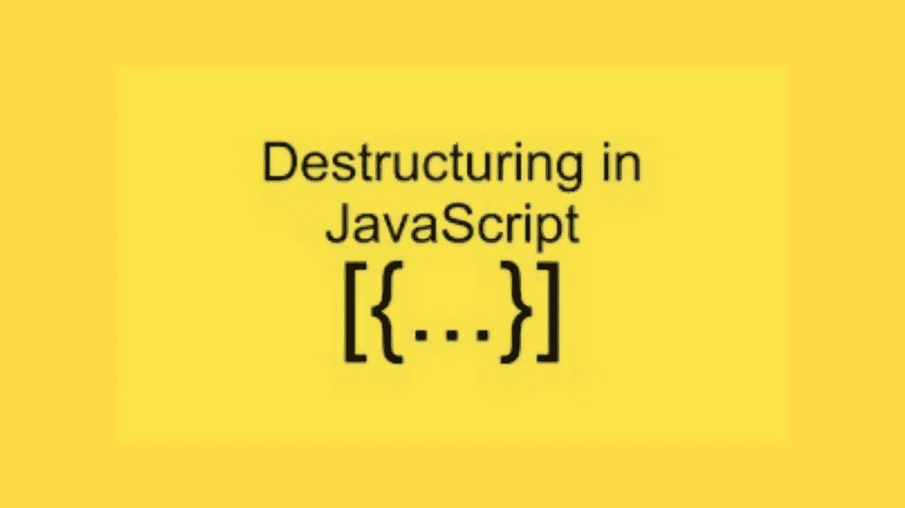

# 你听说过 JavaScript 析构赋值吗？

> 原文：<https://javascript.plainenglish.io/have-you-heard-of-the-javascript-destructuring-assignment-45f66bb9655e?source=collection_archive---------12----------------------->



嗨伙计们！我又来了，有非常重要的事情要告诉你。了解这一点可能会改进您的编码，让您编写更干净的代码。

我们开始吧😍！

当然，你一定听说过 ES6，因为你开始编码。如果不是，那么让我解释一下。

JavaScript 又称为 ECMAScript，也称为 ES。它是 JavaScript 的标准化版本。每一年，它都在进化。他们正在开发新的特性，让你的代码写得更整洁，工作效率更高。

ES5 是在 2009 年完成的，它一直是你作为一个新手要学习的。它很容易学习，是学习 2015 年发布的具有许多强大功能的最新版本 ES6 的敲门砖。这些强大的新特性之一是析构赋值。

这是一个功能强大且易于学习的特性。在下一节中，将解释它的功能。

这个新的 ES6 功能做了许多令人惊奇的事情，包括:

```
const myObj = { email: 'akdn@gmail.com', age: 25, gender: 'male'};const email = myObj.email;const age = myObj.age;
```

看着上面，你注意到了什么？

让我来分解一下。

在 ES5 中，上面的代码用于将一个对象的值赋给一个新变量。这是通过声明一个新变量并使用点符号将它赋给从对象中获取的值来实现的。

现在可以用一种非常简单的方法来完成。检查下面的代码。

```
const myObj = { email: 'akdn@gmail.com', age: 25, gender: 'male'};const { email, age } = myObj;console.log(email);console.log(age);
```

第二行代码使用 ES6 析构赋值语法将从对象中提取的值赋给新变量 email，age。

`console.log(email)`将 akdn@gmail.com 打印到控制台，而`console.log(age)`将 25 打印到控制台。

> *你知道可以给提取的值赋一个新的变量名吗？*

这是通过在分配新名称时将新名称放在冒号后来实现的。例如，可以按照下面的语法给上面提取的值一个新的名称

```
const { email: userEmail, age: userAge } = myObj;console.log(userEmail);console.log(userAge);
```

`console.log(userEmail)`将 akdn@gmail.com 打印到控制台，而`console.log(userAge)`将 25 打印到控制台。

2.析构赋值使得从数组中赋值新变量成为可能。

第一行声明了一个数组。新变量 a 和 b 在第 3 行使用析构语法赋值。第一个变量将采用`array (arr)`的第一个值，而第二个变量将采用第二个值。

所以，`console.log(a,b)`会打印 1 2 到控制台。

> *您还可以访问任何索引处的值。这通过使用逗号到达索引来实现。*
> 
> *你也可以使用 rest 参数来重新分配数组元素。*

```
let arr = [1,2,3,4,5,6,7];const [a,b, ...newArr] = arr;console.log(a,b);console.log(newArr);
```

`console.log(newArr)`将把一组数字[3，4，5，6，7]打印到控制台，因为其余的值是使用上面代码第 2 行中的 rest 参数分配给`newArr`的。

根据专业知识，析构任务可以用来做各种各样的事情。如果你想成为编写功能强大且简洁的函数的专家，那么你必须边学边练。

> *现在，打开你的代码编辑器，让你的思维变得狂野。你肯定可以用这种新的逻辑来表演魔术。*

感谢阅读！

【https://tealfeed.com】最初发表于[](https://tealfeed.com/heard-destructuring-assignment-gtwn8)**。**

**更多内容看* [***说白了。报名参加我们的***](https://plainenglish.io/) **[***免费周报***](http://newsletter.plainenglish.io/) *。关注我们*[***Twitter***](https://twitter.com/inPlainEngHQ)*和*[***LinkedIn***](https://www.linkedin.com/company/inplainenglish/)*。加入我们的* [***社区***](https://discord.gg/GtDtUAvyhW) *。****