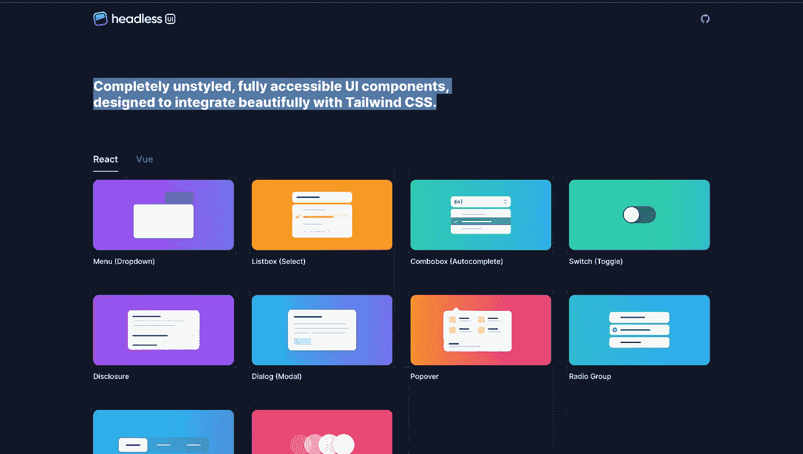

# 介绍 Headless UI:一个非样式化的 UI 组件库

> 原文：<https://javascript.plainenglish.io/headless-ui-87062802d76f?source=collection_archive---------10----------------------->

## 完全非风格化的、完全可访问的 UI 组件，旨在与 Tailwind CSS 完美集成。



Headless UI library website screenshot

## 在后台

我正在开发一个 NFT 市场，我们需要一个 UI 组件库，可以很好地与 Tailwind CSS 配合使用。有很多对 Tailwind CSS 的支持，但是大多数 UI 库都有自己内置的设计系统和每个组件的样式。这使得定制有点痛苦。

在今天的故事中，我们将介绍与 Tailwind CSS 完美契合的新 UI 库。Headless UI 是一个库，它是为所有内联 CSS 爱好者以及只想要组件而不想要内置样式的开发人员而设计的。

## 装置

开始的过程真的很容易。如果你使用过 Material UI 或 chakra UI 和其他 react.js UI 库，你可能会理解。有时使用这些第三方库安装是相当棘手的。

Headless 没有预构建的样式，因此安装和开始需要零行代码。

```
yarn add @headlessui/react
```

## 成分

让我们讨论重要的部分，即组件。记住我们只从 UI 组件开始。您可以在下面的链接中阅读完整的组件列表。

[](https://headlessui.dev/react/combobox) [## 无头用户界面

### 首先，通过 npm 或 yarn 安装 Headless UI:Combobox 是使用 Combobox 构建的。输入…

headlessui.dev](https://headlessui.dev/react/combobox) 

这是部件清单—

*   [菜单](https://headlessui.dev/react/menu)
*   [列表框](https://headlessui.dev/react/listbox)
*   [组合框](https://headlessui.dev/react/combobox)
*   [开关](https://headlessui.dev/react/switch)
*   [披露](https://headlessui.dev/react/disclosure)
*   [Popover](https://headlessui.dev/react/popover)
*   [无线电组](https://headlessui.dev/react/radio-group)
*   [选项卡](https://headlessui.dev/react/tabs)
*   [过渡](https://headlessui.dev/react/transition)

## 结论

Headless UI 是一个仅由 Tailwind CSS 开发的项目。虽然他们还没有提供所有类型的组件，但也许在未来，他们会。现在，我写了更多关于技术和 Web3 的文章，所以如果你感兴趣，你可以关注我或者订阅。直到，下一次，有一个美好的一天，人们。

*更多内容请看*[***plain English . io***](https://plainenglish.io/)*。报名参加我们的**[***免费周报***](http://newsletter.plainenglish.io/) *。关注我们关于*[***Twitter***](https://twitter.com/inPlainEngHQ)*和*[***LinkedIn***](https://www.linkedin.com/company/inplainenglish/)*。加入我们的* [***社区***](https://discord.gg/GtDtUAvyhW) *。**