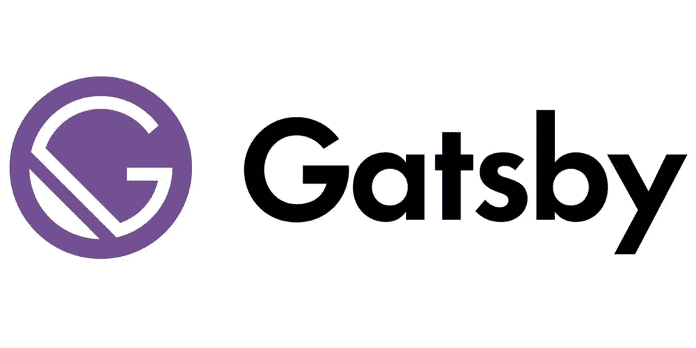

# 盖茨比让无头 WordPress 变得简单

> 原文：<https://javascript.plainenglish.io/headless-wordpress-made-easy-with-gatsby-6a308e14b6f8?source=collection_archive---------13----------------------->

## WordPress 被广泛认为是世界上最受欢迎的内容管理系统之一。但是，你可以拿着你的 WP 内容，把它移过来，用盖茨比。

WordPress 被广泛认为是世界上最流行的内容管理系统之一。

事实上，截至 2021 年末， [WordPress 为世界上 100 万个顶级网站中的 35%提供支持](https://gracethemes.com/wordpress-is-still-the-most-popular-cms-choice-top-trends-in-2020-and-predictions-for-2021/)。太了不起了！

为什么这么受欢迎？

首先，它可以免费下载和使用。但是，如果你想定制它，WordPress 确实会对它的模板和插件收取费用。

除了免费，WordPress 的无处不在意味着如果你是互联网上的内容创作者，你可能以前用过它。

如果您还没有，那也没关系，因为它非常用户友好。此外，它足够灵活，不仅可以像博客一样发挥作用，还可以用于许多不同的项目。

然而，使用 WordPress 也有严重的缺点。

## WordPress 的缺点

一个是安全性，因为它太受欢迎了。黑客用的逻辑是，如果流行，弄清楚如何黑进去更有意义。然后，一旦发现，这个过程可以重复。

另一个缺点是 WordPress 网站下载速度慢。这意味着观众在等待网站加载，可能会变得不感兴趣并离开。他们使用多余的代码和沉重的主题肯定会损害他们网站的速度。

最后，插件的必要性是第三个缺点。一次使用许多插件会导致加载时间缓慢。最重要的是，许多重要的插件只有通过支付年费才能获得。这意味着你的“免费”网站一年的运营时间要长得多。

幸运的是，有一种方法可以解决我们上面提到的所有问题。

它被称为“无头 WordPress”

## 解决方案:无头 WordPress

Headless 可能听起来很可怕，但它只是指使用 WordPress 来管理内容，但使用不同的框架来显示内容。

在这个例子中，出于多种原因，我们将使用 Gatsby。

Gatsby 作为一个静态站点生成器，不仅比 WordPress 站点加载更快，而且更容易更新，非常适合 SEO 优化。

静态站点生成器最好的部分之一是它们预先呈现站点的能力。预取的数据不仅意味着网站的快速初始访问和下载，还意味着网站的使用更加流畅，对访问者的响应更加灵敏。

预取的数据也有助于 SEO，因为对于 SPAs(单页应用程序),来自服务器的空白 HTML 页面。这是因为页面是在浏览器中实时呈现的。

在后端，React 和该网站仍然可以制作单个页面和应用程序，所有页面都被预渲染并发送到服务器。所以，在第一次访问后，这个网站实际上更像一个温泉。

此外，使用无头 WordPress——特别是 Gatsby——可以提高安全性，因为静态站点生成器意味着没有数据存储在服务器上。盖茨比在他们的技术文档中解释说没有“可到达的数据库”。

最后，Gatsby 允许你从 WordPress 获取信息，并以多种可定制的方式将它集成到整个网站中。这意味着使用其他内容管理系统或网络服务。

## 使用盖茨比，Fathym 上的主机

如果你是一个博客写手，或者有任何使用 WordPress 的基于内容的网站，你可能想要挣脱束缚。Gatsby 是运行无头 WordPress 的一个真正免费的选项，然后你甚至可以在 Fathym 上免费托管那个站点(在升级之前启动)。

因为 Gatsby 比传统的 WordPress 网站快得多，这是一个更好的用户体验，你的网站也有可能比竞争对手的网站更快。

## 加入 Fathym

今天就把你的 WordPress 网站转移到 [Fathym，和 Gatsby 一起免费试用](https://auth.fathym.com/fathymcloudprd.onmicrosoft.com/oauth2/v2.0/authorize?p=b2c_1_sign_up_sign_in&client_id=98f014f1-2547-4bcc-a583-3edc8f1190f2&redirect_uri=https%3A%2F%2Fwww.lowcodeunit.com%2F.oauth%2FB2C_1_SIGN_UP_SIGN_IN&response_type=id_token&scope=openid%20profile&response_mode=form_post&nonce=637789907534834707.OWNhMWZkZGMtODQ2NC00YTg0LWFjZWQtYjlkNzg0YTIzMDhkYTcxMzVkZmYtN2E2Mi00ZDRlLWIxODQtZjMxMjBkNWI2OTEx&state=CfDJ8C5COa2dn0dMrEVjdLxcXm-FCakeBxrXIOHa_lF_u0ckh9rvLFuKJ30MWBprExUQA_N5HmWWWPdxqWlni-KFqpg_jVjPahrQdGw79U0sMBN8dTvgrlAMeT9--L-7VgMBsZfFPAho9dcKUN1jO6lAaxL13PM1_vGer-vJc6tcpigRpNr5jcHtitGIKjexLmQqkIslp3MFKCKAi-5IiVd3JbpibPm4gbmDQpYtgstmG9SSlpjvEqJk_2AIqtMHkiojK3kE4WSc5mcYS3FQ3hiRqVQRPlL3jI7U3bUsqGYtLuoJr_St6mGBbHvGmB6M0MCeFn_G5LDsRzyHZhBWf9a1qo6dktz_kEcsAahYPLWjAI_2&x-client-SKU=ID_NETSTANDARD2_0&x-client-ver=6.11.1.0)。一旦你看到速度和用户体验的提高，我们有一种感觉，你会留下来。

【https://www.fathym.com】最初发表于**。**

**更多内容请看*[***plain English . io***](https://plainenglish.io/)*。报名参加我们的* [***免费周报***](http://newsletter.plainenglish.io/) *。关注我们关于*[***Twitter***](https://twitter.com/inPlainEngHQ)*和*[***LinkedIn***](https://www.linkedin.com/company/inplainenglish/)*。加入我们的* [***社区不和谐***](https://discord.gg/GtDtUAvyhW) *。**