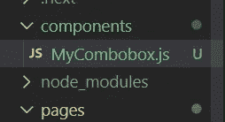
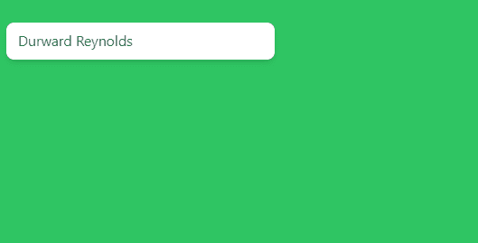

# 无头 UI:组合框自动完成

> 原文：<https://javascript.plainenglish.io/headlessui-combobox-autocomplete-part-1-basic-example-d59a012021e2?source=collection_archive---------2----------------------->

## 第 1 部分:基本示例


Photo by [Christopher Gower](https://unsplash.com/@cgower?utm_source=medium&utm_medium=referral) on [Unsplash](https://unsplash.com?utm_source=medium&utm_medium=referral)

在这篇文章中，我们将创建一个基本的例子。

在我们[创建了 Next.js 项目](https://nextjs.org/docs/getting-started)之后，安装[顺风](https://tailwindcss.com/docs/guides/nextjs)和[无头 UI](https://headlessui.dev/react/combobox) 。

转到根文件夹，创建一个“组件”文件夹。



MyCombobox.js 内部

```
import { useState } from 'react'import { Combobox } from '@headlessui/react'const people = ['Durward Reynolds','Kenton Towne','Therese Wunsch','Benedict Kessler','Katelyn Rohan',]export default function MyCombobox() {const [selectedPerson, setSelectedPerson] = useState(people[0])const [query, setQuery] = useState('')const filteredPeople =query === ''? people: people.filter((person) => {return person.toLowerCase().includes(query.toLowerCase())})return (<Combobox value={selectedPerson} onChange={setSelectedPerson}><Combobox.Input onChange={(event) => setQuery(event.target.value)} /><Combobox.Options>{filteredPeople.map((person) => (<Combobox.Option key={person} value={person}>{person}</Combobox.Option>))}</Combobox.Options></Combobox>)}
```

创建一个

来保存组合框，创建另一个来保存组合框。输入和 Combobox.Options。制作一个最终的来仅容纳<combobox.input>。</combobox.input>

```
import { useState } from 'react'import { Combobox } from '@headlessui/react'const people = ['Durward Reynolds','Kenton Towne','Therese Wunsch','Benedict Kessler','Katelyn Rohan',]export default function MyCombobox() {const [selectedPerson, setSelectedPerson] = useState(people[0])const [query, setQuery] = useState('')const filteredPeople =query === ''? people: people.filter((person) => {return person.toLowerCase().includes(query.toLowerCase())})return (<**div className="fixed top-16 w-72 p-3**"><Combobox value={selectedPerson} onChange={setSelectedPerson}><**div className="relative mt-1"**><**div className="relative w-full cursor-default overflow-hidden rounded-lg bg-white text-left shadow-md focus:outline-none focus-visible:ring-2 focus-visible:ring-white focus-visible:ring-opacity-75 focus-visible:ring-offset-2 focus-visible:ring-offset-teal-300 sm:text-sm">**<Combobox.Input  **className="w-full border-none py-2 pl-3 pr-10 text-sm leading-5 text-gray-900 focus:ring-0"**onChange={(event) => setQuery(event.target.value)} /></div><Combobox.Options  **className="absolute mt-1 max-h-60 w-full overflow-auto rounded-md bg-white py-1 text-base shadow-lg ring-1 ring-black ring-opacity-5 focus:outline-none sm:text-sm"**>{filteredPeople.map((person) => (<Combobox.Option key={person} value={person}>{person}</Combobox.Option>))}</Combobox.Options></div></Combobox></div>)}
```



如果你喜欢这个故事，你可能也喜欢中等会员。一个月才 5 美元(一杯咖啡的价格！)但是它会在支持你最喜欢的作家的同时，给你无限的接触故事的机会。如果你注册使用[这个链接](https://ckmobile.medium.com/membership)，我会赚一小笔佣金。谢谢！

## 关注我们: [YouTube](https://www.youtube.com/channel/UCu4-4FnutvSHVo9WHvq80Ww?sub_confirmation=1) ， [Medium](https://ckmobile.medium.com/) ， [Udemy](https://www.udemy.com/user/cyruschan2/) ， [Linkedin](https://www.linkedin.com/company/ckmobi/) ， [Twitter](https://twitter.com/ckmobilejavasc1) ， [Instagram](https://www.instagram.com/ckmobile8050) ， [Gumroad](https://app.gumroad.com/ckmobile) ， [Quora](https://ckmobile.quora.com/) ， [Telegram](https://t.me/ckmobi)

*更多内容请看*[***plain English . io***](https://plainenglish.io/)*。报名参加我们的* [***免费周报***](http://newsletter.plainenglish.io/) *。关注我们关于*[***Twitter***](https://twitter.com/inPlainEngHQ)[***LinkedIn***](https://www.linkedin.com/company/inplainenglish/)*[***YouTube***](https://www.youtube.com/channel/UCtipWUghju290NWcn8jhyAw)*[***不和***](https://discord.gg/GtDtUAvyhW) *。***