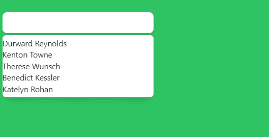

# 无头 UI-组合框自动完成

> 原文：<https://javascript.plainenglish.io/headlessui-combobox-autocomplete-part-2-using-objects-as-data-500e1160e79f?source=collection_archive---------4----------------------->

## 第 2 部分—将对象用作数据


Photo by [Ales Nesetril](https://unsplash.com/@alesnesetril?utm_source=medium&utm_medium=referral) on [Unsplash](https://unsplash.com?utm_source=medium&utm_medium=referral)

如果数据是对象数组而不是字符串数组。你需要改变一些事情。

一个是在过滤器上，而不仅仅是 person，因为这次 person 包含 id、name 和 unavailable。

为了查看名称的匹配，我们使用`person.name.toLowerCase().includes(query.toLowerCase())`

```
const filteredPeople =query === ''? people: people.filter((person) => {return **person.name.toLowerCase().includes(query.toLowerCase())**})
```

然后，我们需要提供一个 displayValue，这样它就会在输入框中显示名称。

```
<Combobox.Input  className="w-full border-none py-2 pl-3 pr-10 text-sm leading-5 text-gray-900 focus:ring-0"onChange={(event) => setQuery(event.target.value)}**displayValue={(person) => person.name}**/>
```

然后在组合框中。选项，我们需要添加键、值和禁用。

```
<Combobox.Options  className="absolute mt-1 max-h-60 w-full overflow-auto rounded-md bg-white py-1 text-base shadow-lg ring-1 ring-black ring-opacity-5 focus:outline-none sm:text-sm">{filteredPeople.map((person) => (<Combobox.Option **key={person.id}****value={person}****disabled={person.unavailable}**>{person.name}</Combobox.Option>))}</Combobox.Options>
```



the name that is not available cannot be clicked

如果你喜欢这个故事，你可能也喜欢中等会员。一个月才 5 美元(一杯咖啡的价格！)但是它会在支持你最喜欢的作家的同时，给你无限的接触故事的机会。如果你用[这个链接](https://ckmobile.medium.com/membership)注册，我会赚一小笔佣金。谢谢！

关注我们: [YouTube](https://www.youtube.com/channel/UCu4-4FnutvSHVo9WHvq80Ww?sub_confirmation=1) ， [Medium](https://ckmobile.medium.com/) ， [Udemy](https://www.udemy.com/user/cyruschan2/) ， [Linkedin](https://www.linkedin.com/company/ckmobi/) ， [Twitter](https://twitter.com/ckmobilejavasc1) ， [Instagram](https://www.instagram.com/ckmobile8050) ， [Gumroad](https://app.gumroad.com/ckmobile) ， [Quora](https://ckmobile.quora.com/) ， [Telegram](https://t.me/ckmobi)

*更多内容请看*[***plain English . io***](https://plainenglish.io/)*。报名参加我们的* [***免费周报***](http://newsletter.plainenglish.io/) *。关注我们关于*[***Twitter***](https://twitter.com/inPlainEngHQ)[***LinkedIn***](https://www.linkedin.com/company/inplainenglish/)*[***YouTube***](https://www.youtube.com/channel/UCtipWUghju290NWcn8jhyAw)*[***不和***](https://discord.gg/GtDtUAvyhW) *。对增长黑客感兴趣？检查* [***电路***](https://circuit.ooo/) *。***