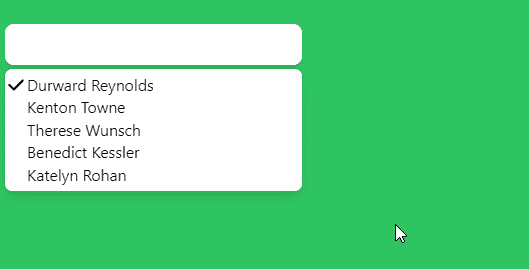

# HeadlessUI- Combobox 自动完成

> 原文：<https://javascript.plainenglish.io/headlessui-combobox-autocomplete-part-3-active-and-selected-a8e84c572a37?source=collection_archive---------3----------------------->

## 第 3 部分—活动的和选定的

使选项处于活动状态或被选中状态，或者两者兼有。我们需要从 React 导入片段，还需要从 Heroicon 导入 CheckIcon。

```
import { useState, Fragment } from 'react'import { CheckIcon } from '@heroicons/react/solid'
```

然后在 filteredPeople，转到“使组合框显示为片段”选项，然后

*   在激活时将是蓝色和白色文本颜色，否则它将是白色和黑色文本。

```
{filteredPeople.map((person) => (<Combobox.Option key={person.id}value={person}disabled={person.unavailable}**as={Fragment}**>{({ active, selected }) => (**<li****className={`flex ${****active ? 'bg-blue-500 text-white' : 'bg-white text-black'****}`}****>****{selected ? <CheckIcon className="h-5 w-5" aria-hidden="true" />:<div className="h-5 w-5"></div>}**<div>{person.name}</div></li>)}</Combobox.Option>))}
```

如果选中，将显示高度和宽度为 5 个单位的<checkicon>。</checkicon>

```
{selected ? <CheckIcon className="h-5 w-5" aria-hidden="true" />:<div className="h-5 w-5"></div>}
```



如果你喜欢这个故事，你可能也喜欢中等会员。一个月才 5 美元(一杯咖啡的价格！)但是它会在支持你最喜欢的作家的同时，给你无限的接触故事的机会。如果你注册使用[这个链接](https://ckmobile.medium.com/membership)，我会赚一小笔佣金。谢谢！

关注我们: [YouTube](https://www.youtube.com/channel/UCu4-4FnutvSHVo9WHvq80Ww?sub_confirmation=1) ， [Medium](https://ckmobile.medium.com/) ， [Udemy](https://www.udemy.com/user/cyruschan2/) ， [Linkedin](https://www.linkedin.com/company/ckmobi/) ， [Twitter](https://twitter.com/ckmobilejavasc1) ， [Instagram](https://www.instagram.com/ckmobile8050) ， [Gumroad](https://app.gumroad.com/ckmobile) ， [Quora](https://ckmobile.quora.com/) ， [Telegram](https://t.me/ckmobi)

*更多内容请看*[***plain English . io***](https://plainenglish.io/)*。报名参加我们的* [***免费周报***](http://newsletter.plainenglish.io/) *。关注我们关于*[***Twitter***](https://twitter.com/inPlainEngHQ)[***LinkedIn***](https://www.linkedin.com/company/inplainenglish/)*[***YouTube***](https://www.youtube.com/channel/UCtipWUghju290NWcn8jhyAw)*[***不和***](https://discord.gg/GtDtUAvyhW) *。对增长黑客感兴趣？检查* [***电路***](https://circuit.ooo/) *。***