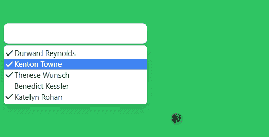
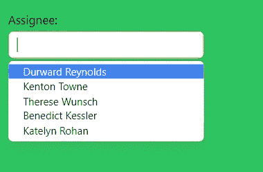

# HeadlessUI- Combobox 自动完成

> 原文：<https://javascript.plainenglish.io/headlessui-combobox-autocomplete-part-4-selecting-multiple-values-e948bd3ec83b?source=collection_archive---------11----------------------->

## 第 4 部分—选择多个值

在本文中，我们将允许在组合框中选择多个值。

首先，我们需要将默认状态更改为数组。

```
const [selectedPerson, setSelectedPerson] = useState([people[0],people[1]])
```

接下来，我们将`multiple`道具添加到组合框中。



要添加标签，我们可以使用 Combobox。标签

```
return (<div className="fixed top-16 w-72 p-3"><Combobox value={selectedPerson} onChange={setSelectedPerson} multiple><Combobox.Label>Assignee:</Combobox.Label><div className="relative mt-1"><div className="relative w-full cursor-default overflow-hidden rounded-lg bg-white text-left shadow-md focus:outline-none focus-visible:ring-2 focus-visible:ring-white focus-visible:ring-opacity-75 focus-visible:ring-offset-2 focus-visible:ring-offset-teal-300 sm:text-sm">
```



如果你喜欢这个故事，你可能也喜欢中等会员。一个月才 5 美元(一杯咖啡的价格！)但是它会在支持你最喜欢的作家的同时，给你无限的接触故事的机会。如果你用[这个链接](https://ckmobile.medium.com/membership)注册，我会赚一小笔佣金。谢谢！

关注我们: [YouTube](https://www.youtube.com/channel/UCu4-4FnutvSHVo9WHvq80Ww?sub_confirmation=1) ， [Medium](https://ckmobile.medium.com/) ， [Udemy](https://www.udemy.com/user/cyruschan2/) ， [Linkedin](https://www.linkedin.com/company/ckmobi/) ， [Twitter](https://twitter.com/ckmobilejavasc1) ， [Instagram](https://www.instagram.com/ckmobile8050) ， [Gumroad](https://app.gumroad.com/ckmobile) ， [Quora](https://ckmobile.quora.com/) ， [Telegram](https://t.me/ckmobi)

*更多内容请看*[***plain English . io***](https://plainenglish.io/)*。报名参加我们的* [***免费周报***](http://newsletter.plainenglish.io/) *。关注我们关于*[***Twitter***](https://twitter.com/inPlainEngHQ)[***LinkedIn***](https://www.linkedin.com/company/inplainenglish/)*[***YouTube***](https://www.youtube.com/channel/UCtipWUghju290NWcn8jhyAw)*[***不和***](https://discord.gg/GtDtUAvyhW) *。对增长黑客感兴趣？检查* [***电路***](https://circuit.ooo/) *。***