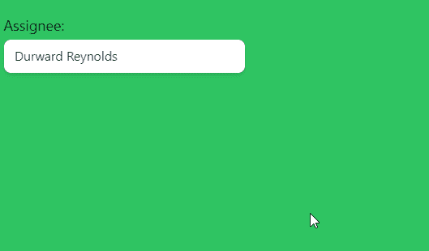

# HeadlessUI: Combobox 自动完成

> 原文：<https://javascript.plainenglish.io/headlessui-combobox-autocomplete-part-5-active-option-70fd5f59269a?source=collection_archive---------13----------------------->

## 第 5 部分:主动选项

在这一部分中，我们将讨论活动选项属性，但这在用于选择单值时有意义，而不是用于多值。

这是因为它将只显示最近选择的值。

所以我们将 selectedPerson 的默认值还原为单个人，而不是数组。

```
const [selectedPerson, setSelectedPerson] = useState(people[0])
```

我们还移除了<组合框>中的`multiple`道具

然后在<combobox>下，写一个这样的模板</combobox>

```
{({activeOption})=>(<></>)} 
```

然后把所有的<combobox.label>、<combobox.input>和<combobox.options>放到片段里。</combobox.options></combobox.input></combobox.label>

```
<div className="fixed top-16 w-72 p-3"><Combobox value={selectedPerson} onChange={setSelectedPerson} >{({activeOption})=>(<><Combobox.Label>Assignee:</Combobox.Label><div className="relative mt-1"><div className="relative w-full cursor-default overflow-hidden rounded-lg bg-white text-left shadow-md focus:outline-none focus-visible:ring-2 focus-visible:ring-white focus-visible:ring-opacity-75 focus-visible:ring-offset-2 focus-visible:ring-offset-teal-300 sm:text-sm"><Combobox.Input className="w-full border-none py-2 pl-3 pr-10 text-sm leading-5 text-gray-900 focus:ring-0"onChange={(event) => setQuery(event.target.value)}displayValue={(person) => person.name}/></div><Combobox.Options className="absolute mt-1 max-h-60 w-full overflow-auto rounded-md bg-white py-1 text-base shadow-lg ring-1 ring-black ring-opacity-5 focus:outline-none sm:text-sm">{filteredPeople.map((person) => (<Combobox.Option key={person.id}value={person}disabled={person.unavailable}as={Fragment}>{({ active, selected }) => (<liclassName={`flex ${active ? 'bg-blue-500 text-white' : 'bg-white text-black'}`}>{selected ? <CheckIcon className="h-5 w-5" aria-hidden="true" /> : <div className="h-5 w-5"></div>}<div>{person.name}</div></li>)}</Combobox.Option>))}{activeOption && (<div>The current active user is: {activeOption.name}</div>)}</Combobox.Options></div></>)}</Combobox></div>
```



display the active option at the bottom

现在，您可以看到列表底部显示的活动选项。

如果你喜欢这个故事，你可能也喜欢中等会员。一个月才 5 美元(一杯咖啡的价格！)但是它会在支持你最喜欢的作家的同时，给你无限的接触故事的机会。如果你注册使用[这个链接](https://ckmobile.medium.com/membership)，我会赚一小笔佣金。谢谢！

# 关注我们: [YouTube](https://www.youtube.com/channel/UCu4-4FnutvSHVo9WHvq80Ww?sub_confirmation=1) ， [Medium](https://ckmobile.medium.com/) ， [Udemy](https://www.udemy.com/user/cyruschan2/) ， [Linkedin](https://www.linkedin.com/company/ckmobi/) ， [Twitter](https://twitter.com/ckmobilejavasc1) ， [Instagram](https://www.instagram.com/ckmobile8050) ， [Gumroad](https://app.gumroad.com/ckmobile) ， [Quora](https://ckmobile.quora.com/) ， [Telegram](https://t.me/ckmobi)

*更多内容请看*[***plain English . io***](https://plainenglish.io/)*。报名参加我们的* [***免费周报***](http://newsletter.plainenglish.io/) *。关注我们关于*[***Twitter***](https://twitter.com/inPlainEngHQ)[***LinkedIn***](https://www.linkedin.com/company/inplainenglish/)*[***YouTube***](https://www.youtube.com/channel/UCtipWUghju290NWcn8jhyAw)***，以及****[***不和***](https://discord.gg/GtDtUAvyhW) *对成长黑客感兴趣？检查* [***电路***](https://circuit.ooo/) ***。*****