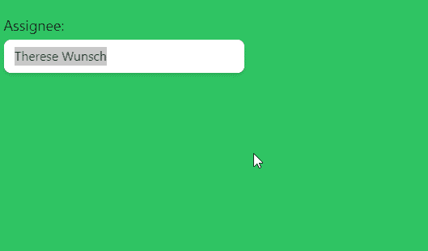
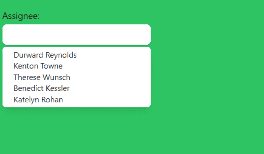

# HeadlessUI: Combobox 自动完成

> 原文：<https://javascript.plainenglish.io/headlessui-combobox-autocomplete-part-6-empty-values-3ce661b5abcb?source=collection_archive---------11----------------------->

## 第 6 部分:空值

在这一部分中，我们将展示如何将 combobox 清除回一个空值。



这时，在你选择一个名字后，即使你按 backspace 来清空输入框。您仍然可以看到该名称已被选中。

通过清除输入框来清除选定的值。我们可以在<组合框>中添加`nullable`

```
<Combobox value={selectedPerson} onChange={setSelectedPerson} nullable >
```

在

```
<Combobox.Input className="w-full border-none py-2 pl-3 pr-10 text-sm leading-5 text-gray-900 focus:ring-0"onChange={(event) => setQuery(event.target.value)}**displayValue={(person) => person?.name}**/>
```



现在您可以看到，当输入被清除时，活动选项也被清除。

如果你喜欢这个故事，你可能也喜欢中等会员。一个月才 5 美元(一杯咖啡的价格！)但是它会在支持你最喜欢的作家的同时，给你无限的接触故事的机会。如果你注册使用[这个链接](https://ckmobile.medium.com/membership)，我会赚一小笔佣金。谢谢！

# 关注我们: [YouTube](https://www.youtube.com/channel/UCu4-4FnutvSHVo9WHvq80Ww?sub_confirmation=1) ， [Medium](https://ckmobile.medium.com/) ， [Udemy](https://www.udemy.com/user/cyruschan2/) ， [Linkedin](https://www.linkedin.com/company/ckmobi/) ， [Twitter](https://twitter.com/ckmobilejavasc1) ， [Instagram](https://www.instagram.com/ckmobile8050) ， [Gumroad](https://app.gumroad.com/ckmobile) ， [Quora](https://ckmobile.quora.com/) ， [Telegram](https://t.me/ckmobi)

*更多内容请看*[***plain English . io***](https://plainenglish.io/)*。报名参加我们的* [***免费周报***](http://newsletter.plainenglish.io/) *。关注我们关于*[***Twitter***](https://twitter.com/inPlainEngHQ)[***LinkedIn***](https://www.linkedin.com/company/inplainenglish/)*[***YouTube***](https://www.youtube.com/channel/UCtipWUghju290NWcn8jhyAw)***，以及****[***不和***](https://discord.gg/GtDtUAvyhW) *对成长黑客感兴趣？检查* [***电路***](https://circuit.ooo/) ***。*****