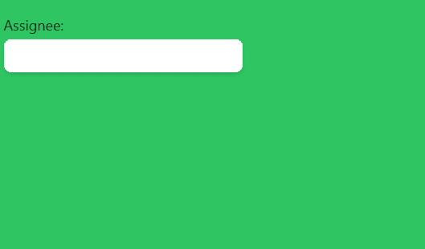

# HeadlessUI: Combobox 自动完成

> 原文：<https://javascript.plainenglish.io/headlessui-combobox-autocomplete-part-7-transition-8bb53b7d78c8?source=collection_archive---------12----------------------->

## 第 7 部分:过渡

在这一部分，我们将添加到组合框的过渡。

首先，我们需要从 headless UI 导入转换。

```
import { Combobox,Transition  } from '@headlessui/react';
```

然后我们添加<transition>来包装<combobox.options>。</combobox.options></transition>

```
<Transitionenter="transition duration-1000 ease-out"enterFrom="transform scale-105 opacity-0"enterTo="transform scale-100 opacity-100"leave="transition duration-500 ease-out"leaveFrom="transform scale-100 opacity-100"leaveTo="transform scale-95 opacity-0">
```



```
<div className="fixed top-16 w-72 p-3"><Combobox value={selectedPerson} onChange={setSelectedPerson} nullable >{({activeOption})=>(<><Combobox.Label>Assignee:</Combobox.Label><div className="relative mt-1"><div className="relative w-full cursor-default overflow-hidden rounded-lg bg-white text-left shadow-md focus:outline-none focus-visible:ring-2 focus-visible:ring-white focus-visible:ring-opacity-75 focus-visible:ring-offset-2 focus-visible:ring-offset-teal-300 sm:text-sm"><Combobox.Input className="w-full border-none py-2 pl-3 pr-10 text-sm leading-5 text-gray-900 focus:ring-0"onChange={(event) => setQuery(event.target.value)}displayValue={(person) => person?.name}/></div>**<Transition****enter="transition duration-1000 ease-out"****enterFrom="transform scale-105 opacity-0"****enterTo="transform scale-100 opacity-100"****leave="transition duration-500 ease-out"****leaveFrom="transform scale-100 opacity-100"****leaveTo="transform scale-95 opacity-0"****>**<Combobox.Options className="absolute mt-1 max-h-60 w-full overflow-auto rounded-md bg-white py-1 text-base shadow-lg ring-1 ring-black ring-opacity-5 focus:outline-none sm:text-sm">{filteredPeople.map((person) => (<Combobox.Option key={person.id}value={person}disabled={person.unavailable}as={Fragment}>{({ active, selected }) => (<liclassName={`flex ${active ? 'bg-blue-500 text-white' : 'bg-white text-black'}`}>{selected ? <CheckIcon className="h-5 w-5" aria-hidden="true" /> : <div className="h-5 w-5"></div>}<div>{person.name}</div></li>)}</Combobox.Option>))}{activeOption && (<div>The current active user is: {activeOption.name}</div>)}</Combobox.Options></Transition></div></>)}</Combobox></div>
```

如果你喜欢这个故事，你可能也喜欢中等会员。一个月才 5 美元(一杯咖啡的价格！)但是它会在支持你最喜欢的作家的同时，给你无限的接触故事的机会。如果你注册使用[这个链接](https://ckmobile.medium.com/membership)，我会赚一小笔佣金。谢谢！

# 关注我们: [YouTube](https://www.youtube.com/channel/UCu4-4FnutvSHVo9WHvq80Ww?sub_confirmation=1) ， [Medium](https://ckmobile.medium.com/) ， [Udemy](https://www.udemy.com/user/cyruschan2/) ， [Linkedin](https://www.linkedin.com/company/ckmobi/) ， [Twitter](https://twitter.com/ckmobilejavasc1) ， [Instagram](https://www.instagram.com/ckmobile8050) ， [Gumroad](https://app.gumroad.com/ckmobile) ， [Quora](https://ckmobile.quora.com/) ， [Telegram](https://t.me/ckmobi)

*更多内容请看*[***plain English . io***](https://plainenglish.io/)*。报名参加我们的* [***免费周报***](http://newsletter.plainenglish.io/) *。关注我们关于*[***Twitter***](https://twitter.com/inPlainEngHQ)[***LinkedIn***](https://www.linkedin.com/company/inplainenglish/)*[***YouTube***](https://www.youtube.com/channel/UCtipWUghju290NWcn8jhyAw)***，以及****[***不和***](https://discord.gg/GtDtUAvyhW) *对成长黑客感兴趣？检查* [***电路***](https://circuit.ooo/) ***。*****