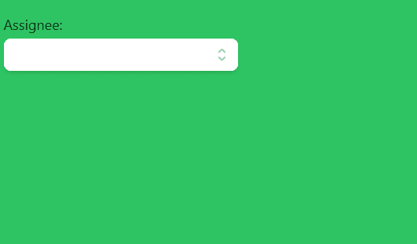

# HeadlessUI: Combobox 自动完成

> 原文：<https://javascript.plainenglish.io/headlessui-combobox-autocomplete-part-8-combobox-button-ea9b5672dab4?source=collection_archive---------8----------------------->

## 第 8 部分:组合框按钮

在这一部分，我们将添加 Combobox 按钮，这样用户就可以点击它并打开下拉菜单。



首先，我们需要从 react heroicon 导入 SelectorIcon。

```
import { CheckIcon, SelectorIcon } from '@heroicons/react/solid'
```

然后我们把组合框。组合框下的按钮。投入

```
<div className="relative w-full cursor-default overflow-hidden rounded-lg bg-white text-left shadow-md focus:outline-none focus-visible:ring-2 focus-visible:ring-white focus-visible:ring-opacity-75 focus-visible:ring-offset-2 focus-visible:ring-offset-teal-300 sm:text-sm"><Combobox.Input className="w-full border-none py-2 pl-3 pr-10 text-sm leading-5 text-gray-900 focus:ring-0"onChange={(event) => setQuery(event.target.value)}displayValue={(person) => person?.name}/><Combobox.Button className="absolute inset-y-0 right-0 flex items-center pr-2"><SelectorIconclassName="h-5 w-5 text-gray-400"aria-hidden="true"/></Combobox.Button></div>
```

现在用户可以点击选择按钮，打开下拉菜单。

# 关注我们: [YouTube](https://www.youtube.com/channel/UCu4-4FnutvSHVo9WHvq80Ww?sub_confirmation=1) ， [Medium](https://ckmobile.medium.com/) ， [Udemy](https://www.udemy.com/user/cyruschan2/) ， [Linkedin](https://www.linkedin.com/company/ckmobi/) ， [Twitter](https://twitter.com/ckmobilejavasc1) ， [Instagram](https://www.instagram.com/ckmobile8050) ， [Gumroad](https://app.gumroad.com/ckmobile) ， [Quora](https://ckmobile.quora.com/) ， [Telegram](https://t.me/ckmobi)

*更多内容看* [***说白了。报名参加我们的***](https://plainenglish.io/) **[***免费每周简讯***](http://newsletter.plainenglish.io/) *。关注我们关于* [***推特***](https://twitter.com/inPlainEngHQ) ，[***LinkedIn***](https://www.linkedin.com/company/inplainenglish/)***，***[***YouTube***](https://www.youtube.com/channel/UCtipWUghju290NWcn8jhyAw)***，****[***不和*** *对成长黑客感兴趣？检查出*](https://discord.gg/GtDtUAvyhW) [***电路***](https://circuit.ooo/) ***。******