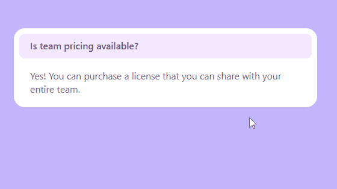

# 披露

> 原文：<https://javascript.plainenglish.io/headlessui-disclosure-part-1-basic-example-2a32c3cbb225?source=collection_archive---------9----------------------->

## 第 1 部分:基本示例

用 Next.js 创建项目后，安装 headless ui 和 [tailwind CSS。](https://tailwindcss.com/docs/guides/nextjs)

```
npm install @headlessui/react
```

在根文件夹中，创建一个名为“components”的文件夹。

在文件夹内，创建“MyDisclosure.js”。

```
import React from 'react'import { Disclosure } from '@headlessui/react'const MyDisclosure = () => {return (<div className="w-full px-4 pt-16"><div className="mx-auto w-full max-w-md rounded-2xl bg-white p-2"><Disclosure><Disclosure.Button className="flex w-full justify-between rounded-lg bg-purple-100 px-4 py-2 text-left text-sm font-medium text-purple-900 hover:bg-purple-200 focus:outline-none focus-visible:ring focus-visible:ring-purple-500 focus-visible:ring-opacity-75">Is team pricing available?</Disclosure.Button><Disclosure.Panel className="px-4 pt-4 pb-2 text-sm text-gray-500">Yes! You can purchase a license that you can share with your entireteam.</Disclosure.Panel></Disclosure></div></div>)}export default MyDisclosure
```

在 index.js 上，导入 MyDisclosure

```
import MyDisclosure from '../components/MyDisclosure'export default function Home() {return (<div className="bg-violet-300 h-screen"><MyDisclosure/></div>)}
```



如果你喜欢这个故事，你可能也喜欢中等会员。一个月才 5 美元(一杯咖啡的价格！)但是它会在支持你最喜欢的作家的同时，给你无限的接触故事的机会。如果你注册使用[这个链接](https://ckmobile.medium.com/membership)，我会赚一小笔佣金。谢谢！

# 关注我们: [YouTube](https://www.youtube.com/channel/UCu4-4FnutvSHVo9WHvq80Ww?sub_confirmation=1) ， [Medium](https://ckmobile.medium.com/) ， [Udemy](https://www.udemy.com/user/cyruschan2/) ， [Linkedin](https://www.linkedin.com/company/ckmobi/) ， [Twitter](https://twitter.com/ckmobilejavasc1) ， [Instagram](https://www.instagram.com/ckmobile8050) ， [Gumroad](https://app.gumroad.com/ckmobile) ， [Quora](https://ckmobile.quora.com/) ， [Telegram](https://t.me/ckmobi)

*更多内容请看*[***plain English . io***](https://plainenglish.io/)*。报名参加我们的* [***免费周报***](http://newsletter.plainenglish.io/) *。关注我们关于*[***Twitter***](https://twitter.com/inPlainEngHQ)[***LinkedIn***](https://www.linkedin.com/company/inplainenglish/)*[***YouTube***](https://www.youtube.com/channel/UCtipWUghju290NWcn8jhyAw)***，以及****[***不和***](https://discord.gg/GtDtUAvyhW) *对成长黑客感兴趣？检查* [***电路***](https://circuit.ooo/) ***。*****