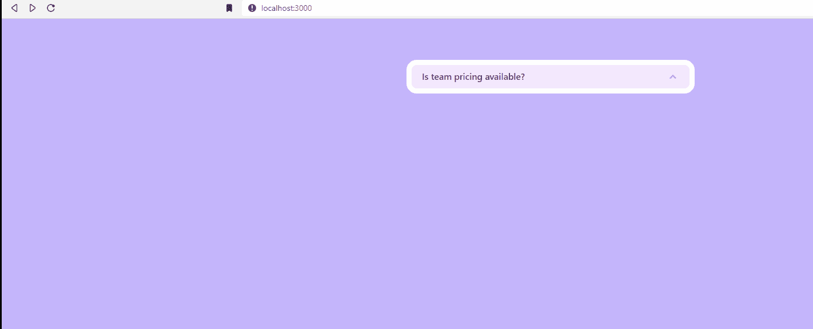

# 披露

> 原文：<https://javascript.plainenglish.io/headlessui-disclosure-part-3-closing-disclosures-manually-94e3124dc8b0?source=collection_archive---------8----------------------->

## 第 3 部分:手动关闭披露


Photo by [Domenico Loia](https://unsplash.com/@domenicoloia?utm_source=medium&utm_medium=referral) on [Unsplash](https://unsplash.com?utm_source=medium&utm_medium=referral)

在这一部分，我们将创建一个自定义组件作为披露按钮。

首先，在 components 文件夹下，创建 MyLink.js

```
import React from 'react'const MyLink = React.forwardRef(({ onClick, href }, ref) => {return (<a href={href} onClick={onClick} ref={ref}> MyLink</a>)})export default MyLink
```

然后在披露下。面板，添加披露。按钮并显示为<mylink>，href= "/home "</mylink>

```
<Disclosure.Panel className="px-4 pt-4 pb-2 text-sm text-gray-500">Yes! You can purchase a license that you can share with your entireteam.<Disclosure.Button as={MyLink} href="/home">Home</Disclosure.Button></Disclosure.Panel>
```

在 pages 文件夹下，创建 home.js

```
import React from 'react'const home = () => {return (<div>home</div>)}export default home
```

所以当用户点击我的链接按钮时。它将关闭披露并转到主页。



`React.forwardRef`参考

[](https://stackoverflow.com/questions/66421459/warning-function-components-cannot-be-given-refs) [## 警告:不能给函数组件引用

### 感谢贡献一个堆栈溢出的答案！请务必回答问题。提供详细信息并分享…

stackoverflow.com](https://stackoverflow.com/questions/66421459/warning-function-components-cannot-be-given-refs) 

来自官方文档:[if-the-child-is-a-function-component](https://nextjs.org/docs/api-reference/next/link#if-the-child-is-a-function-component)展示了在`Link`中包装自定义函数组件的正确方法。

1.  在`Link`中增加`passHref`属性。
2.  用`React.forwardRef`包装你的自定义函数组件。

然而，`NavbarBrand`不是你能操纵的部件。您可以创建一个定制组件来包装`NavbarBrand`。这大概就像

```
const CustomNavbarBrand = React.forwardRef(({ onClick, href }, ref) => {
  return (
    <NavbarBrand href={href} onClick={onClick} ref={ref}>
      Click Me
    </NavbarBrand>
  )
})

<Link href="/">
  <CustomNavbarBrand>{APP_NAME}</CustomNavbarBrand>
</Link>
```

如果你喜欢这个故事，你可能也喜欢中等会员。一个月才 5 美元(一杯咖啡的价格！)但是它会在支持你最喜欢的作家的同时，给你无限的接触故事的机会。如果你注册使用[这个链接](https://ckmobile.medium.com/membership)，我会赚一小笔佣金。谢谢！

# 关注我们: [YouTube](https://www.youtube.com/channel/UCu4-4FnutvSHVo9WHvq80Ww?sub_confirmation=1) ， [Medium](https://ckmobile.medium.com/) ， [Udemy](https://www.udemy.com/user/cyruschan2/) ， [Linkedin](https://www.linkedin.com/company/ckmobi/) ， [Twitter](https://twitter.com/ckmobilejavasc1) ， [Instagram](https://www.instagram.com/ckmobile8050) ， [Gumroad](https://app.gumroad.com/ckmobile) ， [Quora](https://ckmobile.quora.com/) ， [Telegram](https://t.me/ckmobi)

*更多内容请看*[***plain English . io***](https://plainenglish.io/)*。报名参加我们的* [***免费周报***](http://newsletter.plainenglish.io/) *。关注我们关于*[***Twitter***](https://twitter.com/inPlainEngHQ)[***LinkedIn***](https://www.linkedin.com/company/inplainenglish/)*[***YouTube***](https://www.youtube.com/channel/UCtipWUghju290NWcn8jhyAw)***，以及****[***不和***](https://discord.gg/GtDtUAvyhW) *对成长黑客感兴趣？检查* [***电路***](https://circuit.ooo/) ***。*****