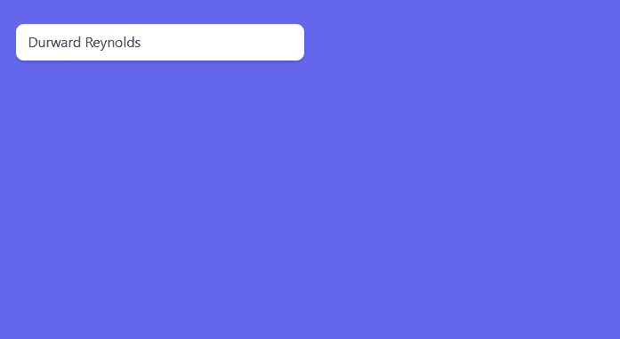

# 无头用户界面列表框—设置活动和选定选项的样式

> 原文：<https://javascript.plainenglish.io/headlessui-listbox-part-2-styling-the-active-and-selected-option-c2eafec0239?source=collection_archive---------5----------------------->

## 第 2 部分:从 Heroicons 添加活动样式和复选图标

所以首先我们需要安装 Heroicons

```
npm install [@heroicons/react](http://twitter.com/heroicons/react)
```

我们主要是从[文档](https://headlessui.dev/react/listbox)“对活动和选中的选项进行样式化”中复制代码。

我们需要添加的其他内容是样式和列表框。选项，跨度和李。

```
import { useState, Fragment } from 'react'import { Listbox } from '@headlessui/react'import { CheckIcon } from '@heroicons/react/solid'const people = [{ id: 1, name: 'Durward Reynolds', unavailable: false },{ id: 2, name: 'Kenton Towne', unavailable: false },{ id: 3, name: 'Therese Wunsch', unavailable: false },{ id: 4, name: 'Benedict Kessler', unavailable: true },{ id: 5, name: 'Katelyn Rohan', unavailable: false },]export default function MyListbox() {const [selectedPerson, setSelectedPerson] = useState(people[0])return (<div className="fixed top-16 w-72 left-16"><Listbox value={selectedPerson} onChange={setSelectedPerson}><Listbox.Button className="relative w-full cursor-default rounded-lg bg-white py-2 pl-3 pr-10 text-left shadow-md focus:outline-none focus-visible:border-indigo-500 focus-visible:ring-2 focus-visible:ring-white focus-visible:ring-opacity-75 focus-visible:ring-offset-2 focus-visible:ring-offset-orange-300 sm:text-sm">{selectedPerson.name}</Listbox.Button><Listbox.Options className="absolute mt-1 max-h-60 w-full overflow-auto rounded-md bg-white py-1 text-base shadow-lg ring-1 ring-black ring-opacity-5 focus:outline-none sm:text-sm">{people.map((person) => (<Listbox.Optionkey={person.id}value={person}disabled={person.unavailable}as={Fragment}className={({ active }) =>`relative cursor-default select-none py-2 pl-10 pr-4 ${active ? 'bg-amber-100 text-amber-900' : 'text-gray-900'}`}>{({ active, selected }) => (<li**className={`${active ? 'bg-blue-500 text-white' : 'bg-white text-black'**}`}>**{selected ? (****<span className="absolute inset-y-0 left-0 flex items-center pl-3 text-amber-600">****<CheckIcon className="h-5 w-5" aria-hidden="true" />****</span>****) : null}                {person.name}****</li>****)}**</Listbox.Option>))}</Listbox.Options></Listbox></div>)}
```



如果你喜欢这个故事，你可能也喜欢中等会员。一个月才 5 美元(一杯咖啡的价格！)但是它会在支持你最喜欢的作家的同时，给你无限的接触故事的机会。如果你注册使用[这个链接](https://ckmobile.medium.com/membership)，我会赚一小笔佣金。谢谢！

关注我们: [YouTube](https://www.youtube.com/channel/UCu4-4FnutvSHVo9WHvq80Ww?sub_confirmation=1) ， [Medium](https://ckmobile.medium.com/) ， [Udemy](https://www.udemy.com/user/cyruschan2/) ， [Linkedin](https://www.linkedin.com/company/ckmobi/) ， [Twitter](https://twitter.com/ckmobilejavasc1) ， [Instagram](https://www.instagram.com/ckmobile8050) ， [Gumroad](https://app.gumroad.com/ckmobile) ， [Quora](https://ckmobile.quora.com/) ， [Telegram](https://t.me/ckmobi)

加入分支机构赚钱

[](https://ckmobile.gumroad.com/affiliates) [## Gumroad

### 编辑描述

ckmobile.gumroad.com](https://ckmobile.gumroad.com/affiliates) 

*更多内容请看*[***plain English . io***](https://plainenglish.io/)*。报名参加我们的* [***免费周报***](http://newsletter.plainenglish.io/) *。关注我们关于*[***Twitter***](https://twitter.com/inPlainEngHQ)[***LinkedIn***](https://www.linkedin.com/company/inplainenglish/)*[***YouTube***](https://www.youtube.com/channel/UCtipWUghju290NWcn8jhyAw)*[***不和***](https://discord.gg/GtDtUAvyhW) *。对增长黑客感兴趣？检查* [***电路***](https://circuit.ooo/) *。***