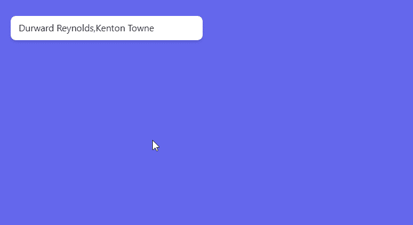
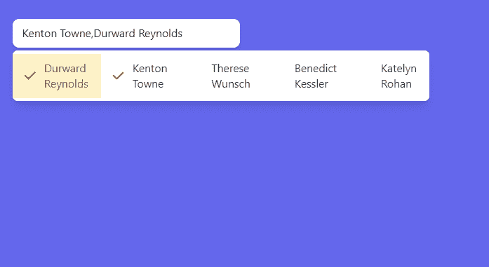

# HeadlessUI:列表框

> 原文：<https://javascript.plainenglish.io/headlessui-listbox-part-3-multiple-values-f8b8a821fa11?source=collection_archive---------5----------------------->

## 第 3 部分:多重价值

在本文中，我们将使用 multiple prop 并向 value 传递一个数组，而不是一个选项。

首先，我们将默认值设置为前两个人

```
const [selectedPerson, setSelectedPerson] = useState([people[0], people[1]])
```

在[文档](https://headlessui.dev/react/listbox)中，它将名称改为 selectedPeople，但为了简单起见，我继续使用 selected people。

接下来，给<listbox>添加多重道具。</listbox>

```
return (<div className="fixed top-16 w-72 left-16"><Listbox value={selectedPerson} onChange={setSelectedPerson} multiple>
```



## 水平选项

要制作水平选项，只需在 Listbox 组件上添加水平属性，就可以用左右箭头键而不是上下键来导航项目。

```
<div className="fixed top-16 w-72 left-16"><Listbox value={selectedPerson} onChange={setSelectedPerson} multiple horizontal>
```

我们还删除了 Listbox 中的以下类。选择

```
w-full overflow-auto
```

相反，添加以下类

```
flex flex-row
```



如果你喜欢这个故事，你可能也喜欢中等会员。一个月才 5 美元(一杯咖啡的价格！)但是它会在支持你最喜欢的作家的同时，给你无限的接触故事的机会。如果你用[这个链接](https://ckmobile.medium.com/membership)注册，我会赚一小笔佣金。谢谢！

# 关注我们: [YouTube](https://www.youtube.com/channel/UCu4-4FnutvSHVo9WHvq80Ww?sub_confirmation=1) ， [Medium](https://ckmobile.medium.com/) ， [Udemy](https://www.udemy.com/user/cyruschan2/) ， [Linkedin](https://www.linkedin.com/company/ckmobi/) ， [Twitter](https://twitter.com/ckmobilejavasc1) ， [Instagram](https://www.instagram.com/ckmobile8050) ， [Gumroad](https://app.gumroad.com/ckmobile) ， [Quora](https://ckmobile.quora.com/) ， [Telegram](https://t.me/ckmobi)

*更多内容请看*[***plain English . io***](https://plainenglish.io/)*。报名参加我们的* [***免费周报***](http://newsletter.plainenglish.io/) *。关注我们关于*[***Twitter***](https://twitter.com/inPlainEngHQ)[***LinkedIn***](https://www.linkedin.com/company/inplainenglish/)*[***YouTube***](https://www.youtube.com/channel/UCtipWUghju290NWcn8jhyAw)***，以及****[***不和***](https://discord.gg/GtDtUAvyhW) *对成长黑客感兴趣？检查* [***电路***](https://circuit.ooo/) ***。*****