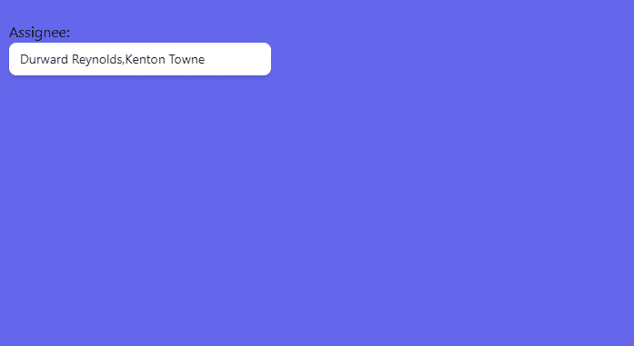

# HeadlessUI:列表框

> 原文：<https://javascript.plainenglish.io/headlessui-listbox-part-5-transition-7cf2796d9ac?source=collection_archive---------7----------------------->

## 第 4 部分:过渡

在这一部分中，我们将向列表框添加过渡。

首先，我们需要添加来自 headless ui react 的转换

```
import { Listbox ,Transition } from '@headlessui/react'
```

然后我们使用<transition>组件来包装</transition>

我们从文档中复制了<transition>组件，并对比例进行了调整</transition>

```
**enterFrom="transform scale-125 opacity-0"**
```



```
export default function MyListbox() {const [open, setOpen] = useRecoilState(openState)const [selectedPerson, setSelectedPerson] = useState([people[0], people[1]])return (<div className="fixed top-16 w-72 left-16"><Listbox value={selectedPerson} onChange={setSelectedPerson} name="assignee" multiple horizontal><Listbox.Label>Assignee:</Listbox.Label><Listbox.Button className="relative w-full cursor-default rounded-lg bg-white py-2 pl-3 pr-10 text-left shadow-md focus:outline-none focus-visible:border-indigo-500 focus-visible:ring-2 focus-visible:ring-white focus-visible:ring-opacity-75 focus-visible:ring-offset-2 focus-visible:ring-offset-orange-300 sm:text-sm"> {selectedPerson.map((person) => person.name).join(',')}</Listbox.Button>**<Transition****enter="transition duration-100 ease-out"****enterFrom="transform scale-125 opacity-0"****enterTo="transform scale-100 opacity-100"****leave="transition duration-75 ease-out"****leaveFrom="transform scale-100 opacity-100"****leaveTo="transform scale-95 opacity-0"****>**<Listbox.Options className="absolute mt-1 max-h-60 flex flex-row  rounded-md bg-white py-1 text-base shadow-lg ring-1 ring-black ring-opacity-5 focus:outline-none sm:text-sm">{people.map((person) => (<Listbox.Optionkey={person.id}value={person}disabled={person.unavailable}as={Fragment}className={({ active }) =>`relative cursor-default select-none py-2 pl-10 pr-4 ${active ? 'bg-amber-100 text-amber-900' : 'text-gray-900'}`}>{({ active, selected }) => (<liclassName={`${active ? 'bg-blue-500 text-white' : 'bg-white text-black'}`}>{selected ? (<span className="absolute inset-y-0 left-0 flex items-center pl-3 text-amber-600"><CheckIcon className="h-5 w-5" aria-hidden="true" /></span>) : null}                {person.name}</li>)}</Listbox.Option>))}</Listbox.Options>**</Transition>**</Listbox></div>)}
```

如果你喜欢这个故事，你可能也喜欢中等会员。一个月才 5 美元(一杯咖啡的价格！)但是它会在支持你最喜欢的作家的同时，给你无限的接触故事的机会。如果你用[这个链接](https://ckmobile.medium.com/membership)注册，我会赚一小笔佣金。谢谢！

# 关注我们: [YouTube](https://www.youtube.com/channel/UCu4-4FnutvSHVo9WHvq80Ww?sub_confirmation=1) ， [Medium](https://ckmobile.medium.com/) ， [Udemy](https://www.udemy.com/user/cyruschan2/) ， [Linkedin](https://www.linkedin.com/company/ckmobi/) ， [Twitter](https://twitter.com/ckmobilejavasc1) ， [Instagram](https://www.instagram.com/ckmobile8050) ， [Gumroad](https://app.gumroad.com/ckmobile) ， [Quora](https://ckmobile.quora.com/) ， [Telegram](https://t.me/ckmobi)

*更多内容请看*[***plain English . io***](https://plainenglish.io/)*。报名参加我们的* [***免费周报***](http://newsletter.plainenglish.io/) *。关注我们关于*[***Twitter***](https://twitter.com/inPlainEngHQ)[***LinkedIn***](https://www.linkedin.com/company/inplainenglish/)*[***YouTube***](https://www.youtube.com/channel/UCtipWUghju290NWcn8jhyAw)***，以及****[***不和***](https://discord.gg/GtDtUAvyhW) *对成长黑客感兴趣？检查* [***电路***](https://circuit.ooo/) ***。*****