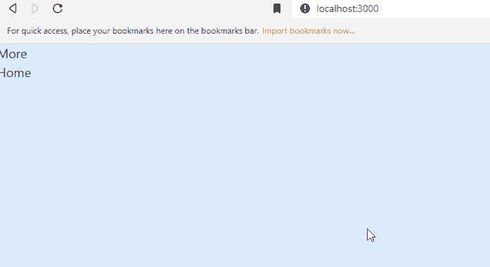

# 使用 Next.js 和 Headless UI 创建下拉菜单

> 原文：<https://javascript.plainenglish.io/headlessui-menu-part-1-installation-and-active-style-32634510da98?source=collection_archive---------6----------------------->

## 第 1 部分:安装 Next.js、Headless UI 和 Tailwind CSS

在这几篇文章中，我们将使用 Next.js 和 Headless UI 创建一个下拉菜单。



首先，我们需要创建项目并安装必要的包。

通过键入以下命令创建项目:

```
npx create-next-app learn-headless-menu
```

安装无头用户界面:

```
yarn add @headlessui/react
```

安装顺风 CSS:

```
npm install -D tailwindcss postcss autoprefixer
npx tailwindcss init -p
```

配置您的模板路径:

```
module.exports = {
  content: [
    "./pages/**/*.{js,ts,jsx,tsx}",
    "./components/**/*.{js,ts,jsx,tsx}",
  ],
  theme: {
    extend: {},
  },
  plugins: [],
}
```

将顺风指令添加到 CSS 中:

```
[@tailwind](http://twitter.com/tailwind) base;
[@tailwind](http://twitter.com/tailwind) components;
[@tailwind](http://twitter.com/tailwind) utilities;
```

## 设置活动项目的样式

```
import { Menu } from '@headlessui/react'export default function MyDropdown() {return (<Menu><Menu.Button>More</Menu.Button><Menu.Items><Menu.Item>{({ active }) => (<a**className={`${active ? 'bg-blue-500 text-white' : 'bg-white text-black'**}`} href="/account-settings">Account settings</a>)}</Menu.Item><Menu.Item>{({ active }) => (<a**className={`${active ? 'bg-blue-500 text-white' : 'bg-white text-black'**}`} href="/account-settings">Documentation</a>)}</Menu.Item><Menu.Item disabled><span className="opacity-75">Invite a friend (coming soon!)</span></Menu.Item></Menu.Items></Menu>)}
```


这看起来不像菜单，不如在下一部分加点风格。

如果你喜欢这个故事，你可能也会喜欢中等会员。一个月才 5 美元(一杯咖啡的价格！)但是它会在支持你最喜欢的作家的同时，给你无限的接触故事的机会。如果你用 [*这个链接*](https://ckmobile.medium.com/membership) *报名，我就赚一小笔佣金。谢谢！*

*关注我们:*[*YouTube*](https://www.youtube.com/channel/UCu4-4FnutvSHVo9WHvq80Ww?sub_confirmation=1)*，*[*Medium*](https://ckmobile.medium.com/)*，*[*Udemy*](https://www.udemy.com/user/cyruschan2/)*，*[*Linkedin*](https://www.linkedin.com/company/ckmobi/)*，*[*Twitter*](https://twitter.com/ckmobilejavasc1)*，*

加入分支机构赚钱:

[](https://ckmobile.gumroad.com/affiliates) [## Gumroad

### 申请成为会员很容易。填写下表，让 Ckmobile 知道您将如何推广他们的…

ckmobile.gumroad.com](https://ckmobile.gumroad.com/affiliates) 

*更多内容请看*[***plain English . io***](https://plainenglish.io/)*。报名参加我们的* [***免费周报***](http://newsletter.plainenglish.io/) *。关注我们关于*[***Twitter***](https://twitter.com/inPlainEngHQ)*和*[***LinkedIn***](https://www.linkedin.com/company/inplainenglish/)*。加入我们的* [***社区不和谐***](https://discord.gg/GtDtUAvyhW) *。*