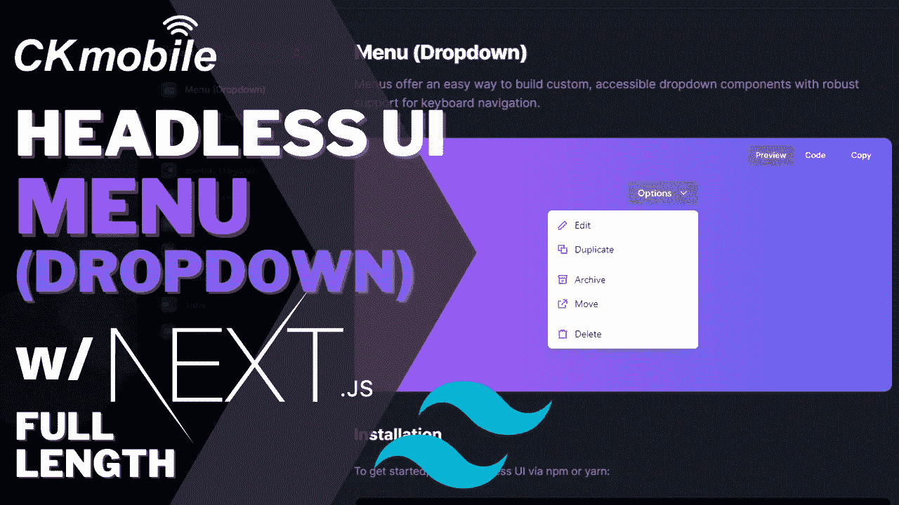
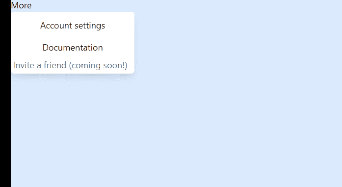
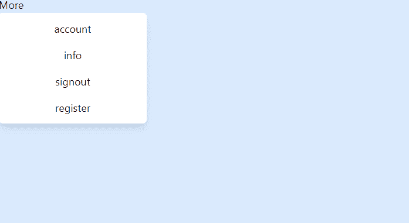

# 使用 Next.js 和 Headless UI 创建下拉菜单

> 原文：<https://javascript.plainenglish.io/headlessui-menu-part-2-add-style-to-menu-items-237a9e414648?source=collection_archive---------7----------------------->

## 第 2 部分:添加样式使它看起来像一个菜单——添加 Tailwind CSS 和 JSON。



在上一篇文章中，菜单不像普通菜单。在本文中，我们将添加 style 和 JSON 来假装从数据库获取数据以生成菜单。

首先，将类添加到菜单项:

```
<Menu.Items className="focus:outline-none absolute origin-top-left  w-56  divide-y divide-gray-100 rounded-md bg-white shadow-lg ">
```

用

包住所有的<menu.item>。</menu.item>

```
<Menu.Items className=" absolute origin-top-left  w-56  divide-y divide-gray-100 rounded-md bg-white shadow-lg "><div className="p-1"><Menu.Item>
```

也从变成

```
<Menu.Item>{({ active }) => (<buttonclassName={`${active && 'bg-blue-500'}`}href="/account-settings">Account settings</button>)}
```

将下面的类添加到按钮中，使其为圆形和全宽:

```
<Menu.Item>{({ active }) => (<buttonclassName={`${active && 'bg-blue-500'} **w-full rounded-md p-2**`}href="/account-settings">Account settings</button>)}</Menu.Item>
```



创建包含项目名称和禁用属性的项目数据。

```
**const items = [
{name:"account",disabled:false},
{name:"info",disabled:false},
{name:"signout",disabled:true},
{name:"register",disabled:false}]**
```

我们还将这些类添加到菜单中。项目和菜单。按钮

```
import { Menu } from '@headlessui/react'export default function MyDropdown() {**const items = [{name:"account",disabled:false},{name:"info",disabled:false},{name:"signout",disabled:true},{name:"register",disabled:false}]**return (<Menu><Menu.Button>More</Menu.Button><Menu.Items className="**focus:outline-none absolute  w-56  divide-y divide-gray-100 rounded-md bg-white shadow-lg ring-1 ring-black ring-opacity-5"**>{/* Use the `active` render prop to conditionally style the active item. */}{items.map(item=>(<Menu.Item disabled={item.disabled}>{({ active }) => (<buttonclassName={`${active ? 'bg-blue-500 text-white' : ' text-black'} **w-full rounded-md px-2 py-2**`}href="/account-settings">{item.name}</button>)}</Menu.Item>))}</Menu.Items></Menu>)}
```

## 循环浏览项目

我们循环遍历这些项，并将 item.disabled 和 item.name 传递给组件，因此它将动态生成这些项，一些项将基于 JSON 被禁用。

```
import { Menu } from '@headlessui/react'const MyDropdown = () => {const items = [{ name: "account", disabled: false },{ name: "info", disabled: false },{ name: "signout", disabled: true },{ name: "register", disabled: false }]return (<Menu><Menu.Button>More</Menu.Button><Menu.Items className="focus:outline-none absolute origin-top-left  w-56  divide-y divide-gray-100 rounded-md bg-white shadow-lg "><div className="p-1">**{items.map(item=>(****<Menu.Item disabled={item.disabled}>****{({ active }) => (****<button****className={`${active && 'bg-blue-500'} w-full rounded-md p-2`}****href="/account-settings"****>****{item.name}****</button>****)}****</Menu.Item>**))}</div></Menu.Items></Menu>)}export default MyDropdown
```

对于 disabled 按钮，该项目应禁用键盘导航和 ARIA 的目的。



*如果你喜欢这个故事，你可能也会喜欢中等会员。一个月才 5 美元(一杯咖啡的价格！)但是它会在支持你最喜欢的作家的同时，给你无限的接触故事的机会。如果你用* [*这个链接*](https://ckmobile.medium.com/membership) *报名，我就赚点小提成。谢谢！*

*关注我们:*[*YouTube*](https://www.youtube.com/channel/UCu4-4FnutvSHVo9WHvq80Ww?sub_confirmation=1)*，*[*Medium*](https://ckmobile.medium.com/)*，*[*Udemy*](https://www.udemy.com/user/cyruschan2/)*，*[*Linkedin*](https://www.linkedin.com/company/ckmobi/)*，**Twitter**，*

加入分支机构赚钱:

[](https://ckmobile.gumroad.com/affiliates) [## Gumroad

### 申请成为会员很容易。填写下表，让 Ckmobile 知道您将如何推广他们的…

ckmobile.gumroad.com](https://ckmobile.gumroad.com/affiliates) 

*更多内容请看*[***plain English . io***](https://plainenglish.io/)*。报名参加我们的* [***免费周报***](http://newsletter.plainenglish.io/) *。关注我们关于*[***Twitter***](https://twitter.com/inPlainEngHQ)*和*[***LinkedIn***](https://www.linkedin.com/company/inplainenglish/)*。加入我们的* [***社区不和谐***](https://discord.gg/GtDtUAvyhW) *。*