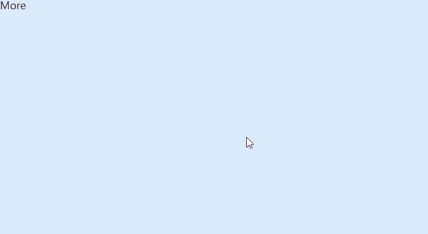
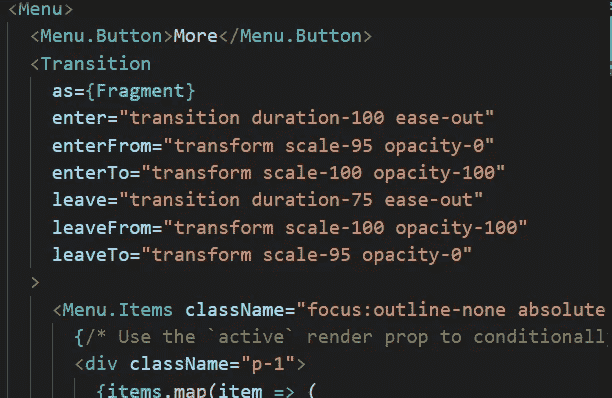

# 使用 Next.js 和 Headless UI 创建下拉菜单

> 原文：<https://javascript.plainenglish.io/headlessui-menu-part-3-add-transition-c37a66cb4dce?source=collection_archive---------10----------------------->

## 第 3 部分:向菜单添加过渡。


Photo by [Artem Sapegin](https://unsplash.com/@sapegin?utm_source=medium&utm_medium=referral) on [Unsplash](https://unsplash.com?utm_source=medium&utm_medium=referral)

在这一部分，我们将把过渡添加到菜单中。

若要告诉元素直接呈现其子元素而不使用包装元素，请使用 as={React。片段}。

从 React Headless UI 导入`Transition`，也从 React 导入`Fragment`。

```
import { Menu, Transition } from '@headlessui/react'
import { Fragment } from 'react'
```



我们使用<transition>组件来包装<menu.items>。</menu.items></transition>

```
<Transitionas={Fragment}enter="transition duration-100 ease-out"enterFrom="transform scale-95 opacity-0"enterTo="transform scale-100 opacity-100"leave="transition duration-75 ease-out"leaveFrom="transform scale-100 opacity-100"leaveTo="transform scale-95 opacity-0">
```



```
<Transitionas={Fragment}enter="transition duration-**1000** ease-out"enterFrom="transform scale-95 opacity-0"enterTo="transform scale-100 opacity-100"leave="transition duration-75 ease-out"leaveFrom="transform scale-100 opacity-100"leaveTo="transform scale-95 opacity-0">
```

我们可以给持续时间增加一个更大的数字，使动画更有意义。


我们将持续时间调回到 100，为了使菜单从左上角出现，我们可以将类别`origin-top-left`添加到<菜单中。物品>。

```
<Menu.Items className="focus:outline-none absolute origin-top-left  w-56  divide-y divide-gray-100 rounded-md bg-white shadow-lg ">
```


*如果你喜欢这个故事，你可能也会喜欢中等会员。一个月才 5 美元(一杯咖啡的价格！)但是它会在支持你最喜欢的作家的同时，给你无限的接触故事的机会。如果你用* [*这个链接*](https://ckmobile.medium.com/membership) *报名，我就赚点小提成。谢谢！*

# 关注我们: [YouTube](https://www.youtube.com/channel/UCu4-4FnutvSHVo9WHvq80Ww?sub_confirmation=1) ， [Medium](https://ckmobile.medium.com/) ， [Udemy](https://www.udemy.com/user/cyruschan2/) ， [Linkedin](https://www.linkedin.com/company/ckmobi/) ， [Twitter](https://twitter.com/ckmobilejavasc1) ， [Instagram](https://www.instagram.com/ckmobile8050) ， [Gumroad](https://app.gumroad.com/ckmobile) ， [Quora](https://ckmobile.quora.com/) ， [Telegram](https://t.me/ckmobi)

加入分支机构赚钱

[](https://ckmobile.gumroad.com/affiliates) [## Gumroad

### 申请成为会员很容易。填写下表，让 Ckmobile 知道您将如何推广他们的…

ckmobile.gumroad.com](https://ckmobile.gumroad.com/affiliates) 

*更多内容请看*[***plain English . io***](https://plainenglish.io/)*。报名参加我们的**[***免费周报***](http://newsletter.plainenglish.io/) *。关注我们关于*[***Twitter***](https://twitter.com/inPlainEngHQ)*和*[***LinkedIn***](https://www.linkedin.com/company/inplainenglish/)*。查看我们的* [***社区不和谐***](https://discord.gg/GtDtUAvyhW) *加入我们的* [***人才集体***](https://inplainenglish.pallet.com/talent/welcome) *。**