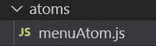
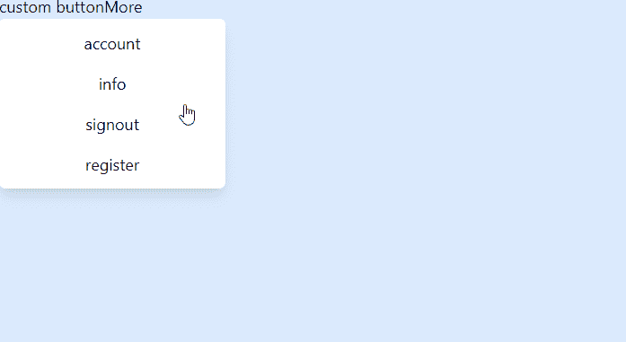

# 使用 Next.js 和 Headless UI 创建下拉菜单

> 原文：<https://javascript.plainenglish.io/headlessui-menu-part-4-custom-button-bcacfa7a4e5d?source=collection_archive---------4----------------------->

## 第 4 部分:创建一个自定义按钮来控制菜单的打开和关闭


Photo by [Arnold Francisca](https://unsplash.com/@clark_fransa?utm_source=medium&utm_medium=referral) on [Unsplash](https://unsplash.com?utm_source=medium&utm_medium=referral)

在本文中，我们将创建自己的按钮来控制菜单的打开和关闭。

首先，我们需要添加反作用力后坐力。

```
yarn add recoil
```

在 _app.js 中，从反冲导入反冲根，然后使用<recoilroot>组件包装<component>。</component></recoilroot>

```
import { RecoilRoot } from 'recoil'import '../styles/globals.css'function MyApp({ Component, pageProps }) {return (<RecoilRoot><Component {...pageProps} /></RecoilRoot>)}export default MyApp
```

## 创建 MenuAtom.js

在“atoms 文件夹”下创建 menuAtom.js。



```
import { atom } from "recoil";export const openState = atom({key: 'openState', // unique ID (with respect to other atoms/selectors)default: false, // truedefault value (aka initial value)});
```

在 MyDropdown.js 中，导入 useRecoilState 和 openState。

```
import { useRecoilState } from 'recoil'import { openState } from '../atoms/menuAtom'export default function MyDropdown() {const items = [{ name: "account", disabled: false }, { name: "info", disabled: false }, { name: "signout", disabled: true }, { name: "register", disabled: false }]const [isOpen, setIsOpen] = useRecoilState(openState)return (...
```

然后进入 index.js。

```
import { useRecoilState } from 'recoil'import { openState } from '../atoms/menuAtom'import MyDropdown from '../components/MyDropdown'export default function Home() {const [isOpen, setIsOpen] = useRecoilState(openState)return (<div className="bg-blue-100 h-screen"><button onClick={()=>setIsOpen(!isOpen)}>custom button</button><MyDropdown/></div>)}
```



如果你喜欢这个故事，你可能也喜欢中等会员。一个月才 5 美元(一杯咖啡的价格！)但是它会在支持你最喜欢的作家的同时，给你无限的接触故事的机会。如果你注册使用[这个链接](https://ckmobile.medium.com/membership)，我会赚一小笔佣金。谢谢！

# 关注我们: [YouTube](https://www.youtube.com/channel/UCu4-4FnutvSHVo9WHvq80Ww?sub_confirmation=1) ， [Medium](https://ckmobile.medium.com/) ， [Udemy](https://www.udemy.com/user/cyruschan2/) ， [Linkedin](https://www.linkedin.com/company/ckmobi/) ， [Twitter](https://twitter.com/ckmobilejavasc1) ， [Instagram](https://www.instagram.com/ckmobile8050) ， [Gumroad](https://app.gumroad.com/ckmobile) ， [Quora](https://ckmobile.quora.com/) ， [Telegram](https://t.me/ckmobi)

加入分支机构赚钱

[](https://ckmobile.gumroad.com/affiliates) [## Gumroad

### 申请成为会员很容易。填写下表，让 Ckmobile 知道您将如何推广他们的…

ckmobile.gumroad.com](https://ckmobile.gumroad.com/affiliates) 

*更多内容请看*[***plain English . io***](https://plainenglish.io/)*。报名参加我们的**[***免费周报***](http://newsletter.plainenglish.io/) *。关注我们关于*[***Twitter***](https://twitter.com/inPlainEngHQ)*和*[***LinkedIn***](https://www.linkedin.com/company/inplainenglish/)*。查看我们的* [***社区不和谐***](https://discord.gg/GtDtUAvyhW) *加入我们的* [***人才集体***](https://inplainenglish.pallet.com/talent/welcome) *。**