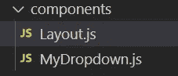
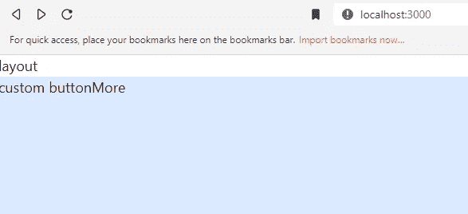
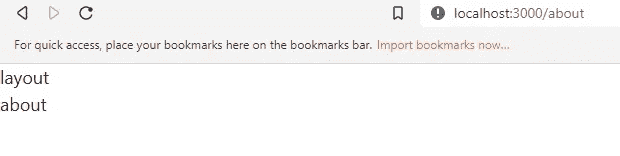

# 使用 Next.js 和 Headless UI 创建下拉菜单

> 原文：<https://javascript.plainenglish.io/headlessui-menu-part-5-using-layout-a11c59ecaa1f?source=collection_archive---------8----------------------->

## 第 5 部分:使用<layout>组件。</layout>


Photo by [Mohammad Rahmani](https://unsplash.com/@afgprogrammer?utm_source=medium&utm_medium=referral) on [Unsplash](https://unsplash.com?utm_source=medium&utm_medium=referral)

为了演示如何使用<link>组件导航到不同的页面，最好使用<layout>组件。</layout>

创建一个组件文件夹，并在该文件夹下创建 Layout.js。



```
import React from 'react'const Layout = ({children}) => {return (<div>layout{children}</div>)}export default Layout
```

然后在 pages 文件夹下，创建 about.js。

```
import React from 'react'const about = () => {return (<div>about</div>)}export default about
```

At _app.js，用<layout>包裹<component>。</component></layout>

```
import '../styles/globals.css'import { RecoilRoot } from 'recoil'import Layout from '../components/Layout'function MyApp({ Component, pageProps }) {return (<RecoilRoot><Layout><Component {...pageProps} /></Layout></RecoilRoot>)}export default MyApp
```

现在，如果我们转到 localhost:3000，它的顶部会有一个布局。



如果我们转到 localhost:3000/about，它也会在顶部有一个布局。



如果你喜欢这个故事，你可能也喜欢中等会员。一个月才 5 美元(一杯咖啡的价格！)但是它会在支持你最喜欢的作家的同时，给你无限的接触故事的机会。如果你注册使用[这个链接](https://ckmobile.medium.com/membership)，我会赚一小笔佣金。谢谢！

# 关注我们: [YouTube](https://www.youtube.com/channel/UCu4-4FnutvSHVo9WHvq80Ww?sub_confirmation=1) ， [Medium](https://ckmobile.medium.com/) ， [Udemy](https://www.udemy.com/user/cyruschan2/) ， [Linkedin](https://www.linkedin.com/company/ckmobi/) ， [Twitter](https://twitter.com/ckmobilejavasc1) ， [Instagram](https://www.instagram.com/ckmobile8050) ， [Gumroad](https://app.gumroad.com/ckmobile) ， [Quora](https://ckmobile.quora.com/) ， [Telegram](https://t.me/ckmobi)

加入分支机构赚钱:

[](https://ckmobile.gumroad.com/affiliates) [## Gumroad

### 申请成为会员很容易。填写下表，让 Ckmobile 知道您将如何推广他们的…

ckmobile.gumroad.com](https://ckmobile.gumroad.com/affiliates) 

*更多内容请看*[***plain English . io***](https://plainenglish.io/)*。报名参加我们的**[***免费周报***](http://newsletter.plainenglish.io/) *。关注我们关于*[***Twitter***](https://twitter.com/inPlainEngHQ)*和*[***LinkedIn***](https://www.linkedin.com/company/inplainenglish/)*。查看我们的* [***社区不和谐***](https://discord.gg/GtDtUAvyhW) *加入我们的* [***人才集体***](https://inplainenglish.pallet.com/talent/welcome) *。**