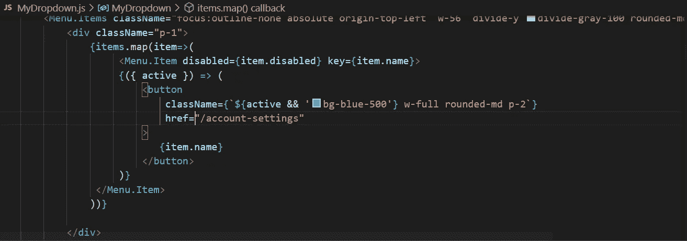
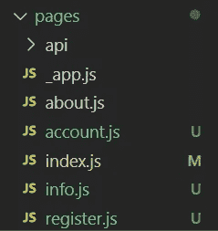
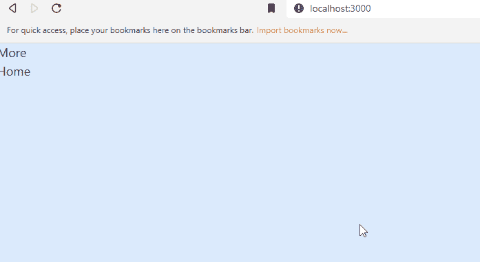

# 使用 Next.js 和 Headless UI 创建下拉菜单

> 原文：<https://javascript.plainenglish.io/headlessui-menu-part-6-using-next-js-link-component-5c264ec532cd?source=collection_archive---------0----------------------->

## 第 6 部分:使用 Next.js 链接组件。


Photo by [Christopher Gower](https://unsplash.com/@cgower?utm_source=medium&utm_medium=referral) on [Unsplash](https://unsplash.com?utm_source=medium&utm_medium=referral)

在 components 文件夹下，创建 MyLink.js

```
import Link from 'next/link'import React from 'react'const MyLink = (props) => {let { href, children, active, ...rest } = propsreturn (<Link href={href}>**<button {...rest}****className={`${active && 'bg-blue-500'} w-full rounded-md p-2`}****href="/account-settings"****>**{children}**</button>**</Link>)}export default MyLink
```

实际上，Link 组件中的内容是从 MyDropdown.js 复制的，除了 item.name 更改为 children



```
{items.map(item=>(<Menu.Item disabled={item.disabled} key={item.name}>**{({ active }) => (****<MyLink href={`${item.name}`} active={active}****>****{item.name}****</MyLink>****)}**</Menu.Item>))}
```

然后创建像 account.js、info.js、register.js 这样的页面



一个示例页面如下所示:

```
import React from 'react'const account = () => {return (<div>account</div>)}export default account
```

从 index.js 中移除 MyDropdown 组件。

```
export default function Home() {return (<div >Home</div>)}
```

转到 Layout.js，导入 MyDropdown 并将蓝色背景和 h-screen 类添加到 div 中。

```
import React from 'react'import MyDropdown from './MyDropdown'const Layout = ({children}) => {return (<div className="bg-blue-100 h-screen"><MyDropdown/>{children}</div>)}export default Layout
```



如果你喜欢这个故事，你可能也喜欢中等会员。一个月才 5 美元(一杯咖啡的价格！)但是它会在支持你最喜欢的作家的同时，给你无限的接触故事的机会。如果你用[这个链接](https://ckmobile.medium.com/membership)注册，我会赚一小笔佣金。谢谢！

# 关注我们: [YouTube](https://www.youtube.com/channel/UCu4-4FnutvSHVo9WHvq80Ww?sub_confirmation=1) ， [Medium](https://ckmobile.medium.com/) ， [Udemy](https://www.udemy.com/user/cyruschan2/) ， [Linkedin](https://www.linkedin.com/company/ckmobi/) ， [Twitter](https://twitter.com/ckmobilejavasc1) ， [Instagram](https://www.instagram.com/ckmobile8050) ， [Gumroad](https://app.gumroad.com/ckmobile) ， [Quora](https://ckmobile.quora.com/) ， [Telegram](https://t.me/ckmobi)

加入分支机构赚钱

[](https://ckmobile.gumroad.com/affiliates) [## Gumroad

### 申请成为会员很容易。填写下表，让 Ckmobile 知道您将如何推广他们的…

ckmobile.gumroad.com](https://ckmobile.gumroad.com/affiliates) 

*更多内容请看*[***plain English . io***](https://plainenglish.io/)*。报名参加我们的**[***免费周报***](http://newsletter.plainenglish.io/) *。关注我们关于*[***Twitter***](https://twitter.com/inPlainEngHQ)*和*[***LinkedIn***](https://www.linkedin.com/company/inplainenglish/)*。查看我们的* [***社区不和谐***](https://discord.gg/GtDtUAvyhW) *加入我们的* [***人才集体***](https://inplainenglish.pallet.com/talent/welcome) *。**