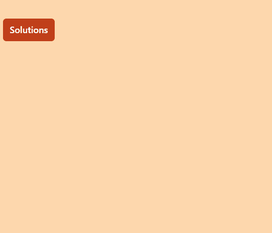

# HeadlessUI: Popover

> 原文：<https://javascript.plainenglish.io/headlessui-popover-part-1-basic-example-8ecc05f71931?source=collection_archive---------6----------------------->

## 第 1 部分:基本示例


Photo by [Glenn Carstens-Peters](https://unsplash.com/@glenncarstenspeters?utm_source=medium&utm_medium=referral) on [Unsplash](https://unsplash.com?utm_source=medium&utm_medium=referral)

在本文中，我们将使用 headless UI 创建一个 Popover 基本示例。

创建项目并安装 TailwindCSS 后，安装 headless UI。

## 创建弹出组件

在根文件夹下，创建 components 文件夹，然后创建 MyPopover.js。

```
import React from 'react'import { Popover } from '@headlessui/react'const MyPopover = () => {return (<div className="**fixed top-16 w-full max-w-sm px-4**"><Popover className="relative"><Popover.ButtonclassName="**group inline-flex items-center rounded-md bg-orange-700 px-3 py-2 text-base font-medium text-white hover:text-opacity-100 focus:outline-none focus-visible:ring-2 focus-visible:ring-white focus-visible:ring-opacity-75**">Solutions</Popover.Button><Popover.Panel className="absolute z-10 mt-3"><div className="**overflow-hidden rounded-lg shadow-lg ring-1 ring-black ring-opacity-5">**<div className="**relative grid gap-8 bg-white p-7** "><a href="/analytics">Analytics</a><a href="/engagement">Engagement</a><a href="/security">Security</a><a href="/integrations">Integrations</a></div></div></Popover.Panel></Popover></div>)}export default MyPopover
```

在 index.js 下，导入 MyPopover 组件，添加背景色，并制作一个横跨整个视口高度的

。

```
import MyPopover from '../components/MyPopover'export default function Home() {return (<div className="bg-orange-200 h-screen"><MyPopover/></div>)}
```



如果你喜欢这个故事，你可能也喜欢中等会员。一个月才 5 美元(一杯咖啡的价格！)但是它会在支持你最喜欢的作家的同时，给你无限的接触故事的机会。如果你用[这个链接](https://ckmobile.medium.com/membership)注册，我会赚一小笔佣金。谢谢！

# 关注我们: [YouTube](https://www.youtube.com/channel/UCu4-4FnutvSHVo9WHvq80Ww?sub_confirmation=1) ， [Medium](https://ckmobile.medium.com/) ， [Udemy](https://www.udemy.com/user/cyruschan2/) ， [Linkedin](https://www.linkedin.com/company/ckmobi/) ， [Twitter](https://twitter.com/ckmobilejavasc1) ， [Instagram](https://www.instagram.com/ckmobile8050) ， [Gumroad](https://app.gumroad.com/ckmobile) ， [Quora](https://ckmobile.quora.com/) ， [Telegram](https://t.me/ckmobi)

*更多内容请看*[***plain English . io***](https://plainenglish.io/)*。报名参加我们的* [***免费周报***](http://newsletter.plainenglish.io/) *。关注我们关于*[***Twitter***](https://twitter.com/inPlainEngHQ)[***LinkedIn***](https://www.linkedin.com/company/inplainenglish/)*[***YouTube***](https://www.youtube.com/channel/UCtipWUghju290NWcn8jhyAw)***，以及****[***不和***](https://discord.gg/GtDtUAvyhW) *对成长黑客感兴趣？检查* [***电路***](https://circuit.ooo/) ***。*****