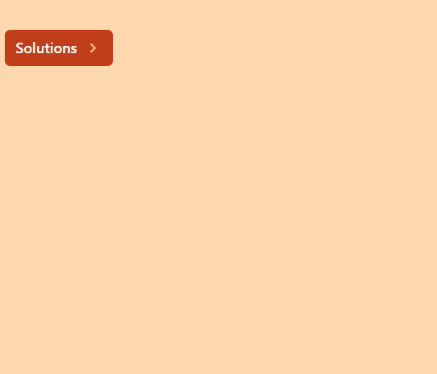

# HeadlessUI: Popover

> 原文：<https://javascript.plainenglish.io/headlessui-popover-part-2-styling-an-open-panels-button-85eeb4ac2f3e?source=collection_archive---------4----------------------->

## 第 2 部分:设计一个打开面板的按钮


Photo by [Fotis Fotopoulos](https://unsplash.com/@ffstop?utm_source=medium&utm_medium=referral) on [Unsplash](https://unsplash.com?utm_source=medium&utm_medium=referral)

在这一部分，我们将在文本旁边的弹出按钮上添加一个向右的 v 形图标。

当弹出面板打开时，图标将指向底部，否则将指向右侧。



首先，我们必须安装 react heroicon。

```
npm install [@heroicons/react](http://twitter.com/heroicons/react)
```

然后我们导入顶部的图标。

```
import { ChevronRightIcon } from '@heroicons/react/solid'
```

<popover>里面添加</popover>

```
{({open})=>(<></>)}
```

然后将<popover.button>和<popover.panel>放入片段中。</popover.panel></popover.button>

```
const MyPopover = () => {return (<div className="fixed top-16 w-full max-w-sm px-4"><Popover className="relative">{({ open }) => (<>**<Popover.Button****className="group inline-flex items-center rounded-md bg-orange-700 px-3 py-2 text-base font-medium text-white hover:text-opacity-100 focus:outline-none focus-visible:ring-2 focus-visible:ring-white focus-visible:ring-opacity-75"****>****<span>Solutions</span>****<ChevronRightIcon****className={`${open ? 'rotate-90 transform' : ''}****ml-2 h-5 w-5 text-orange-300 transition duration-150 ease-in-out group-hover:text-opacity-80****`}****/>****</Popover.Button>****<Popover.Panel className="absolute z-10 mt-3">****<div className="overflow-hidden rounded-lg shadow-lg ring-1 ring-black ring-opacity-5">****<div className="relative grid gap-8 bg-white p-7 ">****<a href="/analytics">Analytics</a>****<a href="/engagement">Engagement</a>****<a href="/security">Security</a>****<a href="/integrations">Integrations</a>****</div>****</div>****</Popover.Panel>**</>)}</Popover></div>)}
```

如果你喜欢这个故事，你可能也喜欢中等会员。一个月才 5 美元(一杯咖啡的价格！)但是它会在支持你最喜欢的作家的同时，给你无限的接触故事的机会。如果你用[这个链接](https://ckmobile.medium.com/membership)注册，我会赚一小笔佣金。谢谢！

# 关注我们: [YouTube](https://www.youtube.com/channel/UCu4-4FnutvSHVo9WHvq80Ww?sub_confirmation=1) ， [Medium](https://ckmobile.medium.com/) ， [Udemy](https://www.udemy.com/user/cyruschan2/) ， [Linkedin](https://www.linkedin.com/company/ckmobi/) ， [Twitter](https://twitter.com/ckmobilejavasc1) ， [Instagram](https://www.instagram.com/ckmobile8050) ， [Gumroad](https://app.gumroad.com/ckmobile) ， [Quora](https://ckmobile.quora.com/) ， [Telegram](https://t.me/ckmobi)

*更多内容请看*[***plain English . io***](https://plainenglish.io/)*。报名参加我们的* [***免费周报***](http://newsletter.plainenglish.io/) *。关注我们关于*[***Twitter***](https://twitter.com/inPlainEngHQ)[***LinkedIn***](https://www.linkedin.com/company/inplainenglish/)*[***YouTube***](https://www.youtube.com/channel/UCtipWUghju290NWcn8jhyAw)***，以及****[***不和***](https://discord.gg/GtDtUAvyhW) *对成长黑客感兴趣？检查* [***电路***](https://circuit.ooo/) ***。*****