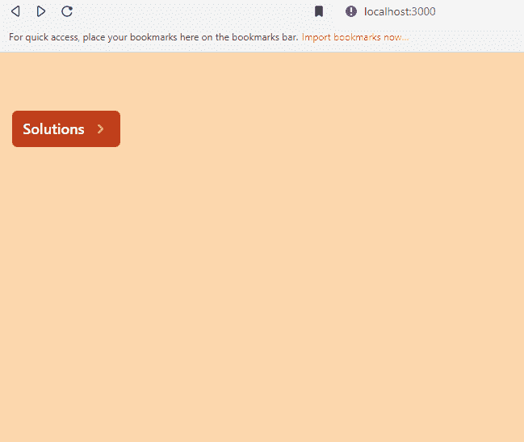
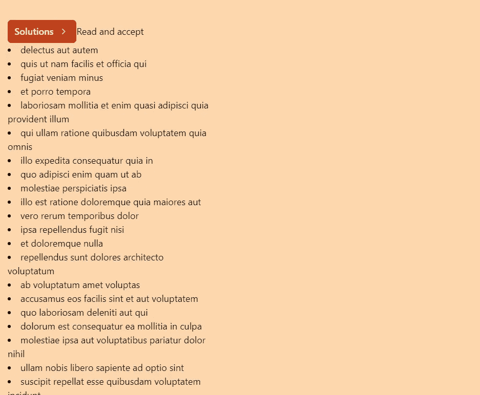

# HeadlessUI: Popover

> 原文：<https://javascript.plainenglish.io/headlessui-popover-part-3-closing-popover-manually-b1a2658a20cc?source=collection_archive---------0----------------------->

## 第 3 部分:手动关闭弹出窗口


Photo by [Danial Igdery](https://unsplash.com/@ricaros?utm_source=medium&utm_medium=referral) on [Unsplash](https://unsplash.com?utm_source=medium&utm_medium=referral)

在这一部分，我们将向您展示如何为弹出面板创建一个自定义按钮。

首先，在 components 文件夹下，创建 MyLink.js

```
import React from 'react'const MyLink = React.forwardRef(({ onClick, href }, ref) => {return (<a href={href} onClick={onClick} ref={ref}><div className="bg-red-500 hover:bg-green-500">My Link</div> </a>)})export default MyLink
```

在 pages 文件夹下，创建 insights.js

```
import React from 'react'const insights = () => {return (<div>insights</div>)}export default insights
```

在<popover.panel>下，添加</popover.panel>

```
<Popover.Panel className="absolute z-10 mt-3"><div className="overflow-hidden rounded-lg shadow-lg ring-1 ring-black ring-opacity-5"><div className="relative grid gap-8 bg-white p-7 "><Popover.Button as={MyLink} href="/insights">Insights</Popover.Button><a href="/analytics">Analytics</a><a href="/engagement">Engagement</a><a href="/security">Security</a><a href="/integrations">Integrations</a></div></div></Popover.Panel>
```



## 强制关闭面板

我们可以通过暴露`close()`渲染道具来强制关闭面板。创建状态`todos`，我们将使用 jsonplaceholder 获取 todos。

```
const MyPopover = () => {**const [todos, setTodos] = useState([])**return (<div className="fixed top-16 w-full max-w-sm px-4"><Popover className="relative">{({ open, close }) => (<><Popover.ButtonclassName="group inline-flex items-center rounded-md bg-orange-700 px-3 py-2 text-base font-medium text-white hover:text-opacity-100 focus:outline-none focus-visible:ring-2 focus-visible:ring-white focus-visible:ring-opacity-75"><span>Solutions</span><ChevronRightIconclassName={`${open ? 'rotate-90 transform' : ''}ml-2 h-5 w-5 text-orange-300 transition duration-150 ease-in-out group-hover:text-opacity-80`}/></Popover.Button>**<button****onClick={async () => {****const data = await fetch('https://jsonplaceholder.typicode.com/todos')****const todos = await data.json()****setTodos(todos)****close()****}}****>**Read and accept</button><Popover.Panel className="absolute z-10 mt-3"><div className="overflow-hidden rounded-lg shadow-lg ring-1 ring-black ring-opacity-5"><div className="relative grid gap-8 bg-white p-7 "><Popover.Button as={MyLink} href="/insights">Insights</Popover.Button><a href="/analytics">Analytics</a><a href="/engagement">Engagement</a><a href="/security">Security</a><a href="/integrations">Integrations</a></div></div></Popover.Panel></>)}</Popover>**{todos.length>0 && todos.map(todo=><li key={todo.id}>{todo.title}</li>)}**</div>)}
```



它将获取数据并关闭面板，todos 显示在解决方案按钮下方。

如果你喜欢这个故事，你可能也喜欢中等会员。一个月才 5 美元(一杯咖啡的价格！)但是它会在支持你最喜欢的作家的同时，给你无限的接触故事的机会。如果你注册使用[这个链接](https://ckmobile.medium.com/membership)，我会赚一小笔佣金。谢谢！

# 关注我们: [YouTube](https://www.youtube.com/channel/UCu4-4FnutvSHVo9WHvq80Ww?sub_confirmation=1) ， [Medium](https://ckmobile.medium.com/) ， [Udemy](https://www.udemy.com/user/cyruschan2/) ， [Linkedin](https://www.linkedin.com/company/ckmobi/) ， [Twitter](https://twitter.com/ckmobilejavasc1) ， [Instagram](https://www.instagram.com/ckmobile8050) ， [Gumroad](https://app.gumroad.com/ckmobile) ， [Quora](https://ckmobile.quora.com/) ， [Telegram](https://t.me/ckmobi)

*更多内容请看*[***plain English . io***](https://plainenglish.io/)*。报名参加我们的* [***免费周报***](http://newsletter.plainenglish.io/) *。关注我们关于*[***Twitter***](https://twitter.com/inPlainEngHQ)[***LinkedIn***](https://www.linkedin.com/company/inplainenglish/)*[***YouTube***](https://www.youtube.com/channel/UCtipWUghju290NWcn8jhyAw)***，以及****[***不和***](https://discord.gg/GtDtUAvyhW) *对成长黑客感兴趣？检查* [***电路***](https://circuit.ooo/) ***。*****