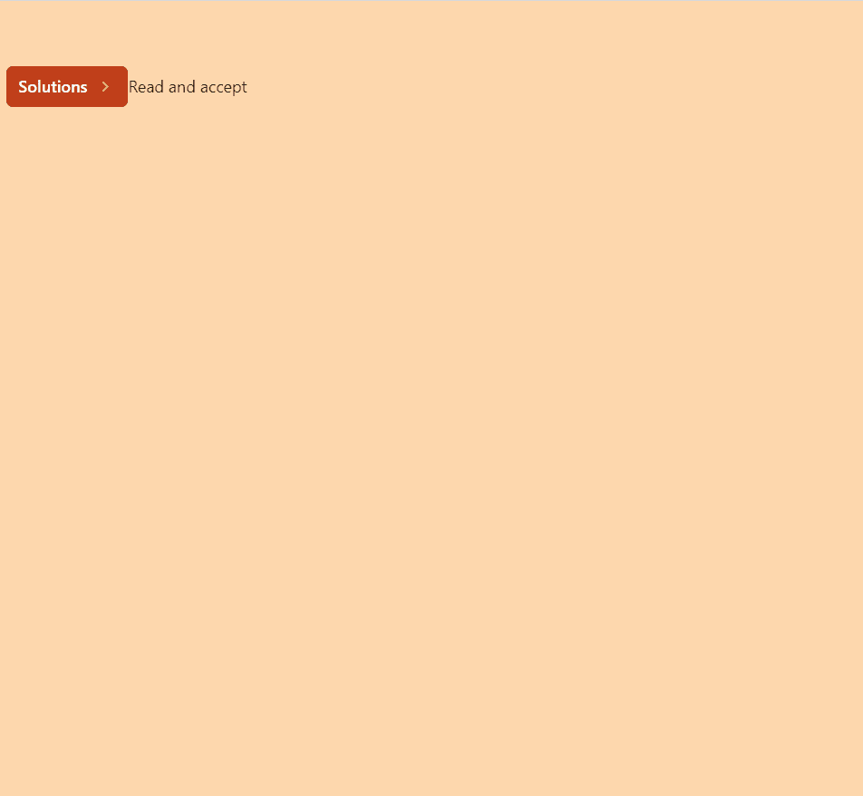

# HeadlessUI: Popover

> 原文：<https://javascript.plainenglish.io/headlessui-popover-part-5-transition-60c169a2fc5d?source=collection_archive---------11----------------------->

## 第 5 部分:过渡


Photo by [DESIGNECOLOGIST](https://unsplash.com/es/@designecologist?utm_source=medium&utm_medium=referral) on [Unsplash](https://unsplash.com?utm_source=medium&utm_medium=referral)

为了制作弹出面板打开/关闭的动画，我们需要添加<transition>组件。</transition>

首先，我们从 headless UI 导入 Transiton。

```
import { Popover, Transition } from '@headlessui/react'
```

然后我们使用<transiton>来包装<popover.panel>。例如，我们在输入时将持续时间变长，比如 1000 毫秒，在开始时将刻度变大，即 125。</popover.panel></transiton>

```
<Transitionenter="transition **duration-1000** ease-out"enterFrom="transform **scale-125** opacity-0"enterTo="transform scale-100 opacity-100"leave="transition duration-75 ease-out"leaveFrom="transform scale-100 opacity-100"leaveTo="transform scale-95 opacity-0"><Popover.Panel className="absolute z-10 mt-3"><div className="overflow-hidden rounded-lg shadow-lg ring-1 ring-black ring-opacity-5"><div className="relative grid gap-8 bg-white p-7 "><Popover.Button as={MyLink} href="/insights">Insights</Popover.Button><a href="/analytics">Analytics</a><a href="/engagement">Engagement</a><a href="/security">Security</a><a href="/integrations">Integrations</a></div></div></Popover.Panel></Transition>
```



如果你喜欢这个故事，你可能也喜欢中等会员。一个月才 5 美元(一杯咖啡的价格！)但是它会在支持你最喜欢的作家的同时，给你无限的接触故事的机会。如果你用[这个链接](https://ckmobile.medium.com/membership)注册，我会赚一小笔佣金。谢谢！

# 关注我们: [YouTube](https://www.youtube.com/channel/UCu4-4FnutvSHVo9WHvq80Ww?sub_confirmation=1) ， [Medium](https://ckmobile.medium.com/) ， [Udemy](https://www.udemy.com/user/cyruschan2/) ， [Linkedin](https://www.linkedin.com/company/ckmobi/) ， [Twitter](https://twitter.com/ckmobilejavasc1) ， [Instagram](https://www.instagram.com/ckmobile8050) ， [Gumroad](https://app.gumroad.com/ckmobile) ， [Quora](https://ckmobile.quora.com/) ， [Telegram](https://t.me/ckmobi)

*更多内容请看*[***plain English . io***](https://plainenglish.io/)*。报名参加我们的* [***免费周报***](http://newsletter.plainenglish.io/) *。关注我们关于*[***Twitter***](https://twitter.com/inPlainEngHQ)[***LinkedIn***](https://www.linkedin.com/company/inplainenglish/)*[***YouTube***](https://www.youtube.com/channel/UCtipWUghju290NWcn8jhyAw)***，以及****[***不和***](https://discord.gg/GtDtUAvyhW) *对成长黑客感兴趣？检查* [***电路***](https://circuit.ooo/) ***。*****